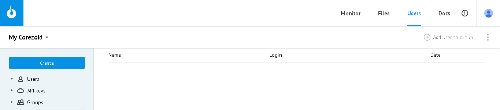
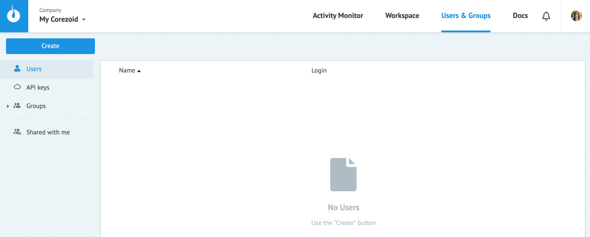
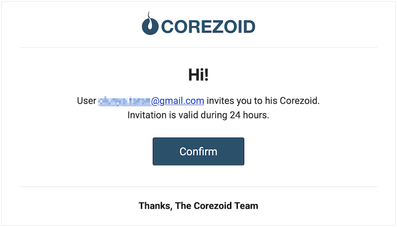
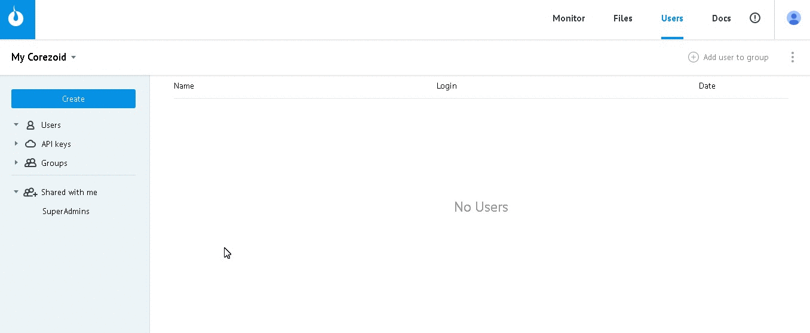
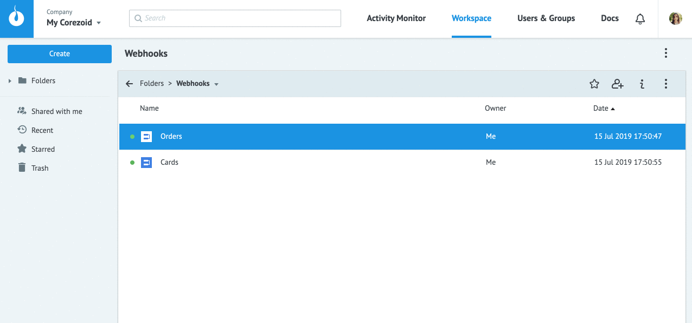
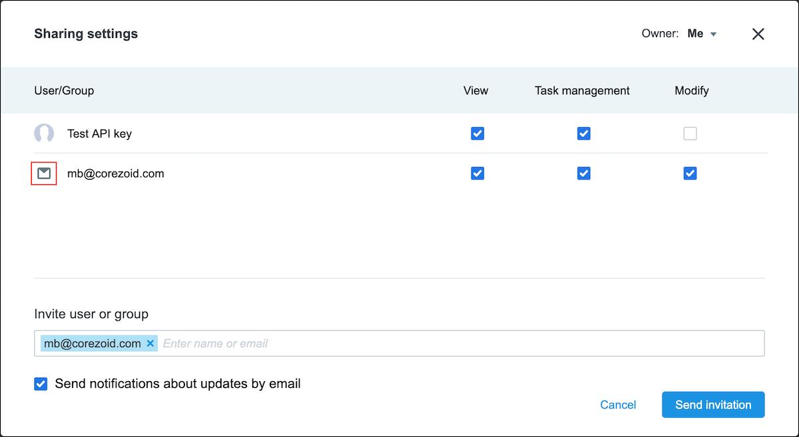
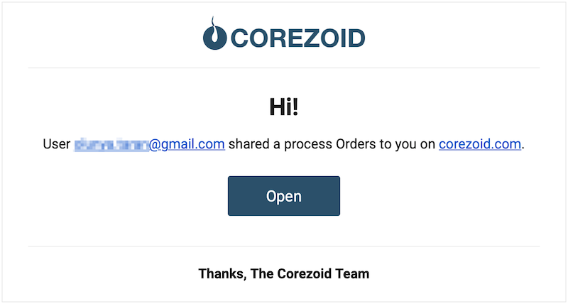
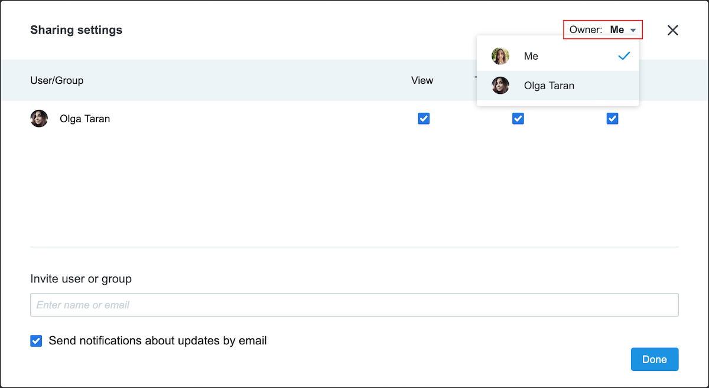

# Управление доступами

Доступ к объектам Corezoid возможно предоставить:
* пользователям - **Users**
* группе пользователей - **Groups**
* ключам для работы с объектами Corezoid через API - **API keys**

## Users

**Users** - это список пользователей, доступных при добавлении прав доступа к объектам.

Чтобы добавить (пригласить) пользователя в свое окружение Corezoid (My Corezoid) или компанию следуйте пути:

`Users -> Create -> User -> Введите email (логин) пользователя -> OK`

После этого действия приглашенному пользователю поступит сообщение на указанный email

В случае подтверждения приглашения пользователь появится в Вашем списке.

>Приглашение действительно в течение 24 часов

## Groups

**Groups** - это пользователи, объединенные в группы.

* Доступ, открытый группе, открывает его для всех входящих в нее пользователей.

* Если группе уже открыт доступ к объекту, то при добавлении в нее нового пользователя доступ автоматически предоставляется и этому новому пользователю.

* Если пользователь добавлен в группу, то в `Users` он не отображается.

**Создать группу**:

`Users -> Create -> Group -> Введите название группы -> OK`

и **добавить пользователя в группу**:

`Выберите группу -> Add user to group -> Введите email (логин) пользователя -> OK`

## API keys

**API keys** - логин и секретный ключ для работы с объектами Corezoid через [API](../api/README.md)

Чтобы создать API keys следуйте пути:

`Users -> Create -> API key -> Введите название -> OK`

Доступы к API keys другим пользователям предоставляются только через группы. Любая другая передача ключей небезопасна.

## Предоставление доступа к объекту

Чтобы открыть доступ к объекту:
* выберите объект и нажмите кнопку **"Share"**
* поле "Invite user or group" введите имя пользователя, название группы или API key, которому необходимо предоставить доступ.
* выберите права доступа для каждого пользователя
    * **Modify** - редактирование и удаление объектов и заявок
    * **View** - просмотр заявок, редактирование объектов
    * **Task management** - добавление заявок
* нажмите **"Send invitation"**

По умолчанию включена отправка уведомлений о предоставлении доступа. Для предоставления доступа без уведомления пользователя по электронной почте, необходимо снять чекбокс **"Send notification about updates by email"**.

Если пользователь уже добавлен в Ваш список, то его поиск возможен по 3 первым символам имени или email.

Если пользователя нет в Вашем списке, то в окне **Sharing settings** возле наименования будет отображаться "конвертик":

"Конвертик" будет до момента подтверждения приглашения, которое будет отправлено ему на email:

## Передача авторства по объектам

Чтобы передать авторство над объектом, выберите нужного пользователя в поле `"Owner"` и нажмите `"Done"`.

> Передать авторство возможно пользователю, которому ранее предоставлен доступ

