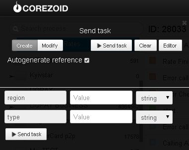

# Получение курсов топлива

Клонируйте [папку "Getting fuel prices"](https://admin.corezoid.com/folder/conv/5954) для получения процесса и дашборда.

Перейдите в процесс.

Для тестирования процесса перейдите в режим `dashboard` и нажмите кнопку `Add task` - добавить заявку

В появившемся окне укажите:
*   `region` - идентификатр региона
*   `type` - тип топлива

Далее нажмите кнопку `Send task` - отправить заявку.

**В случае успеха** в заявку будет добавленпараметр:

* `price`- курс топлива

**В случае ошибки** заявка перейдет в узел эскалации с параметром:
* `Error` - описание ошибки

**Возможные значения параметра `region` по областям:**

* **27** - Винницкая
* **28** - Волынская
* **04** - Днепропетровская
* **05** - Донецкая
* **06** - Житомирская
* **07** - Закарпатская
* **08** - Запорожская
* **09** - Ивано-Франковская
* **11** - Киевская
* **12** - Кировоградская
* **18** - Ровенская
* **19** - Сумская
* **20** - Тернопольская
* **21** - Харьковская
* **22** - Херсонская
* **23** - Хмельницкая
* **24** - Черкасская
* **25** - Черниговская
* **26** - Черновицкая
* **30** - Украина

**Возможные значения параметра `type`:**

* **A80** - A-80
* **A92** - A-92
* **A95** - A-95
* **DT**  - Дизельное топливо
