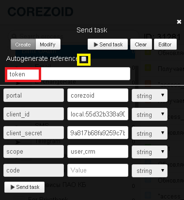

# Авторизации приложения в запросах к REST API Bitrix

Создайте свой **Битрикс24** на сайте [https://www.bitrix24.ru](https://www.bitrix24.ru)


Добавьте свое приложение в Битрикс24 для личного использования или для публикации в каталоге.


После добавления Вы получите код и ключ Вашего приложения.


Для получения "access_token" и авторизации Вашего приложения в запросах к REST API Bitrix клонируйте [шаблон процесса "Bitrix OAuth"](https://www.corezoid.com/admin/edit_conv/31281/8316).


## Описание входящих параметров процесса

* **portal** - Ваш портал Битрикс24, которы указан при регистрации. Например, если адресс Вашего Битрикс24 - https://corezoid.bitrix24.ru, то имя портала - `corezoid`


* **client_id** - код приложения
* **client_secret** - ключ приложения
* **scope** - доступные разрешения для приложения (более одного перечислять через запятую). [Cписок](https://dev.1c-bitrix.ru/learning/course/index.php?COURSE_ID=43&LESSON_ID=2280) доступных значений SCOPE
* **code** - первый код авторизации

## Как получить значение входящего параметра `"code"`

В адрессную строку браузера вставляем ссылку:

```
https://{{имя_портала}}.bitrix24.ru/oauth/authorize/?response_type=code&client_id={{код_приложения}}
```

где,

**{{имя_портала}}** - Ваш портал Битрикс24,
**{{код_приложения}}** - код приложения

Например,
```
https://corezoid.bitrix24.ru/oauth/authorize/?response_type=code&client_id=local.55d32b338a90f0.23817
```

Браузер делает редирект на URL приложения, передавая первый код авторизации - **code**.

В итоге адресной строкой браузера будет ссылка вида:

```
https://apps-b1001609.bitrix24-cdn.com/b1001609/app_local/e38e9f7db4fa858f9e1b92e91e699811/index.html?code=6dm7bdbh6akpc9tax2lp3fih05m5gtf2&domain=имя_портала.bitrix24.ru&member_id=a3238bc7698db8257e62cf799e88b58e
```

>code=6dm7bdbh6akpc9tax2lp3fih05m5gtf2

**Внимание!** Время жизни полученного параметра "code" - 30 сек!


## Запуск процесса

**1)** Перейдите в режим `dashboard` и нажмите кнопку `Add task` - добавить заявку.


В появившемся окне укажите обязательные параметры:
*   portal
*   client_id
*   client_secret
*   scope

и снимите галочку возле поля `"Autogenerate reference"` для того, чтобы указать имя референса заявки = token.



**2)** Перейдите в браузер и по указанной выше ссылке получите параметр "code"

**3)** Укажите значение полученного параметра в добавляемой заявке

**4)** После того как все параметры указаны, нажмите кнопку `Send task`.

>**Заявку достаточно создать всего один раз.**

## Результат процесса

В случае успеха, в параметре заявки `"access_token"` будет хранится полученный токен.

Вы можете получать его значение в других процессах, используя [конструкцию](../../interface/functions/getParamFromApp.md):

```
{{conv[ID_клонироанного_процесса].ref[token].access_token}}
```

В [процессе "Bitrix OAuth"](https://www.corezoid.com/admin/edit_conv/31281/8316) `"access_token"` будет обновляться каждые 25 минут.


## Если "access_token" не обновился

В случае, если при обновлении токена произойдет ошибка, заявка перейдет в узел `"access_token" не обновлен. Эскалация на автора проесса"`.

В этом узле Вы можете настроить эскалацию - используя [Логику PRC](../../interface/nodes/rpc/README.md) вызывать процесс отправки уведомления об ошибке автору процесса:

* **SMS** через [Twilio](../twilio/sms.md), [MessageBird](../sms/messagebird.md), [UniSender](../email/send_sms_unisender.md)
* **Email** через [Mandrill](../email/mandrill_v2.md), [UniSender](../email/send_email_unisender.md)
* **Сообщение в [Telegram](../telegram/README.md)**


