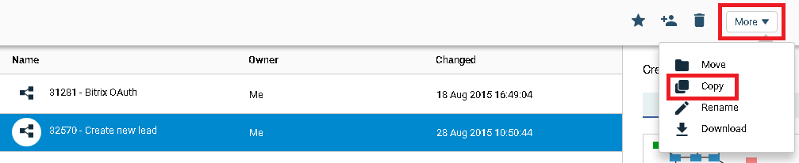
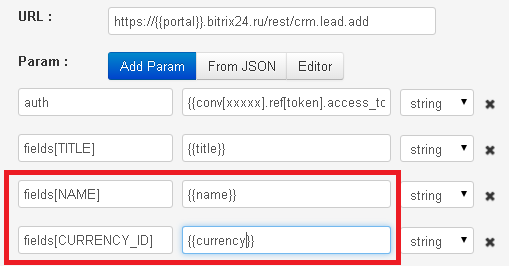
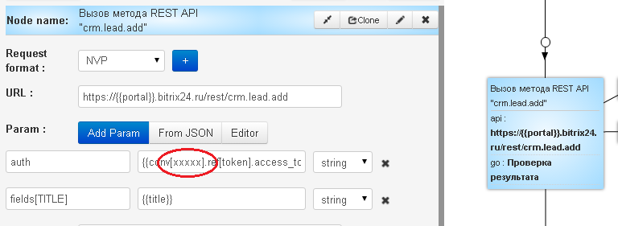
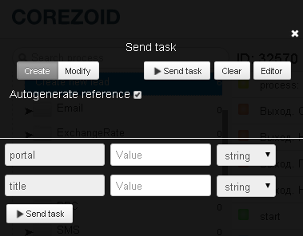

# Создание нового лида

Для [создания нового лида](https://dev.1c-bitrix.ru/rest_help/crm/leads/crm_lead_add.php) Bitrix перейдите по [ссылке](https://admin.corezoid.com/folder/conv/8316) и клонируйте шаблон процесса `"Create new lead"`.

## Описание входящих параметров процесса

* **portal** - Ваш портал Битрикс24, которы указан при регистрации. Например, если адресс Вашего Битрикс24 - https://corezoid.bitrix24.ru, то имя портала - `corezoid`
* **title** - название нового лида

Для создания нового лида обязательным параметром является его название (title).

Значение других параметров передается в API аналогично:

- fields[NAME] - имя нового лида
- fields[CURRENCY_ID] - валюта
- и т.д.

Описание параметров на [сайте](https://dev.1c-bitrix.ru/community/blogs/chaos/crm-sozdanie-lidov-iz-drugikh-servisov.php).

Описание метода [crm.lead.fields](https://dev.1c-bitrix.ru/rest_help/crm/leads/crm_lead_fields.php) "Получение полей лида".

## Запуск процесса

**1)** Для авторизации запроса вставьте id Вашего процесса, который получает и хранит `access_token` Bitrix в значение параметра `auth` вместо **"ххххх"**.

*[Описание процесса](autorizatoin.md), который получает и хранит `access_token`*

**2)** Перейдите в режим `dashboard` и нажмите кнопку `Add task` - добавить заявку.

**3)** В появившемся окне укажите обязательные параметры:
*   portal
*   title

**4)** После того как все параметры указаны, нажмите кнопку `Send task`.

## Описание исходящих праметров процесса

**В случае успеха** в заявку будет добавлен параметр
* `lead_id` - ID созданного лида

**В случае ошибки**, заявка уйдет в узел эскалации и будет добавлен параметр
* `Error` - описание ошибки

