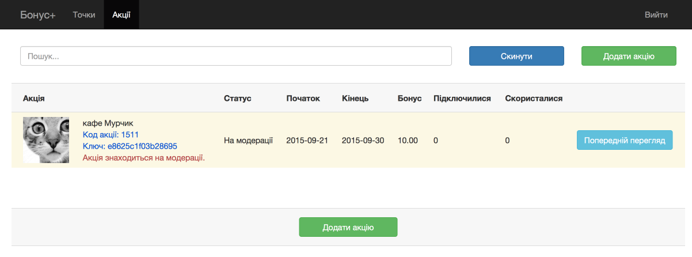

##Акции Бонус Плюс 

**Акция в рамках программы лояльности «Бонус Плюс»** - это предложение от партнера программы «Бонус Плюс» клиенту с картой ПриватБанка получить повышенный персональный процент бонуса в оговоренный условиями акции период времени в случае оплаты товара / услуги в торговой точке, которая указана в условиях. 

**Подключение клиента к акции происходит двумя путями:**
**1)**самостоятельная регистрация клиентом в акции на сайте Бонус Плюс

**2)** регистрация партнером клиента в акции. Например, партнер создал акцию, зарегистрировал в акции своих клиентов и оповестил про акцию, например, через СМС. 

Для регистрации партнером клиента необходимо получить **Код акции** и **Ключ**:

Клонируйте папку Bonus Plus. **Регистрации клиента в акции**

Для регистрации клиента в акции необходимо использовать процес [*"Registration in action Bonus Plus"*](https://www.corezoid.com/admin/edit_conv/35644) и передать следующие параметры:
* promo - код акции
* phone - номер телефона клиента (формат 38 или +38)
* key_promo - ключ 

Ответ для RPC:
* status_promo = “Y” (клиент зарегистрирован в акции)
* status_promo = “N” (клиент НЕ зарегистрирован в акции, основная причина - у клиента нет карты ПриватБанка)

**Получение параметров акции**

Для получение параметров акции необходимо использовать процес [*"Details of the action Bonus Plus"*](https://www.corezoid.com/admin/edit_conv/35645) и передать следующие параметры:
* promo - код акции

Ответ:
**url_details_ukr** - url страницы с акциями региона клиента (укр. язык),
**url_details_rus** - url страницы с акциями региона клиента (рус. язык),
**url_promo_ukr** - url на акцию (укр. язык),
**url_promo_rus** - url на акцию (рус. язык),
**category_rus** - категория акции (рус. язык),
**category_ukr** - категория акции (укр. язык),
**end_time** - время окончания акции,
**start_time** - время начала акции,
**date_end** - дата окончания акции,
**date_start** - дата старта акции,
**bonus_old** - стандартный размер бонуса,
**bonus** - акционный размер бонуса,
**name_rus** - название акции (рус. язык),
**full_name_rus** - полное название акции (рус. язык),
**name_ukr** - название акции (укр. язык),
**full_name_ukr** - полное название акции (укр. язык),
**image_new** - url на баннер акции

**Пример регистрации в акции и отправка СМС клиенту**

Например, в партнера программы «Бонус Плюс» есть своя клиентская база, которую он хочет подключить к акции «Бонус Плюс» и сообщить об этом клиентов через СМС. Для этого необходимо сначала зарегистрировать клиента в акции, после успешной регистрации - осуществить коммуникацию. Пример такого процесса в шаблоне  [*“Пример регистрации в акции Бонус Плюс и отправки СМС клиенту через UniSender”*](https://www.corezoid.com/admin/edit_conv/38727)

