# Bot platform
  
* [Что такое Bot platform](#что-такое-bot-platform)
* [Что такое компания Sender и зачем ее выбирать?](#что-такое-компания-sender-и-зачем-ее-выбирать)
* [Управление текстами сообщений](#управление-текстами-сообщений)
* [Подключение мессенжеров](#подключение-мессенжеров)
* [Описание объектов папки Bot](#описание-объектов-папки-bot)
  
  

## Что такое Bot platform
  
**Bot platform** создает в Вашем аккаунте мультиплатформенного робота для обработки сообщений пользователей Sender, Skype, Telegram, Facebook Messenger, Viber.
  
**Мультиплатформенный робот** - это набор процессов Corezoid, которые реализуют 4 главных принципа:
  
1. прием сообщений от пользователей разных мессенжеров
2. приведение полученных данных к единому формату
3. обработка сообщений согласно главной логики бота (ботов)
4. отправка обратных сообщений пользователям в тот канал (мессенжер), откуда было получено обращение

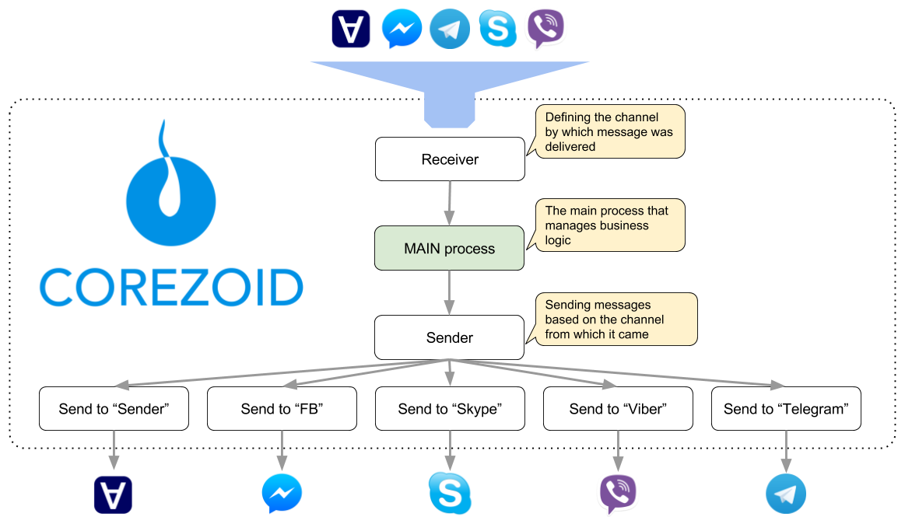
  
При подключении каждый мессенжер подключается к одному процессу-приемнику [Receiver & Route message](#receiver-and-route-message) для получения webhook-ов.
  
В случае, если после создания мультиплатформенного робота есть необходимость добавить мессенжер, который не был выбран изначально или поменять ключи существующего, то это сделать это можно следующим образом:
  
* выбрать процесс Receiver & Route message (процесс-приемник сообщений)
* перейти на вкладку Webhook
* нажать на Connect to messenger 
* подключить или обновить ключи Бота нужного мессенжера
  

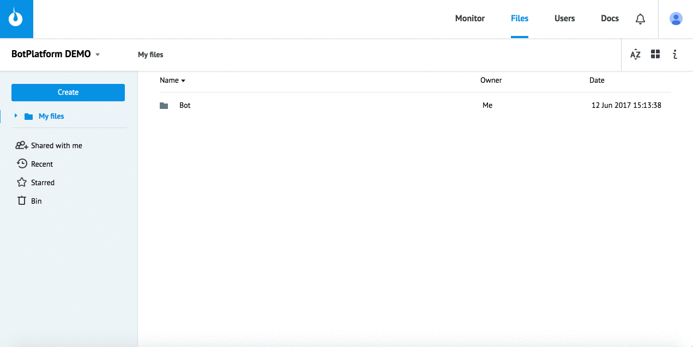
  
  
### Для создания мультиплатформенного робота
  
Выберите [компанию  Sender](#что-такое-компания-sender-и-зачем-ее-выбирать) -> Нажмите Create -> Bot platform -> [Выберите нужные мессенжеры](#подключение-мессенжеров) и добавьте их ключи
  
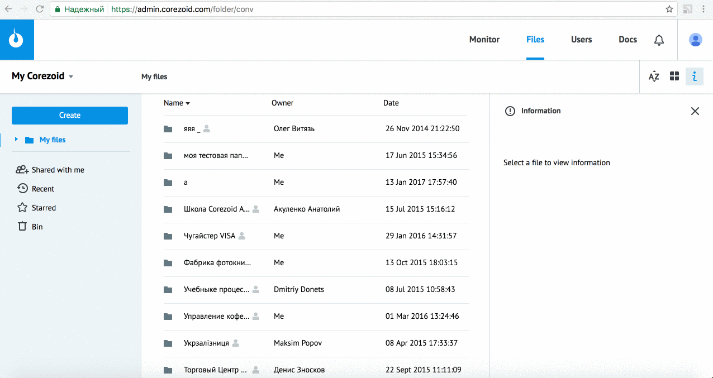
  
В Вашем аккаунте сформируется [папка с процессами](#описание-объектов-папки-bot) **"Bot"**. В них уже реализована следующая [логика в процессе **MAIN logic**](#main-logic):
  
* отправка приветственного сообщения "Отправьте мне /lang  для установки языка общения и /chat для подключения оператора!"
* установка языка общения Бота
* подключение оператора
  
  
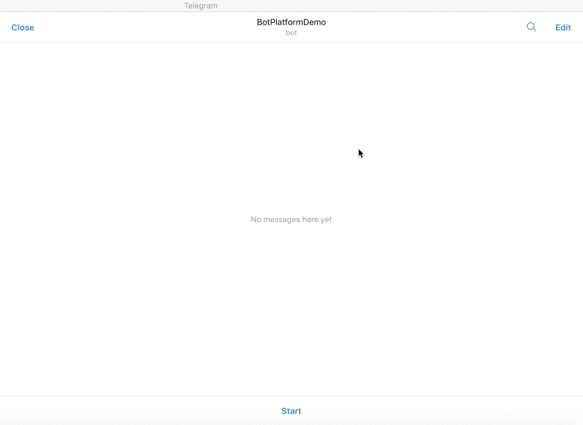
  

Для того, чтобы реализовать Вашего Бота с помощью Bot platform, Вам нужно настроить всего один процесс - [**MAIN logic**](#main-logic)! 
  
Остальной функционал (получение webhook, маршрутизация, отправка сообщений) уже реализован.
  
  
## Что такое компания Sender и зачем ее выбирать?
  
Для реализации функционала подключения операторов в чат с пользователями Ваших Ботов. 
Потому как, [Sender](https://sender.mobi/ru/) - это мессенжер, который является рабочим местом операторов Вашей компании. Сообщения пользователей разных мессенжеров обрабатываются в едином интерфейсе.
  
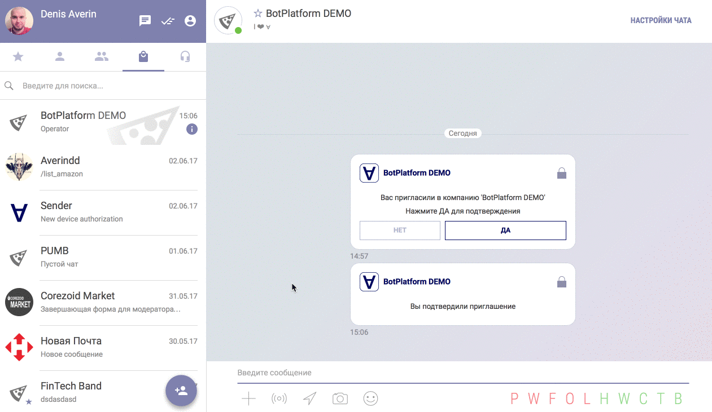
  
Для базовой настройки и тестирования перейдите в [административное окружение Sender](https://admin.sender.mobi/), создайте компанию и добавьте в нее операторов.
  
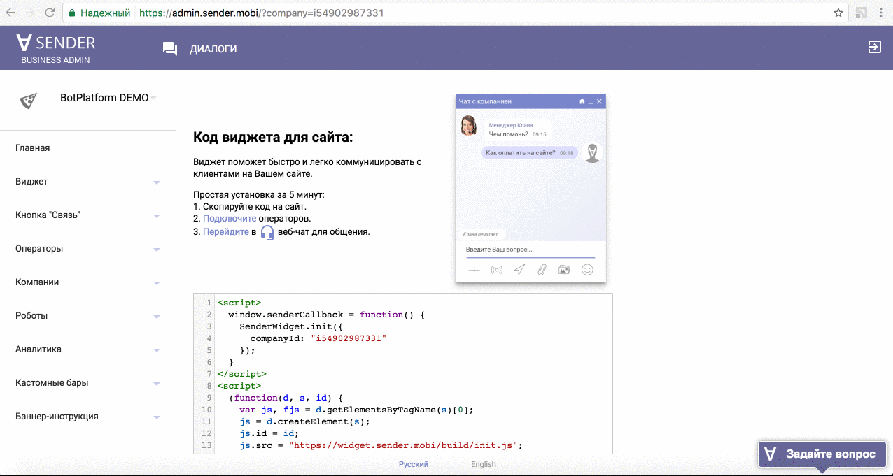
  
Подключение оператора и маршрутизация сообщений из мессенжеров в операторский чат Sender осуществляется с помощью Логики Sender action - Category "Widgets" - Robot "Send Message For Bot Platform"
Для получения ответов от операторов процесс приемник подключается к событию Sender "Получение сообщений от бот платформы" (автоматом при создании BotPlatform).
  
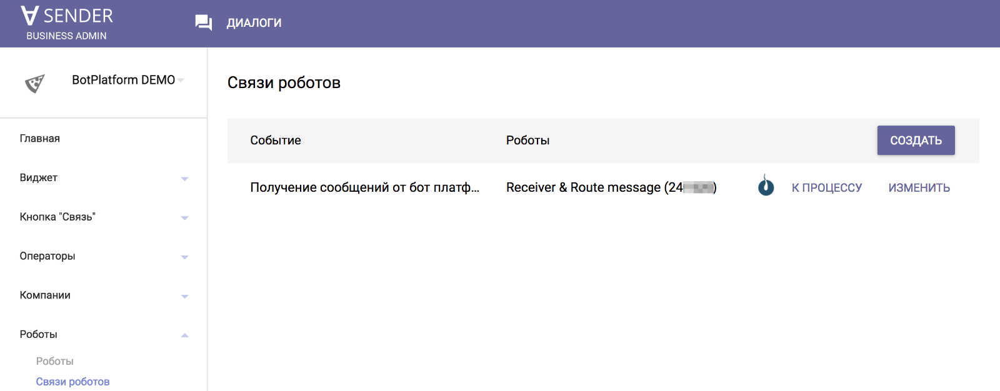
  
Отправка сообщений от оператора пользователю в мессенжер осуществляется через обычный вызов API нужного мессенжера. 
  
Если мультиплатформенный робот создается без предварительного выбора компании, то на первом шаге будет предложен ее выбор из списка или создание новой  "+ Add company".
  
Даже, если на этапе создания Вы не планируете настраивать логику подключения операторов, выбор компании поможет Вам сделать это с легкостью, когда появится необходимость.
  
  
## Управление текстами сообщений
  
Все тексты сообщений и объекты, описывающие кнопки содержатся в диаграмме состояний Texts. 
  
1 сообщение пользователю = 1 заявка в диаграмме состояний с уникальным референсом.
  
Уникальный референс заявки = text_id - уникальный идентификатор сообщения.
  
Пример заявки, содержащей текст и кнопки для выбора языка общения бота.
  
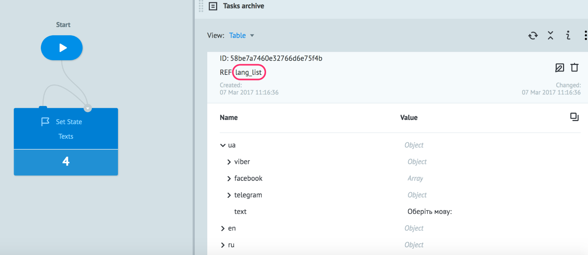
  
Заявка с референсом **lang_list** содержит 3 объекта - **ua**, **en**, **ru**.
  
Каждый объект содержит 4 параметра:
  
* **text** - текст сообщения
* **viber** - объект, описывающий кнопки для отправки сообщения в viber
* **facebook** - объект, описывающий кнопки для отправки сообщения в facebook
* **telegram** - объект, описывающий кнопки для отправки сообщения в telegram
  

Это позволяет:
  
1) легко управлять текстами сообщений (редактировать, добавлять новые, удалять и т.д.), т.к. они собраны в "одном месте"
  
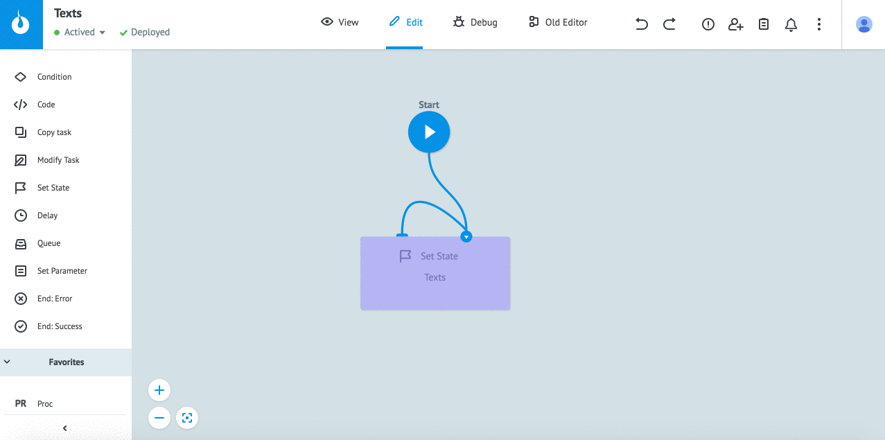
  
2) при создании заявки на отправку сообщения в процесс [Send message](#send-messages) достаточно указать только его **text_id**. Вместо того, чтобы "нагружать" процессы узлами для отправки множества текстов сообщений для множества мессенжеров на разных языках.
  
Например, для отправки сообщения о выборе языка общения сейчас нужен всего 1 узел и выглядит он так:
  

  
А могло бы выглядеть вот так:
  
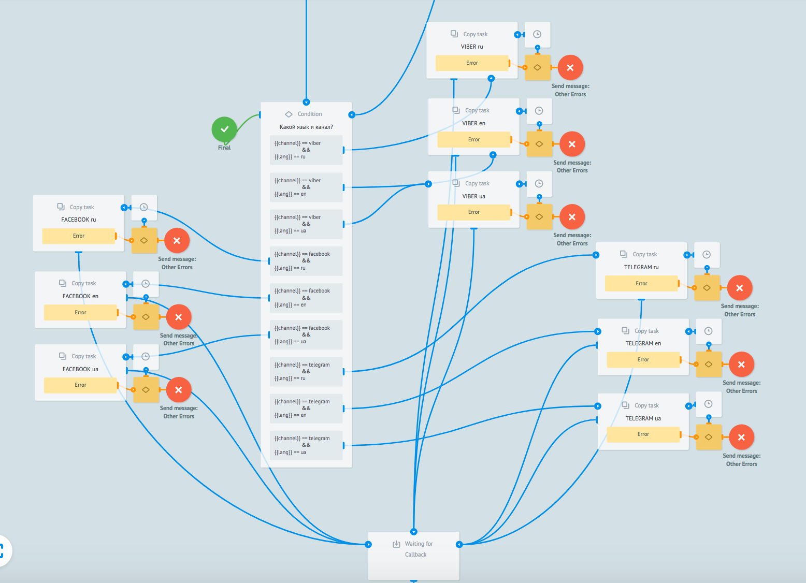
  
И это всего лишь для одного только сообщения. Разница очевидна :)
  
## Подключение мессенжеров
  
### Skype
  
Выберите Skype в списке, добавьте Client ID и Client Secret Вашего приложения в соответствующие поля.
 
После успешного создания робота Вы получите URL процесса-приемника сообщений.
 
Добавьте полученный URL в поле "Messaging endpoint" в процессе регистрации Skype Бота.
 
Подробнее [https://doc.corezoid.com/ru/plugins/skype/weatherbot.html](https://doc.corezoid.com/ru/plugins/skype/weatherbot.html)
  
  
### Telegram
  
Выберите Telegram в списке и добавьте ключ Вашего Бота в соответствующее поле.
  
Успешное создание робота = успешной установке webhook-ов от Telegram Бота.
  
  
### Facebook Messenger
  
Выберите Facebook Messenger в списке и добавьте маркер доступа Вашей страницы в соответствующее поле.
 
После успешного создания робота Вы получите URL процесса-приемника сообщений.
 
Добавьте полученный URL в настройках webhook  facebook приложения, указав его в поле "Обратный URL-адрес"
 
Подробнее [https://doc.corezoid.com/ru/plugins/facebook/weatherbot.html](https://doc.corezoid.com/ru/plugins/facebook/weatherbot.html)
  
  
### Viber
  
Выберите Viber в списке и добавьте токен Вашего Public Account в соответствующее поле.
 
Успешное создание робота = успешной установке webhook-ов от Viber Public Account.
  
  
#### Viber Welcome message
  
В случае необходимости, установите приветственное сообщение для Вашего Public Account:
 
* выберите процесс "Receiver & Route message" (процесс-приемник сообщений)
* перейти на вкладку "Webhook"
* нажмите на "Connect to messenger" 
* выберите "Viber" и нажмите на кнопку "Set Welcome message"
* выберите тип приветственного сообщения - текст или картинка с текстом
* заполните нужные поля

## Описание объектов папки Bot

### Receiver and Route message

С этого процесса все начинается. Все webhook-и подключаются именно к этому процессу.
 
Логика Receiver & Route message:

* принимает сообщения от пользователей Ваших Ботов разных мессенжеров и ответы операторов из активных диалогов Sender
* приводит полученные данные к единому формату:
  * channel - sender / skype / telegram / facebook / viber
  * user_text - текст сообщения пользователя
  * user_name - имя пользователя
  * chat_id - идентификатор чата, пользователя и т.д.
  * token - токен мессенжера
  * action - reply (в случае действий в  операторских чатах)
* передает данные в [**MAIN logic**](#main-logic)
* создает пользователя c уникальным референсом `{{channel}}_{{chat_id}}` или обновляет его данные в диаграмме состояний [**Users**](#users)

### MAIN logic

Это процесс управления логикой Бота.
 
Для демонстрации принципов работы Бота, реализованного в Corezoid, в шаблонных процессах, которые добавляются Вам в аккаунт реализована следующая логика:
 
* отправка приветственного сообщения "Отправьте мне /lang  для установки языка общения и /chat для подключения оператора!"
* установка языка общения Бота
* подключение оператора
  
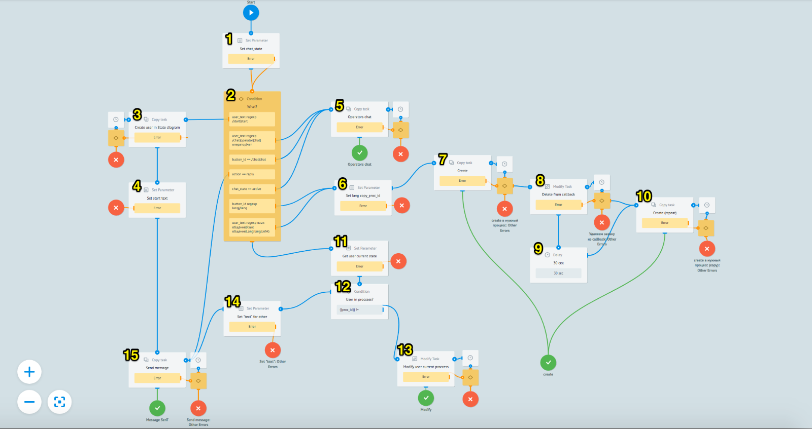
  
1. Получаем текущее состояние чата - **chat_state**
2. Проверка полученных данных по заданным условиям
3. **user_text** содержит **/start** или **start** - создаем пользователя в [State diagram](#state-diagram)
4. Устанавливаем текст приветственного сообщения
5. Передача данных в процесс [Operators calling](#operators-calling), когда **chat\_state = active** и когда **user\_text** или **button\_id** содержат один из признаков того, что пользователь хочет подключить оператора в чата
6. Установка переменной **copy_proc_id** - id процесса, который обрабатывает команду /lang
7. Создание заявки в многошаговом процессе, ид которого содержится в переменной **copy_proc_id**. Формирование уникального ref заявки `{{channel}}_{{chat_id}}` для ее обновления по шагам процесса.
8. Обновление заявки в многошаговом процессе с признаком **action = cancel** для выведения заявки из ожидания в конечный узел. Вызывается в случае ошибки **not\_unical\_ref** на предыдущем шаге. Ошибка свидетельствует о том, что пользователь Бота не завершил многошаговый процесс и начал его сначала.
9. Задержка в 30 сек перед повторной попыткой создания заявки в многошаговом процессе, ид которого содержится в переменной **copy\_proc\_id**.
10. Повтор создания заявки в многошаговом процессе, ид которого содержится в переменной **copy\_proc\_id** (повтор 7). Многошаговых процессов (**copy\_proc\_id**) может быть множество, а узлы для создания, обновления, повтора создания заявок (7, 8, 9, 10) - в одном экземпляре.
11. Если не сработало ни одно из заданных условий в узле 2, по уникальному ref = `{{channel}}_{{chat_id}}` получаем из [State diagram](#state-diagram) **proc_id** многошагового процесса, в котором, возможно, ожидается ответ от пользователя (заявка ждет обновления)
12. Проверка пустой ли **proc_id**
13. Если **proc_id** не пустой, обновление заявки в многошаговом процессе, id которого содержится в переменной **proc_id**. ref заявки = `{{channel}}_{{chat_id}}`
14. Если **proc_id** пустой, установка текста “Здесь должен быть Ваш текст для логики, непредусмотренной процессом MAIN logic"
15. Передача данных в [Send message](#send-messages) для отправки сообщения пользователю

### Send messages
  
Процесс, который принимает данные для отправки сообщений.
 
* Проверяет, передан ли параметр `{process_state}}`. Если передан обновляет cостояние чата в [State diagram](#state-diagram) с **action** = `{{process_state}}`
* Из диаграммы состояний [Users](#users) получает признак языка общения пользователя. Если признак не получен, устанавливает по умолчанию **ru**
* Если в полученной заявке содержится параметр **text_id**, получает соответствующий объект **text_object** из диаграммы состояний **Texts**:

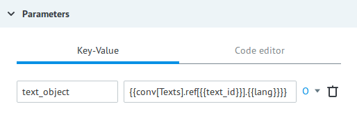
* Из **text_object** получает текст сообщения (**text**) и клавиатуру (**keyboard**)
* По условию проверки параметра `{{channel}}` передает заявку на отправку сообщения в процесс с вызовом API соответствующего мессенжера

### State diagram
  
Диаграмма состояний, предназначенная для хранения текущего состояния чата уникального пользователя мессенжера и токена мессенжера.
  
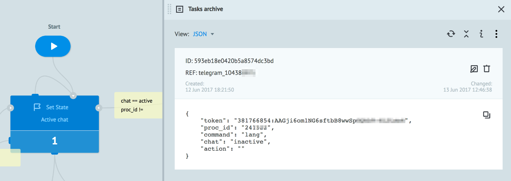
  
Пример получения состояния чата (chat_state) пользователя Telegram c id = 10438 из диаграммы состояний 230638. 
 
`{{conv[230638].ref[telegram_10438].chat}}`
  
или указать в качестве ref - `{{channel}}_{{chat_id}}`
  
Результат:
  
{
  
"chat_state": "inactive"
  
}
  
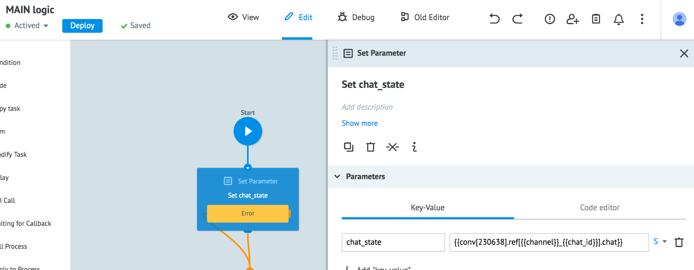
  
Заявки создаются или обновляются из:
  
1. [Main logic](#main-logic) - Create user in State diagram
2. многошаговых процессов, таких как **Сommand Lang** (установка языка общения бота) и [Operators calling](#operators-calling) (подключение оператора)
3. процесса [Send message](#send-messages), когда получен `{{process_state}}`. Чаще всего это последнее сообщение многошагового процесса с process_state = finish
4. процесса [Receiver & Route message](#receiver-and-route-message), когда оператор завершает чат или чат завершается принудительно по истечению времени неактивной сессии
5. **по таймеру = 2 мин** (можно изменять),когда пользователь неактивен (за исключением операторского чата) 

  
### Users
  
Диаграмма состояний, предназначенная для сбора данных и вывода на дашборд информации по пользователям в разрезе каналов.
 
А также для хранения признака языка общения пользователя с ботом (lang). Добавляется из процесса [Сommand Lang](#command-lang), после соответсвующего выбора пользователя. 
Язык общения получает процесс [Send message](#send-messages) для выбора объекта, содержащего текст и кнопки

### Texts
  
Диаграмма состояний для хранения и управления текстами сообщений и кнопками.
  
Подробно в разделе [Управление текстами сообщений](#управление-текстами-сообщений).

### Operators calling
  
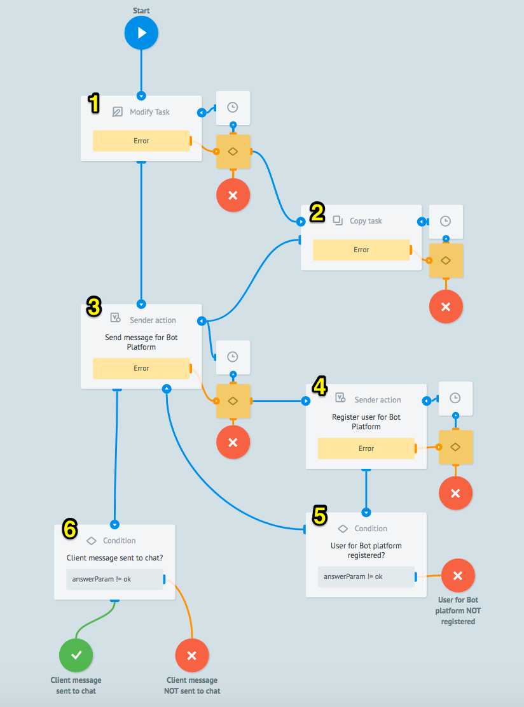
  
1. Обновление заявки в [State diagram](#state-diagram) по **ref** = `{{channel}}_{{chat_id}}` с передачей признака **chat = active**.
2. Создание заявки в [State diagram](#state-diagram) с **ref** = `{{channel}}_{{chat_id}}` с передачей признака **chat = active** в случае ошибки **not\_found\_task** логики 1.
3. Вызов Логики Sender action - Category "Widgets" - Robot "Send Message For Bot Platform" для отправки сообщения пользователя в операторский чат.
4. Вызов Логики Sender action - Category "Widgets" - Robot "Register User For Bot Platform" для в случае ошибки **user\_not\_found** логики 3.
6. Проверка успешной регистрации пользователя. Если успех - повторный вызов логики 3.
7. Проверка успешной отправки сообщения в операторский чат.

### Command Lang
  

  
1. Обновление заявки в [**State diagram**](#state-diagram) по **ref** = `{{channel}}_{{chat_id}}` с передачей признака текущего процесса (**proc\_id**), команды (**command = lang**) и токена мессенжера (**token**)
2. Создание заявки в [**State diagram**](#state-diagram) с **ref** = `{{channel}}_{{chat_id}}` с передачей признака текущего процесса (**proc\_id**), команды (**command = lang**) и токена мессенжера (**token**), в случае ошибки **not_found_task** логики 1
3. Передача данных в [**Send message**](#send-messages) для отправки сообщения с **text\_id = lang\_list**
4. Ожидание выбора языка общения - нажатия на кнопку (обновления заявки)
5. Анализ обновленной заявки. Если **action = cancel** - выход. В противном случае переход на 6 шаг
6. Передача данных в [**Send message**](#send-messages) для отправки сообщения с **text\_id = lang\_set** и признаком завершения многошагового процесса **process_state = finish** для обновления [**State diagram**](#state-diagram) 
7. Обновление диаграммы состояний [**Users**](#users) - передача параметра **lang** = `{{button_id}}` (идентификатор кнопки, выбранной клиентом)
  

### Statistic
  
Дашборд для получения информации по количеству отправленных сообщений и по пользователям в разрезе каналов.

### Telegram
  
Папка с процессами:
  
* **Send message** - отправка сообщений в Telegram
* **Hide inline keyboard** - скрытие клавиатуры
* **Get IMAGE URL** - получение url на картинки в сообщениях

### Facebook
  
Папка с процессами:
  
* **Send message** - отправка сообщений в Facebook Messenger
* **Set FB Bot Welcome Message** - установка приветственного сообщения Facebook Messenger Бота

### Sender
  
Папка с процессом
  
* **Send message** - отправка текстовых сообщений в Sender

### Viber
  
Папка с процессами:
  
* **Send message** - отправка сообщений в Viber
* **Viber events** - определение полученного Viber события 
* **Message statuses** - отслеживание статусов отправленных сообщений

### Commands processes
    
Системный процесс, необходимый для установки **id процесса** [**Сommand Lang**](#command-lang) в узле **Set lang copy\_proc\_id** процесса [**MAIN logic**](#main-logic).
