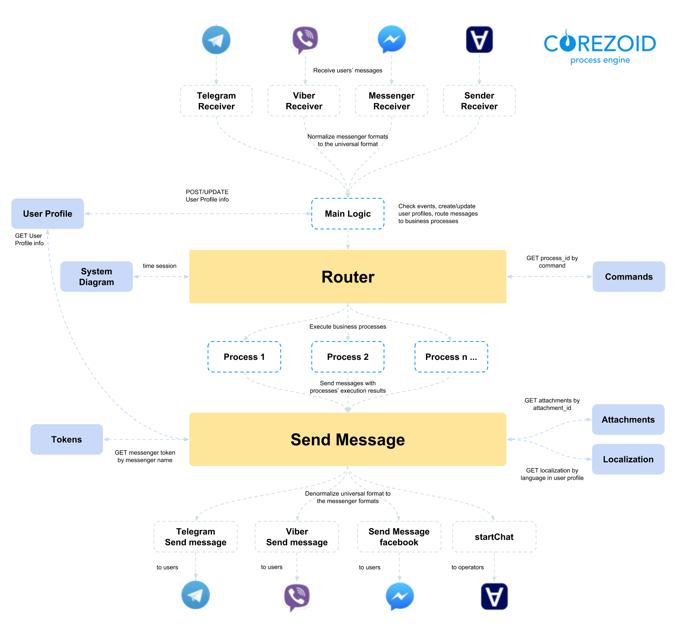

# **Bot Platform 2.0**

  

# Содержание

- [Как создать бота с помощью Bot Platform 2.0](get-started.md)
- [Базовый функционал Bot Platform 2.0](basic-functionality.md)
- [Объекты папки Bot Platform 2.0](objects-description.md)
- [Расширение функций бота](add-new-functionality.md)
- [Авторизация пользователей по номеру телефона](authorization.md)

  
  
  

# Что такое Bot Platform

**Bot Platform** - это набор универсальных процессов в Corezoid для создания и управления ботами в наиболее популярных мессенджерах:

-   Facebook Messenger
-   Viber
-   Telegram.

Благодаря Bot Platform Вы можете создавать универсальные бизнес-процессы, которые доступны во всех мессенджерах, а не разрабатывать бизнес-логику под каждый из мессенджеров отдельно.

# Архитектура

  

[Как создать бота с помощью Bot Platform 2.0](get-started.md)