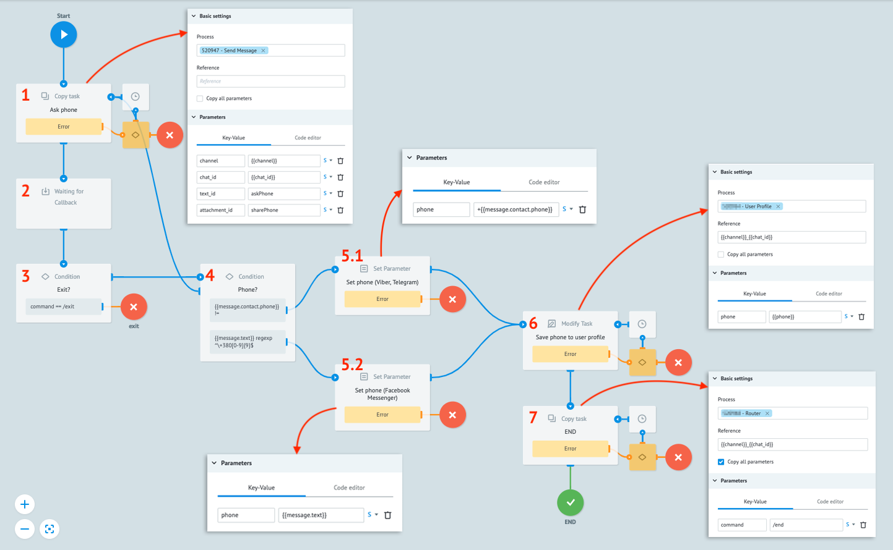
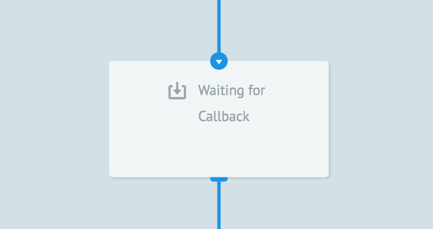
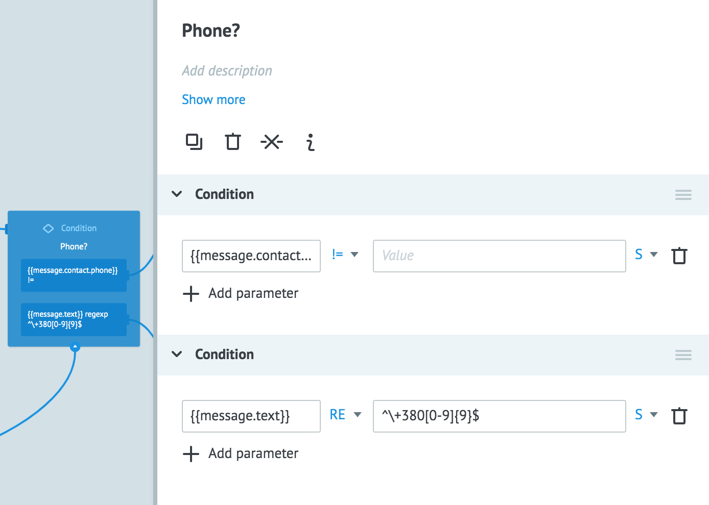
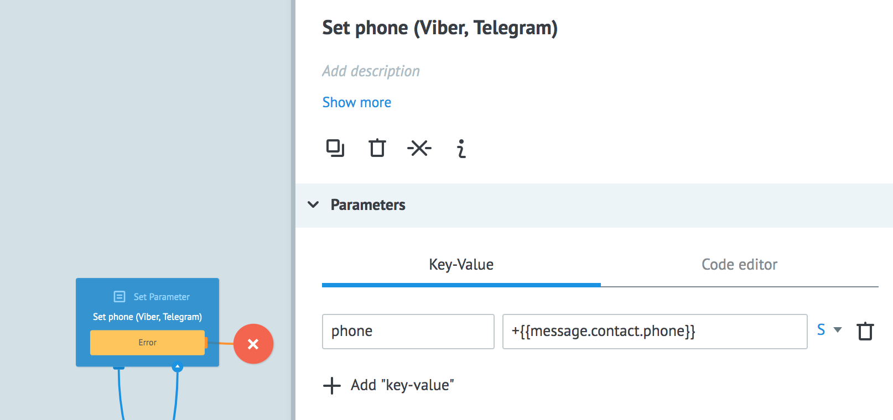
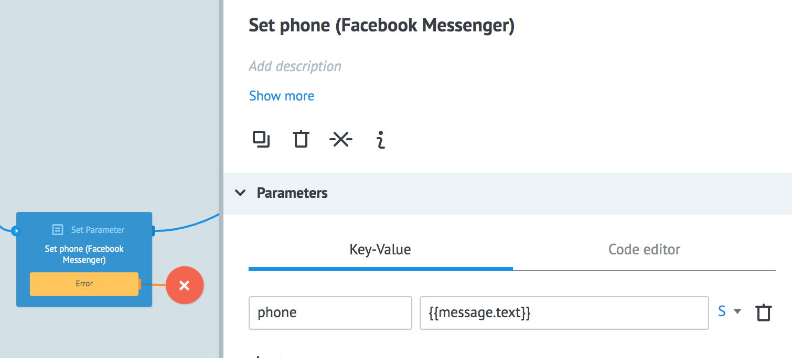
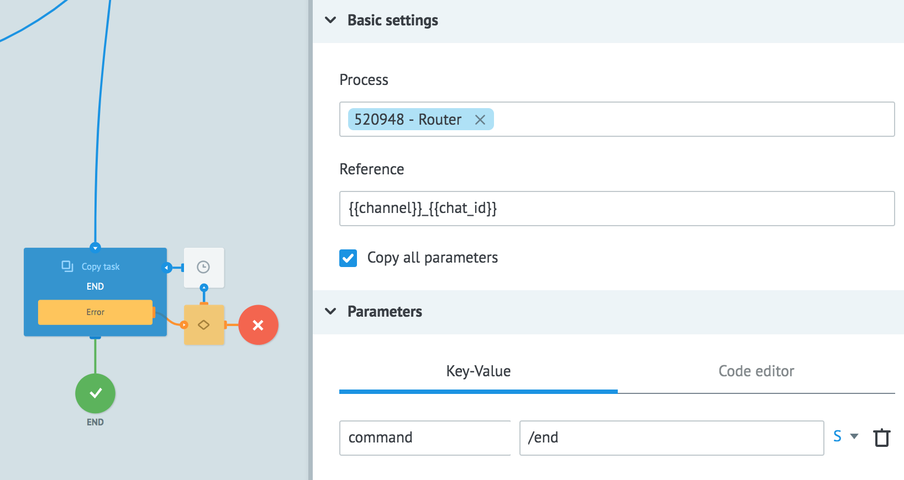
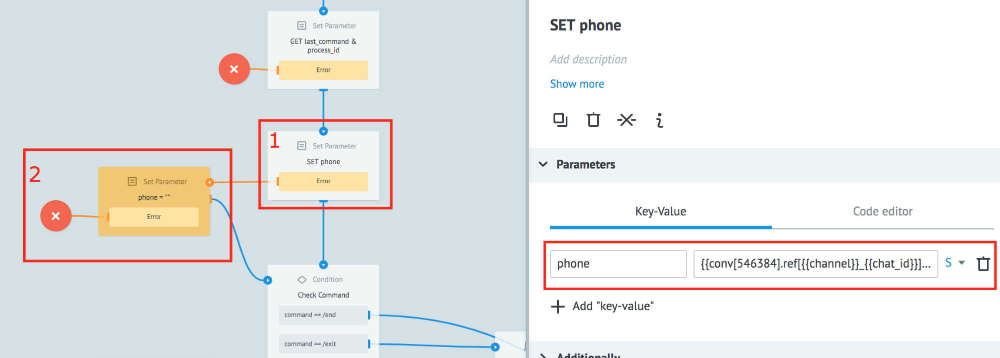
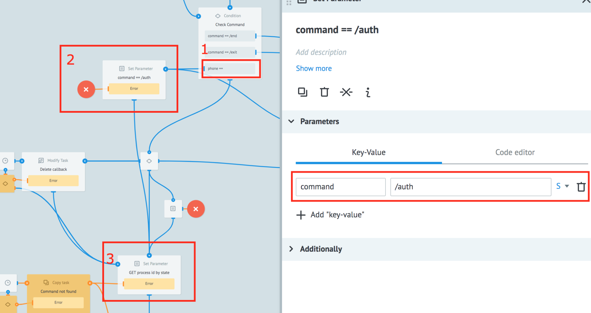
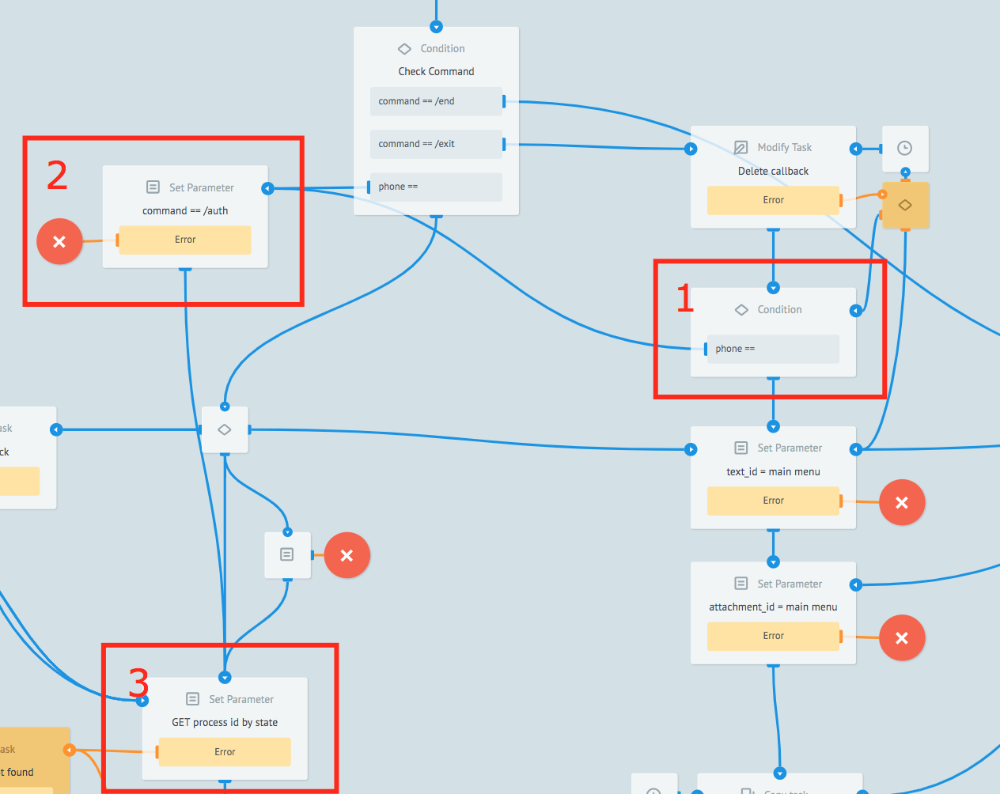

# Авторизация пользователя по номеру телефона

Когда конфигурационные настройки завершены, дополним процесс **/auth** логикой авторизации. Ниже представлена пошаговая схема с описанием процесса авторизации:



  

**1. Отправка сообщения пользователю**
Отправка сообщения от бота пользователю происходит путем копирования заявки в процесс **Send Message**. В логике Copy task необходимо указать следующие параметры:

-   **channel**:```{{channel}}```из заявки для конкретного пользователя
-   **chat_id**:```{{chat_id}}```из заявки для конкретного пользователя
-   **text_id**: `"askPhone"` (сообщение с просьбой нажать кнопку)
-   **attachment_id**: `"sharePhone"` (заготовленный шаблон кнопок)


    
**2. Ожидание ответа от пользователя**
После отправки сообщения бот ожидает действия пользователя. Для этого в процессе используется логика **Waiting for Callback**. В случае любого ответного действия пользователя заявка будет изменена и перейдет в узел 3.



**3. Проверка стандартного выхода из команды**
Для корректной работы бота и удобной навигации рекомендуется использовать кнопку с командой **/exit** для возможности отменить выполнение текущего процесса и выйти в главное меню. Если использовать такой подход, то обязательно необходимо добавить проверку условия выхода (узел с логикой **Condition**).


  

**4. Проверка переданного номера телефона**
Если пользователь не прервал выполнение процесса нажатием кнопки **Exit**, то наш процесс выполняется дальше и проверяет введенное пользователем сообщение при помощи логики **Condition**. В нашем случае, если пользователь ввел недопустимое значение (некорректный номер телефона и т.д.), то мы попросим ввести номер телефона или нажать кнопку отправки номера телефона еще раз. 
>Логику можно дополнить выводом сообщения об ошибке или подсказкой.


  

**5.1. Сохранение номера телефона из сообщения с контактом (Viber, Telegram)**
Если предыдущее условие выполнено успешно, и мы получили объект `message` с контактом, то мы сохраняем номер телефона в параметр `phone`.


  

**5.2. Сохранение номера телефона из текстового сообщения (FB Messenger)**
Если предыдущее условие выполнено успешно, и мы получили объект `message` с текстом, который соответствует регулярному выражению для номера телефона, то мы сохраняем это значение в параметр `phone`.


  

**6. Сохранение номера телефона в профиль пользователя**
Полученное ранее значение параметра `phone` сохраняется в диаграмму состояний **User Profile** в профиль пользователя и его можно будет переиспользовать в других процессах.


  

**7. Завершение процесса**
Для завершения работы процесса и возврата в главное меню используется команда **/end**. Необходимо с помощью логики **Copy task** передать в **Router**  `"command": "/end"`.




Теперь, когда процесс Авторизации готов, настроим проверку, авторизован или нет пользователь в боте:  
  

1.1. В процессе [Router](https://doc.corezoid.com/ru/plugins/bot_platform/v2/objects-description.html) добавляем узел **Set Parameter** между узлами “**GET last_command & process_id**” и “**Check Command**”. Настраиваем получение параметра **phone** из диаграммы **User Profile** с помощью функции [CONV](https://doc.corezoid.com/ru/interface/functions/getParamFromApp.html).

1.2. Если номер телефона не удалось получить, записываем значение `phone: “”`.


  

2.1. В узле “**Check Command**” добавляем проверку наличия номера телефона с помощью конструкции: `phone: “”`.  
2.2. В случае, если проверка сработала и значение параметра `phone: “”`(пустое значение), направляем заявку в узел **Set Parameter** и присваиваем параметру command значение /auth: `command: /auth`  
2.3. Направляем заявку в узел “**GET process id by state**” в котором по названию команды будет определен **process_id** и заявка отправится в необходимый процесс.

  
  
  
  

3.1. Добавляем еще один узел **Condition**, между узлами “**Delete callback**” и “**text_id = main menu**” и аналичную проверку наличия номера телефона, с помощью конструкции: `phone: “”`.  
3.2. В случае, если проверка сработала и значение параметра `phone: “”`(пустое значение), направляем заявку в узел **Set Parameter** и присваиваем параметру command значение /auth: `command: /auth`  
3.3. Направляем заявку в узел “**GET process id by state**” в котором по названию команды будет определен **process_id** и заявка отправится в необходимый процесс.

  
  
В результате, мы настроили проверку: авторизован пользователь или нет.  
Если авторизован - доступен полный функционал бота  
Если не авторизован - доступна только авторизация  
  
> Для проверки авторизации можно ввести дополнительный параметр, например, `auth: true/false` и завязывать логику на нем, вместо **phone**.