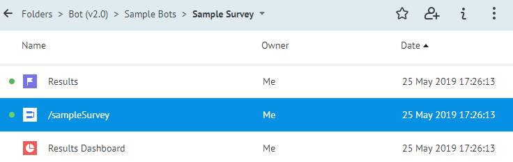

# Базовый функционал Bot Platform 2.0

## Курс валют

Процесс **/exchangeRates (Dynamic Attachment)** находится в папке **Folders > Bot (v2.0) > Sample Bots**.

При нажатии на кнопку **Курс валют** в главном меню, отображается карусель с текущим курсом Доллара США по отношению к другим валютам.

## Смена языка общения

Процесс **/changeLanguage** находится в папке **Folders > Bot (v2.0) > Sample Bots**.
Бот предлагает пользователю выбрать язык общения из трёх вариантов: **en**, **ru** и **ua**. Выбранное значение сохраняется в диаграмме состояний **User Profile** и применяется для локализации текстов и приложений в боте.

## Стандартный опрос

Процесс **/sampleSurvey** в папке **Folders > Bot (v2.0) > Sample Bots > Sample Survey**.

Бот предлагает оценить себя вопросом **“Вам нравится этот бот?”** с вариантами ответа **"Да"** и **"Нет"**.

Результаты опроса копируются в диаграмму состояний **Results**, в которой узлы - это [метрики дашборда](https://doc.corezoid.com/ru/interface/dashboard.html#настройка-чарта) **Results Dashboard**. Диаграмма состояний и дашборд размещены в одной папке с процессом опроса.

## Подключение оператора

Подключение оператора и маршрутизация сообщений из мессенджеров в операторский чат Sender осуществляется с помощью узла **Sender Action** со следующими настройками: **Actions > Category: "Widgets"** + **Robot: "Send Message For Bot Platform"**

Для получения ответов от операторов используется Процесс **Sender Receiver**, который находится в папке **Folders > Bot (v2.0) > Messengers > Sender**. На этапе создания Bot Platform этот Процесс автоматически привязывается к событию Sender **"Получение сообщений от бот платформы"**.

Операторы в Sender рассмотрены в главе [Создание новой компании в Sender](get-started.md#шаг-2.-создание-компании-в-sender).

## Опрос NPS

Процесс **/nps** в папке **Folders > Bot (v2.0) > Messengers > Sender > Chat > NPS**. 

Этот Процесс используется для оценки чата с оператором. Автоматически после завершения чата с оператором бот задает пользователю вопрос **“Диалог был завершен. Уточните, пожалуйста, Ваш вопрос был решен?”** Выбранная пользователем оценка передается в [аналитику](https://doc.sender.mobi/adm_panel_analytics.html#диалоги) Sender. Так же, как и в [стандартном опросе](#стандартный-опрос) предусмотрена диаграмма состояний и дашборд для статистики.

Следующий раздел: [Объекты папки Bot Platform 2.0](components.md)