# Компоненты Bot Platform 2.0


Логика процесса **Receiver**:

-  Принимает события (отправка сообщений, файлов, клики по кнопкам, переходы по ссылкам и др.) от пользователей.
- Приводит полученные данные к единому стандартному формату:
	- `channel` - канал, из которого пришло сообщение. Доступные варианты:  telegram, facebook, viber.
	- `chat_id` - идентификатор чата, пользователя.
	- `event` - тип события
	- `message` - объект с информацией о сообщении
- Передает данные в [процесс Main](#процесс-main).
    

> Обратите внимание!

Если Вы хотите к уже существующей Bot Platform подвязать другого бота, необходимо вручную подключить его webhook к соответствующему процессу **Receiver**.

1. Нажмите на соответствующий Процесс **{{Название мессенджера}} Receiver** и затем нажмите кнопку **View details**.
   
    
   
2. В открывшейся слева области **{{Название мессенджера}} Receiver** перейдите на вкладку **Webhook**.

    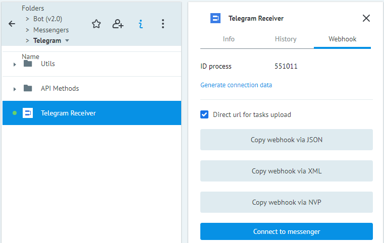

3. Нажмите кнопку **Connect to messenger**. Появится диалоговое окно **Connect to messenger**.

    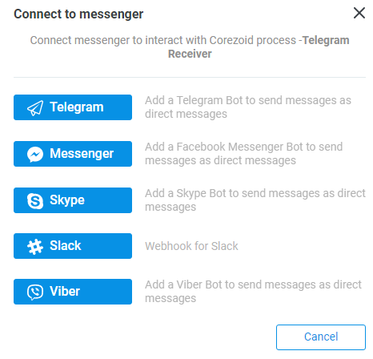

4. Нажмите на кнопку _**необходимого мессенджера**_. В диалоговом окне появится поле ввода.

    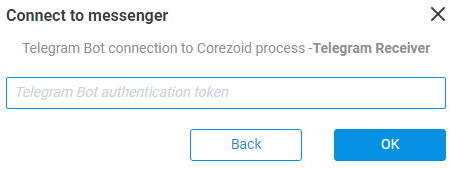 

5. Укажите в этом поле **token** доступа к новому боту и нажмите **ОК**.

6. Актуализируйте token в [диаграмме Tokens](#tokens). **REF** Заявки должен называться **token**. 

  
Нажмите кнопку **Connect to messenger**, выберите мессенджер и укажите новый токен для подключения webhook к процессу. Также необходимо обязательно актуализировать токены в [диаграмме состояний Tokens](#tokens). `REF` заявки должен называться **token**.

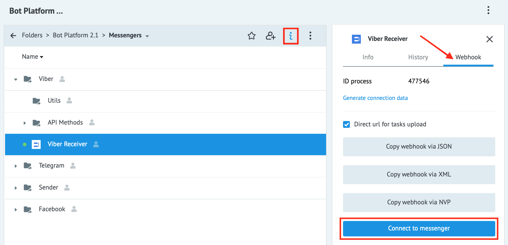

## Процесс Main

Процесс **Main** получает на вход стандартный набор данных из мессенджеров и выполняет первичную бизнес-логику бота перед началом маршрутизации заявок по подпроцессам.

**Input JSON Example**

    {
	    "channel": "viber",
	    "chat_id": "12312321",
	    "event": "message",
	    "message": {
	    "type": "text",
	    "text": "Lorem ipsum..."
		}
    }

#### Описание параметров процесса Main
|Parameter|Type|Required|Description|
|---|---|---|---|
| channel  | string  | +  |  Название мессенджера, из которого обратился пользователя. |
|  chat_id |  string | +  | Уникальный идентификатор пользователя в мессенджере.  |
|  event | string  |  + | Тип события. Доступные значения: start, context, message, command  |
| message  |  object | +  |  Объект сообщения |
| first_name  | string  | -  | Имя пользователя, которое было указано при регистрации в мессенджере. |
|last_name  | string  |  - |  Фамилия пользователя, которая было указано при регистрации в мессенджере. |
| gender  | string  | -  | Пол, который пользователь указал при регистрации в мессенджере   |
|  user_picture |  string | -  |Ссылка на аватар пользователя|
|  country |  string | -  | Страна, в которой находится пользователь. Определяется автоматически мессенджером. |
| language  |  string |  - |  Язык устройства пользователя |
| timezone  |  string |  - | Временная зона  |
| context  |  string | -  | Данные, которые передаются с событием `context`  |

  

### Описание типов event
|Event|Description|
|---|---|
| start   | Инициируется при первом подключении пользователя к боту. В Viber передается при каждом открытии диалога. |
| context | Инициируется при наличии контекста во входящем сообщении от мессенджера. Контекст - дополнительные параметры, которые могут добавляться к ссылке для перехода в бота. Например, запуск команды, реферальная ссылка и т.п. |
| message | Инициируется при отправке сообщения пользователем. |
| command | Инициируется при отправке пользователем текстовое сообщение типа `/commandName.`.|


Пример конструкции для передачи данных через **`context`**:

**Viber** - ```viber://pa?chatURI={{public_account_name}}&context={{params}}```

**Facebook Messenger** - ```http://m.me/{{bot_name}}?ref={{params}}``` 

**Telegram** - ```https://telegram.me/{{bot_name}}?start={{params}}```

## Процесс Router

Процесс, который реализует главную логику обработки событий **Bot platform**. Здесь реализована обработка всех типов [event](#описание-типов-event).

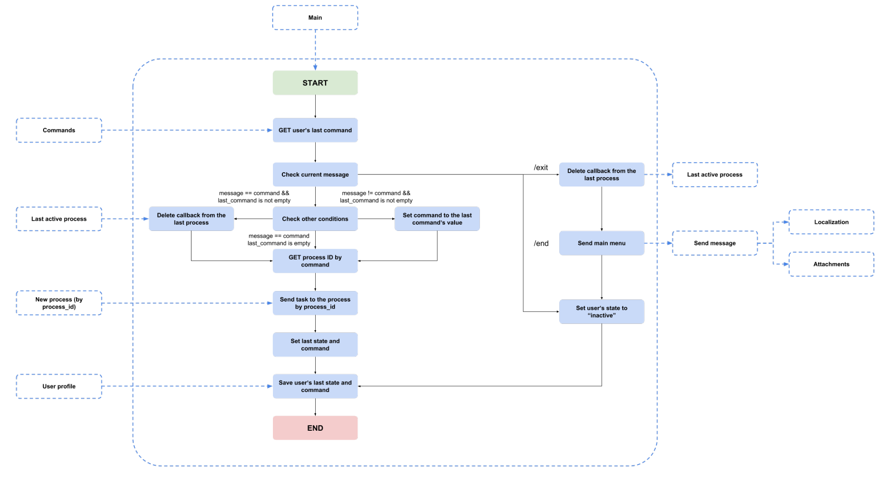

## Процесс Send Message

Этот процесс отвечает за отправку сообщений пользователям. Здесь происходит получение шаблонов текстов и [приложений к сообщениям](#attachments), а также локализация и динамическая подстановка значений в шаблоны.

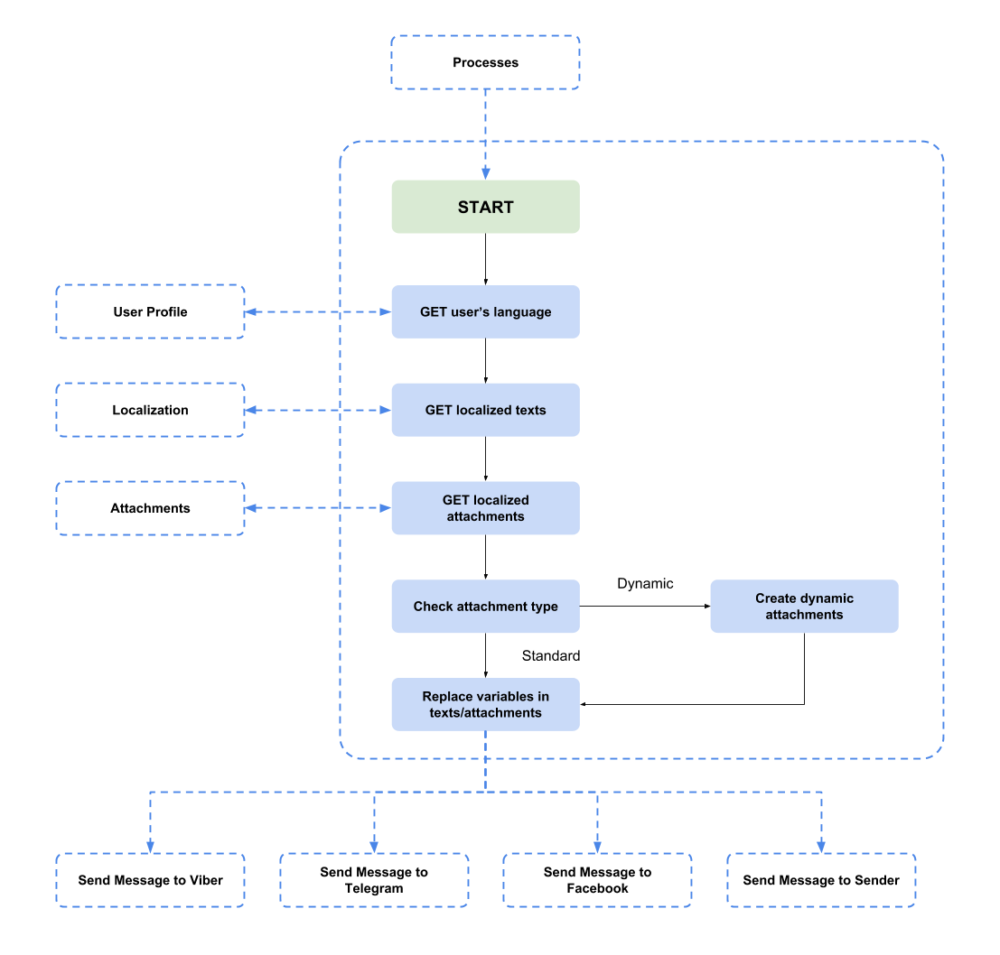


#### Описание параметров процесса Send Message
| Parameter     | Type    | Required                                 | Description |
|---|---|---|---|
| channel       | string  | +                                        | Название мессенджера, из которого обратился пользователь.|
| chat_id       | string  | +                                        | Уникальный идентификатор пользователя в мессенджере.|
| text_id       | string  | +                                        | Название объекта с текстом, который будет отправлен пользователю. Тексты хранятся в диаграмме состояний [Localization](#localization).|
| attachment_id | string  | +                                        | Название объекта, который описывает приложение к текстовому сообщению. Приложения хранятся в диаграмме состояний [Attachments](#attachments).|
| items         | array   | + (если используется Dynamic attachment) | Массив объектов, который используется для динамической подстановки параметров в переменные для отображения пользователю в виде карусели или клавиатуры.|
| currentPage   | integer | + (если используется Dynamic attachment) | Каждый мессенджер имеет ограничение по кол-ву отображаемых элементов в клавиатуре и карусели. Если кол-во элементов в массиве `items` больше максимально допустимого кол-ва отображаемых элементов, массив разбивается на страницы (пагинация). По умолчанию, стартовый номер страницы равен `1`.|

  

**Input JSON Example**

    {
    	"channel": "viber",
    	"chat_id": "12345...",
    	"text_id": "main_text",
    	"attachment_id": "main_keyboard"
    }

  

**Input JSON Example (Dynamic attachment)**

    {
        "channel": "viber",
        "chat_id": "12345...",
        "text_id": "exchange_rates",
        "attachment_id": "carousel_pattern",
        "items": [{
                "name": "AED",
                "value": 4.283634
            },
            {
                "name": "AFN",
                "value": 85.711652
            },
            {
                "name": "ALL",
                "value": 126.118624
            },
            ...
            "currentPage": 1
        }


## Папка Configs

В Bot Platform 2.0 предусмотрены диаграммы состояний, отвечающие за хранение данных:

-   **Attachments** - шаблоны приложений к сообщениям (кнопки, клавиатуры, “карусели”, списки), описанные в формате JSON.
-   **Commands** - соответствие (связка) названий команд и ID процессов.
-   **Localization** - тексты локализации контента.
-   **Tokens** - токены доступа к ботам в мессенджерах (Viber, Telegram, Facebook Messenger).
-   **User Profile** - данные пользователей бота.  
      
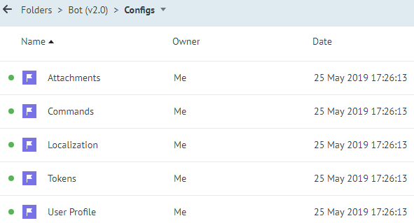
    
Процессы **Bot Platform** взаимодействуют с диаграммами состояния с помощью [динамической конструкции](https://doc.corezoid.com/ru/interface/functions/getParamFromApp.html) для получения данных.


### Attachments

Мессенджеры поддерживают отправку не только текстовых сообщений, но и различных приложений к ним: кнопки, клавиатуры, карусели, списки и др.

Диаграмма состояний **Attachments** содержит все объекты, описывающие приложения к текстовым сообщениям. При добавлении приложения в диаграмму состояний, мы рекомендуем указывать название [референса заявки](https://doc.corezoid.com/ru/interface/tasks/) в соответствии с названием целевого действия, для которого будет использоваться данное приложение. Например, `mainMenu` - для отображения главного меню, `exit` - для кнопки выхода из текущего бизнес-процесса и т.д. 
   
  
Название приложения используется в параметре `attachment_id` при отправке сообщения пользователю.


Процесс **Send message** с помощью [динамической конструкции](https://doc.corezoid.com/ru/interface/functions/getParamFromApp.html):

    {{conv[{{attachment_state_diagram_id}}].ref[{{attachment_id}}]}}
    
получает объект с описанием приложений для всех мессенджеров. Далее в параметр `attachment` сохраняется то приложение, которое соответствует вызываевому мессенджеру и к нему применяются:
-  **Локализация**: все значения ```{{t'<key>}}``` приложения заменяются на тексты из диаграммы состояний [Localization](#localization);
-  **Динамическая подстановка значений**: замена переменных ```{{param}}``` в приложении на значения параметров, которые поступают в процесс **Sender Message** вместе с заявкой.
    
Сформированное сообщение бот отправляет пользователю.


  

#### Пример

По умолчанию диаграмма состояний **Attachments** уже содержит примеры готовых приложений. Например **mainKeyboard - кнопки главного меню**.

Facebook Messenger:

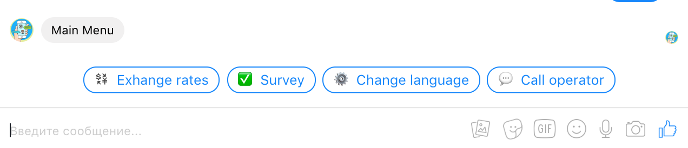


Viber:


Telegram:

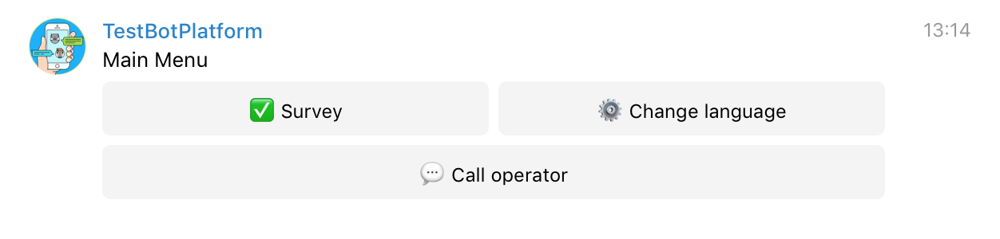


Детальнее с типами сообщений можно ознакомиться непосредственно в документации API мессенджеров:

-   [Viber](https://viber.github.io/docs/api/rest-bot-api/#message-types)
-   [Facebook Messenger](https://developers.facebook.com/docs/messenger-platform/reference/send-api/)
-   [Telegram](https://core.telegram.org/bots/api#message)
    

  

**JSON Example**

**`REF: exit`**

        {
            "telegram": {
                "type": "inline_keyboard",
                "buttons": [
                    [{
                        "text": "🚪 {{t'exit}}",
                        "callback_data": "/exit"
                    }]
                ]
            },
            "viber": {
                "type": "keyboard",
                "buttons": [{
                    "Columns": 6,
                    "Rows": 1,
                    "BgColor": "#F3F3F3",
                    "Text": "🚪 {{t'exit}}",
                    "ActionType": "reply",
                    "ActionBody": "/exit",
                    "TextVAlign": "middle",
                    "TextHAlign": "center",
                    "TextSize": "regular",
                    "Silent": true
                }]
            },
            "facebook": {
                "type": "quick_replies",
                "buttons": [{
                    "content_type": "text",
                    "title": "🚪 {{t'exit}}",
                    "payload": "/exit"
                }]
            }
        }


  
#### Как работает Dynamic attachment?

  

При разработке бота часто возникает необходимость отображать данные однородной структуры. Это может быть каталог продукции, корзина с выбранными товарами, перечень действующих акций и т.д.

  

Процесс **Send message** поддерживает формирование приложений по шаблону для переменного количества элементов.

  

##### Добавление шаблона

Рассмотрим добавление шаблона на примере существующего в **Attachment**  шаблона для отображения курса валют:
  

**JSON Example (Dynamic attachment)**

**`REF: carousel_pattern`**

     {
         "attachment": {
             "facebook": {
                 "type": "carousel",
                 "items": [{
                     "title": "{{value}} {{name}}",
                     "subtitle": "1 USD"
                 }]
             },
             "viber": {
                 "type": "carousel",
                 "carouselRows": "1",
                 "carouselColumns": "6",
                 "items": [{
                     "Columns": 6,
                     "Rows": 1,
                     "ActionType": "reply",
                     "ActionBody": "none",
                     "Text": "1 USD = {{value}} {{name}}",
                     "TextSize": "small",
                     "TextVAlign": "middle",
                     "TextHAlign": "middle",
                     "Silent": true,
                     "BgColor": "#FFFFFF"
                 }]
             }
         }
     }


  

>**Обратите внимание!** Для Telegram шаблон не описан, т.к. Telegram не поддерживает подобный тип сообщений.

  

##### Массив элементов items

  

Для формирования карусели необходимо сформировать массив элементов, из которого значения будут подставлены в шаблон:

    "items": [{
            "title": "4.183966 AED",
            "subtitle": "1 USD"
        },
        {
            "title": "85.890287 AFN",
            "subtitle": "1 USD"
        }
    ]


 
##### Преобразование JSON

При вызове процесса **Send message** необходимо обязательно передать параметры:

-   **attachment_id** = "carousel_pattern"
-   **items** = "items"
-   **currentPage** = 1
-   **disableExitButton** = false|true (флаг отображение кнопки “Выход”)

Все остальные действия с объектом выполняет узел с логикой **Code** "createDynamicAttachment".

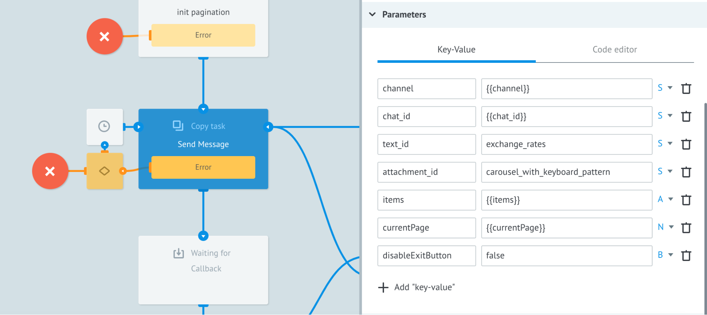

  

Процесс **Send Message** автоматически разбивает весь массив элементов на страницы и добавляет кнопки навигации (пагинация). При разбивке на страницы учитываются ограничения мессенджера согласно документации. При значении параметра **disableExitButton=false** добавляется кнопка **Выход**.


**Преобразованный JSON :**  

     "message": {
         "quick_replies": [{
             "content_type": "text",
             "title": "🚪 Exit",
             "payload": "/exit"
         }],
         "attachment": {
             "type": "template",
             "payload": {
                 "template_type": "generic",
                 "elements": [{
                         "title": "4.183966 AED",
                         "subtitle": "1 USD"
                     },
                     {
                         "title": "85.890287 AFN",
                         "subtitle": "1 USD"
                     }
                 ]
             }
         }
     }


  
  

**Пример отображения**

Facebook Messenger:  
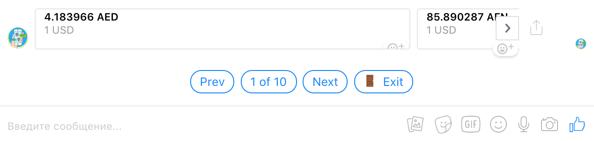
  

Viber:


### Commands

Нажатие на кнопку бота инициирует отправку команды, которая запускает процесс в Corezoid. Чтобы нажатие на кнопку запустило процесс в Corezoid, Вам нужно связать **название команды** с **ID процесса**.

  

**Router** по названию команды [вычитывает](https://doc.corezoid.com/ru/interface/functions/getParamFromApp.html) значение параметра `process_id` заявки из диаграммы **Commands** и запускает процесс.


>**Обратите внимание!** `REF` заявки должен называться так же, как и ваша команда, с учетом введенного регистра. Например: /changeLanguage.

**JSON Example**

  
**`REF: /changeLanguage`**

    {
    	"process_id": "12345"
    }

  

### Localization

Диаграмма состояний Localization хранит все тексты сообщений и тексты приложений сообщений в одной заявке:

**Пример заявки:**

**`REF: localization`**

        {
            "/exit": {
                "en": "Exit",
                "ru": "Выход",
                "ua": "Вихід"
            },
            "mainMenu": {
                "en": "Main Menu",
                "ru": "Главное меню",
                "ua": "Головне меню"
            },
            "no": {
                "en": "No",
                "ru": "Нет",
                "ua": "Ні"
            },
            "yes": {
                "en": "Yes",
                "ru": "Да",
                "ua": "Так"
            },
            ...
        }

  

Такой подход позволяет:

1.  Централизовать управление всеми текстами бота.
2.  Отправлять сообщения, указав лишь **`key`** необходимого текста в объекте **`localization`**
3.  Реализовать локализацию интерфейса бота. По умолчанию тексты указаны на языках **`en`**, **`ru`**, **`ua`**, но добавить можно любой язык мира.


Для отправки текстового сообщения необходимо передать в значение параметра `text_id` название ключа (`key`) из заявки **`localization`**.

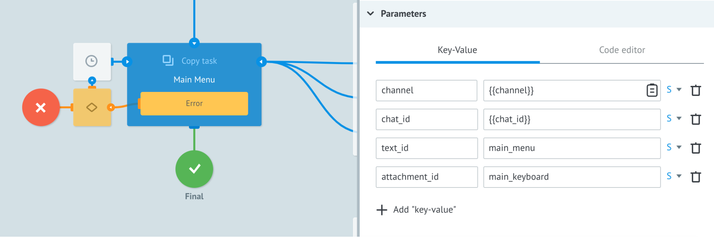

  

**Пример**. Для отправки главного меню в боте необходимо в процесс **Send message** передать параметры:

    {
        "attachment_id": "mainKeyboard",
        "channel": "viber",
        "chat_id": "...",
        "text_id": "mainMenu"
    }


Для использования локализации в приложениях сообщений (attachments), параметры (текст кнопок, заголовки и др.) задаются в формате ```{{t'<key>}}```, где `<key>` - ключ необходимого текста в объекте **localization**.  
  

**Пример**. Для локализации кнопки “Выход”:

    {
        "content_type": "text",
        "title": "🚪 {{t'/exit}}",
        "payload": "/exit"
    }

  

Процесс **Send message** отправляет сообщение на том языке, который хранится в диаграмме состояний **User Profile** для пользователя. По умолчанию - язык **`en`**, эта настройка изменяется на уровне узла Set Parameter под названием **SET default language == EN** в процессе **Send message**.


### Tokens
Эта диаграмма состояний отвечает за хранение токенов доступа к ботам.

**JSON Example**  
  
**`REF: token`**

    {
    	"telegram": "...",
    	"viber": "...",
    	"facebook": "..."
    }


### User Profile

Диаграмма состояний, в которой хранятся данные пользователей бота. Создание пользователя происходит при первом обращении к боту и при дальнейшей активности актуализируются.

Создание/редактирование заявки с данными пользователя происходит из процесса **Main** с указанием референса строго заданного формата: 

**```{{channel}}_{{chat_id}}```**, где:  
 
- `channel` - название мессенджера, из которого обратился клиент;
- `chat_id` - уникальный идентификатор пользователя в мессенджере.  

**Пример**: `viber_2yOPxC85DSpJCJHpYzjqTw=`


Поскольку параметры `channel` и `chat_id` обязательны во всех процессах **Bot platform**, это дает возможность получать и редактировать данные пользователя на любом этапе.

---

Следующий раздел: [Расширение функций бота](add-new-functionality.md)