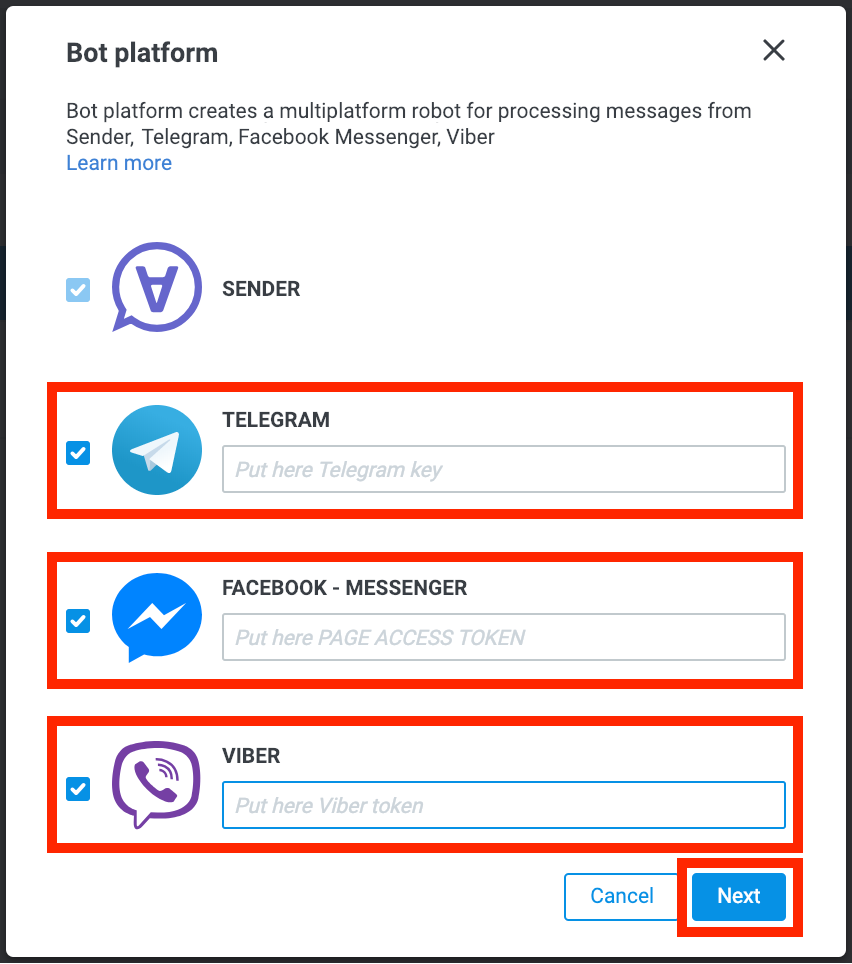
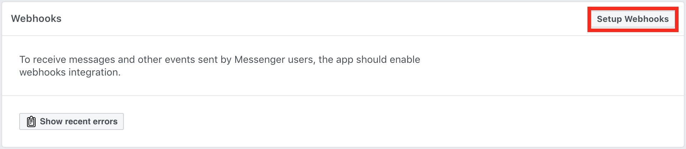

# Как создать бота с помощью Bot Platform 2.0
- [Шаг 1. Регистрация бота в мессенджере](#шаг-1.-регистрация-бота-в-мессенджере.)

  - [Telegram](#telegram)

  - [Viber](#viber)

  - [Facebook Messenger](#facebook-messenger)

- [Шаг 2. Создание компании в Sender](#шаг-2-создание-компании-в-sender)

- [Шаг 3. Подключение бота к Bot Platform](#шаг-3-подключение-бота-к-bot-platform)

## Шаг 1. Регистрация бота в мессенджере

### Telegram

1.  Откройте в Telegram чат с ботом [BotFather](http://telegram.me/BotFather) и нажмите кнопку **Start**.
2.  Отправьте боту команду `/newbot` для создания нового робота.
3.  Укажите Username, которое будет отображаться в контактах и чатах, и адрес.
4.  Если адрес не занят, а имя введено правильно, BotFather пришлет в ответ сообщение с **токеном** — «ключом» для доступа к созданному боту и ссылкой на вашего нового бота.
5.  Сохраните токен для использования на следующем шаге.
    

### Viber

1.  Авторизоваться на [partners.viber.com](https://partners.viber.com/)
2.  Нажать **Create Bot Account**, заполнить информацию о боте.
3.  Получить **токен**.
4.  Сохранить токен для использования на следующем шаге.
    

### Facebook Messenger

1.  Войти в свой аккаунт [facebook](https://www.facebook.com/).
2.  [Создать](https://www.facebook.com/help/104002523024878?helpref=about_content) новую страницу, для которой будет работать бот.
3.  Перейти на специальную [страницу](http://developers.facebook.com/apps) для разработчиков. Если вы впервые находитесь на этой странице, то вас попросят зарегистрироваться в качестве разработчика.
4.  Открыть меню “Мои приложения” и нажать кнопку “Создать приложение”.
5.  Заполните форму:

6.  После создания приложения, в меню слева добавить продукт Messenger нажатием кнопки «Настроить» ("Set up").

7.  Выберите страницу и сгенерируйте токен доступа к странице:
8.  Сохранить токен для использования на следующем шаге.
    

  

## Шаг 2. Создание компании в Sender

При создании **Bot Platform** необходимо выбрать существующую или создать новую компанию в [Sender](https://sender.mobi/ru/). Это необходимо для реализации стандартного функционала подключения оператора в чат в боте.  
  

[Sender](https://sender.mobi/ru/) - это мессенджер, который будет работать в качестве рабочего места операторов Вашей компании. Сообщения пользователей разных мессенджеров обрабатываются в едином интерфейсе.  
  

Для базовой настройки и тестирования перейдите в [административную панель Sender](https://admin.sender.mobi/), [создайте компанию и добавьте в нее операторов](https://doc.sender.mobi/adm_panel_operators.html).

  
После создания новой компании, она будет отображаться в Corezoid.  
  

Если нет учетной записи в Sender, необходимо установить приложение [Sender](https://sender.mobi/ru/) и зарегистрироваться с номером телефона или использовать для авторизации в [web-версии](http://chat.sender.mobi)  [виртуальный номер](https://cosmos.mobi).

## Шаг 3. Подключение бота к Bot Platform

Для создания **Bot Platform**:

-   В левом верхнем углу кликните на выпадающий список под надписью “Company” и выберите созданную на предыдущем шаге компанию Sender.

-   нажмите кнопку **"Create"** и выберите **Bot Platform**.
-   отметьте чекбоксы необходимых мессенджеров и введите ключи, полученные при создании ботов:

-   Нажмите кнопку **"Next"**.  
      
   
Если все токены указаны корректно, начнется процесс подключения мессенджеров. В сообщении об успешном подключении нажмите кнопку для перехода в папку с процессами **Bot platform**.
  

Если был выбран Facebook Messenger, в диалоговом окне будет доступен для копирования webhook (URL для отправки сообщений из Facebook Messenger):

Скопируйте этот URL и завершите настройку приложения Facebook:

 1.  В настройках продукта Facebook в блоке [Webhook](https://en.wikipedia.org/wiki/Webhook) нажмите кнопку “Настройка Webhooks":
 
 2.  В поле “URL обратного вызова” вставьте скопированный URL.
 3.  В поле “Подтвердить маркер” вставьте маркер доступа страницы, полученный ранее.
 4.  Выберите [события](https://developers.facebook.com/docs/messenger-platform/webhook), которые необходимо получать в процесс. Рекомендуется отметить `messages, messaging_postbacks, messaging_optins`. Подтвердите действие.
 5.  После успешного сохранения выберите страницу, на события которой будет подписано приложение и нажмите кнопку “Подписаться”:
 
 

  

Теперь все мессенджеры подключены к процессам и готовы к тестированию.

[Базовый функционал Bot Platform](basic-functionality.md)