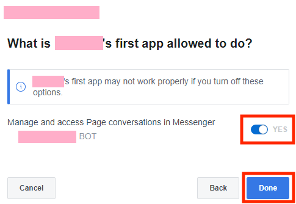
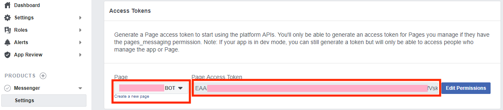
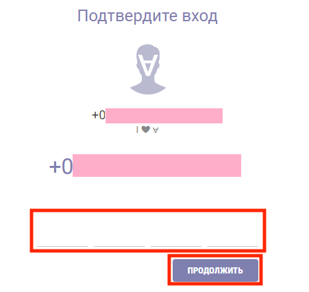
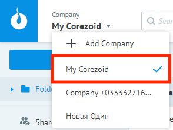
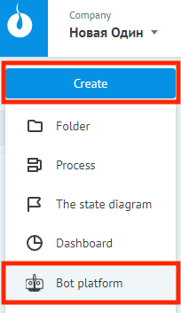
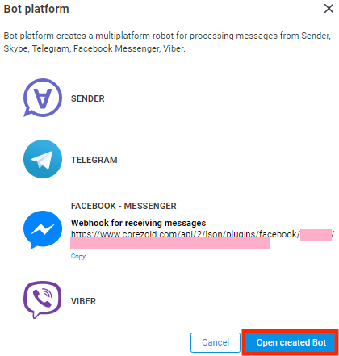
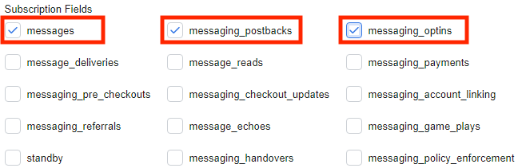

# Как создать бота с помощью Bot Platform 2.0

Бот в Corezoid это отдельный проект, процедура создания которого с нуля очень проста:

- [Шаг 1. Регистрируем бота в мессенджере.](#шаг-1.-регистрация-бота-в-мессенджере.)

  - [Telegram](#telegram)

  - [Viber](#viber)

  - [Facebook Messenger](#facebook-messenger)
  
- [Шаг 2. Создаем компанию в Sender.](#шаг-2-создание-компании-в-sender)

- [Шаг 3. Подключаем бота к Bot Platform](#шаг-3-подключение-бота-к-bot-platform)

К Bot Platform можно подключить как новые, так и ранее созданные боты в мессенджерах

## Шаг 1. Регистрация бота в мессенджере

Доступ к ботам из Bot Platform осуществляется через HTTP API с использованием token идентификации. Ниже описаны инструкции получения token для каждого поддерживаемого мессенджера.

Если Вы хотите подключить к Bot Platform уже имеющийся у Вас бот, можете переходить к следующему этапу.

> Token это ключ доступа к Вашему боту. Каждый, кто владеет им, может управлять Вашим ботом. Хранение и доступ к нему должны соответствовать нормам безопасности чувствительных данных.

### Telegram

1. Откройте чат с ботом [BotFather](http://telegram.me/BotFather) и нажмите кнопку **Start**.
2. Отправьте BotFather команду `/newbot` для создания нового бота. 
3. Следуйте инструкциям BotFather:
    - Дайте Вашему боту имя.
    - Дайте Вашему боту **username**, которое будет отображаться в контактах, чатах. **Username** должен заканчиваться на bot, например **TetrisBot** или **tetris_bot**.
    > Имя бота и username должны быть уникальны в Telegram. 
4. Сохраните полученный token для доступа к Вашему боту.  
    

### Viber

1. Войдите в свой аккаунт на сайте [partners.viber.com](https://partners.viber.com/).
2. Нажмите **Create Bot Account**.
3. Заполните форму для создания бота.
4. Сохраните полученный token для доступа к Вашему боту.
    

### Facebook Messenger

1. Войдите в свой [facebook аккаунт](https://www.facebook.com/).

2. Поскольку каждый бот в Facebook должен быть связан со страницей на Facebook, создайте новую страницу, к которой будет подключен бот, [следуя этим инструкциям](https://www.facebook.com/help/104002523024878?helpref=about_content).

3. Перейдите на [facebook для разработчиков](http://developers.facebook.com/apps). Если Вы впервые здесь, то Вам необходимо будет зарегистрироваться разработчиком.

4. Откройте меню **Мои приложения** и затем нажмите **Создать приложение**.

5. В появившемся диалоговом окне **Create a New App ID**, заполните все поля и затем нажмите **Create App ID** для создания нового приложения.

    

6. Кликните на иконку создаваемого приложения. Вы окажетесь на странице настройки приложения.
    

7. Перейдите в раздел **Dashboard** в левом боковом меню страницы настройки приложения.
8. В области **Add a Product**, найдите Messenger и нажмите под ним **Set up**. Messenger появиться в левом боковом меню под **Products** и Вы окажетесь на странице настройки **Messenger Platform**.

    

9. Перейдите в раздел **Access Tokens**, выберете там нужную страницу в выпадающем списке **Page** и затем нажмите **Edit Permissions**.

    

10. В появившемся новом окне браузера нажмите **Continue as Ваше имя профиля** чтобы подтвердить привязку бота к Вашему Facebook аккаунту.

    

11. Далее установите флажок напротив той **страницы**, к которой будет привязан бот и нажмите **Next**. Эту страницу Вы создавали на втором шаге.

    

12. Установите переключатель напротив **Вашей страницы** в положение **YES** чтобы разрешить боту участвовать в диалогах с клиентами и затем нажмите **Done**.

    

13. Нажмите **Ok**.

    

14. В поле **Page Access Token** появится token для доступа к Вашему боту.

    
    
15. Сохраните полученный token.

## Шаг 2. Создание компании в Sender

Bot Platform позволяет не только автоматизировать коммуникацию, но и подключать к общению оператора, который может предоставить клиентскую поддержку в случае необходимости. Рабочее место оператора организовано с помощью мессенджера [Sender](https://sender.mobi/ru/). 

При создании нового бот-проекта Вам необходимо выбрать существующую или создать новую компанию в Sender. 

В данной главе описано как зарегистрироваться в Sender и создать там новую компанию. Если Вы хотите подключить к Bot Platform уже имеющуюся компанию Sender можете переходить к [следующему этапу](#шаг-3-подключение-бота-к-bot-platform).

Существуют мобильные (Android, iOS) и веб клиентские приложения Sender. Зарегистрироваться и работать как оператор можно через любой вид приложения. В данной главе описана работа с веб приложением.

Для регистрации потребуется предоставить номер мобильного телефона, на который будет зарегистрирована Ваша учетная запись и первая компания. 

Регистрация через мобильное приложение происходит следующим образом:

1. Установите на свой смартфон приложение:
    - [Sender на Google Play для Android](https://play.google.com/store/apps/details?id=mobi.sender).
    - [Sender на App Store для iOS](https://itunes.apple.com/us/app/sender-c/id980844011).
2. Разрешите приложению запрашиваемые права доступа.
3. Укажите номер мобильного телефона для регистрации.

Регистрация через веб приложение происходит следующим образом:

1. Зайдите на страницу [веб приложения](https://chat.sender.mobi/auth).

    
    
2. Укажите номер мобильного телефона для регистрации и нажмите **ПРОДОЛЖИТЬ**.

    

3. Введите полученный по смс код активации и нажмите **ПРОДОЛЖИТЬ**.

После успешной регистрации в Sender, Вы оказываетесь на главной странице веб приложения.

По умолчанию в Sender создается новая компания, зарегистрированная на номер телефона указанный при регистрации. Для работы с бот-проектом в Corezoid нужно создать новую компанию.

Все последующие процедуры в данной главе подразумевают, что Вы:

1. Создали свою учетную запись в Sender.
2. Перешли на [страницу администратора](https://admin.sender.mobi/).

    

Подключение компании Sender к Corezoid происходит автоматически, если при создании этой компании Вы указали адрес электронной почты, на который зарегистрирована Ваша учетная запись в Corezoid. Таким образом компания, созданная по умолчанию при регистрации в Sender на номер мобильного, не привязана к Corezoid автоматически. 

Создание новой компании в Sender с подключением ее к Corezoid происходит следующим образом:

1. Перейдите в левом боковом меню в раздел **Компании** > **Создать**.

    

2. Заполните обязательные поля **Название** и **Телефон**.

3. В поле **E-mail** укажите адрес электронной почты, на который зарегистрирована Ваша учетная запись в Corezoid.

4. По необходимости заполните другие поля.

5. Нажмите **Создать**. Создалась новая компания в Sender, которая синхронизирована с Corezoid

    

Если по какой-либо причине Вы не можете указать для компании в Sender адрес электронной почты, на который зарегистрирована Ваша учетная запись в Corezoid, то Вы можете попробовать подключить такую компанию к Corezoid при помощи роботов:

1. Перейдите в левом боковом меню раздел **Роботы** > **Роботы**.

    
    
2. Нажмите **Создать**. Появится окно **Новый робот**.

    

3. Заполните обязательное поле ***Название***.

    

4. Если у Вас уже создан бот-проект в Corezoid, Вы можете связать робота с ним указав **ID процесса Corezoid** в поле **ID процесса**.

5. Нажмите **Создать**. Создался новый робот в компании в Sender и эта компания синхронизируется с Corezoid.

    

Sender служит рабочим местом оператора для обработки обращений от клиентов. По умолчанию пользователь создавший новую компанию в Sender сразу становится там единственным Оператором в **Роли Owner**. Для добавления новых операторов, перейдите в левом боковом меню в раздел **Операторы** > **Управление**.

С помощью ролей Вы можете разграничивать доступы в рамках компании Sender между Вашими сотрудниками. Для этого нужно добавить сотрудника как Оператора и установить ему необходимую роль.

1. Убедитесь, что добавляемый сотрудник зарегистрирован в Sender. В противном случае Вы не сможете его добавить в компанию.

2. Нажмите **ДОБАВИТЬ ПОЛЬЗОВАТЕЛЯ**. Появится область **Пригласить пользователя**.

    

3. Укажите номер телефона подключаемого сотрудника в поле **Телефон**.

4. Выберете роль сотрудника в компании Sender в поле **Роль**.

5. Нажмите **ПРИГЛАСИТЬ**. Сотрудник получит уведомление в Sender.

6. Сотрудник должен подтвердить Ваше приглашение. После чего он появится в таблице Операторы, которая находится в разделе **Операторы** > **Управление**.

Более подробную информацию о Sender Вы можете найти в [документации](https://doc.sender.mobi/index.html).

## Шаг 3. Подключение бота к Bot Platform

Создание Bot Platform происходит следующим образом:

1. Перейдите в [админ-панель Corezoid](https://admin.corezoid.com/).

2. В левом верхнем углу нажмите на выпадающий список **Company** и выберите в нем **созданную ранее компанию Sender**. 

    

3. Нажмите **Create** и затем выберите в выпадающем списке **Bot platform**.

    

4. В появившемся диалоговом окне **Bot platform** поставьте флажки напротив мессенджеров, которые вы хотите подключить и введите для каждого token.

    

5. Нажмите **Next**. Начнется процесс подключения мессенджеров. Пожалуйста, подождите пока не появится сообщение об успешном завершении этого процесса.

6. Если процесс завершился неуспешно, проверьте корректно ли указан каждый token.

    

7. Если Вы подключаете Facebook Messenger, то необходимо также дополнительно подключить Webhook в админ-панели Facebook. Процедура подключения Faceboook Messenger Weebhook описана далее в этой главе.

8. Нажмите **Open created Bot**. Вы оказались в папке с процессами **Bot platform 2.0**. Детальное описание этой папки в главе [Объекты папки Bot Platform 2.0](components.md).

    

Процедура подключения Webhook для Facebook Messenger выполняется вручную (для других мессенджеров она происходит автоматически) следующим образом:

1. Перейдите на страницу своего Facebook приложения на портале [facebook для разработчиков](http://developers.facebook.com/apps). 
2. Скопируйте token доступа к этому приложению как описано в шагах 12-13 [процедуры создания нового бота для Facebook Messenger](#facebook-messenger).
3. В левом боковом меню перейдите в подраздел **Settings** раздела **Messenger** и нажмите **Subscribe to Events**. 

    
    
4. Вставьте скопированный token в поле **Verify Token** появившегося диалогового окна **New Page Subscription**.

    

5. Перейдите в диалоговое окно **Bot Platform** на Corezoid и нажмите **Copy** под Webhook URL для Facebook Messenger.

    

6. Перейдите в диалоговое окно **New Page Subscription** на Facebook и вставьте скопированный Webhook URL в поле **Callback URL**.

7. Отметьте флажками [события](https://developers.facebook.com/docs/messenger-platform/webhook), которые необходимо получать в процесс. Рекомендуется отметить:  `messages, messaging_postbacks и messaging_optins`.

    

8. Нажмите **Verify and Save**. Диалоговое окно должно исчезнуть и выбранные события отобразиться в разделе **Webhooks**. Также появится выпадающий список **Select a Page**.

    

9. Выберете в этом списке **страницу Вашего приложения**, на события которой будет подписано приложение. Напротив него справа должна появится кнопка **Subscribe**.

     

10. Нажмите **Subscribe**. 

    

Webhook для Facebook Messenger подключен.

Теперь все мессенджеры подключены к процессам и готовы к тестированию. 

Откройте Вашего бота в месседжере и перейдите к следующему разделу: [Базовый функционал Bot Platform](basic-functionality.md)
