# Brightpearl & Shopify

On-line обновление сроков доставки товаров на сайте по факту изменения их наличия на складах.

##Что нужно для запуска

* копия [папки с процессами](https://admin.corezoid.com/folder/conv/55612)

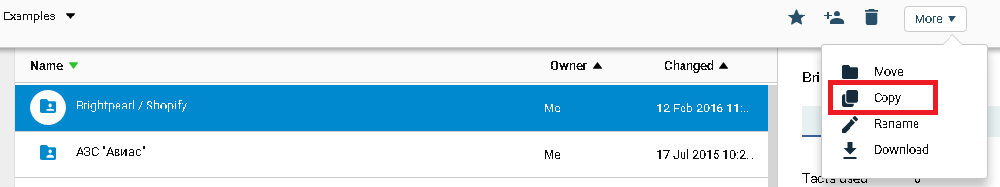

* склады с товарами на [brightpearl.com](https://www.brightpearl.com/)
* данные аккаунта [brightpearl.com](https://www.brightpearl.com/):
 * brightpearl-app-ref,
 * brightpearl-staff-token,
 * account
* данные приложения на [shopify.com](https://www.shopify.com/)
 * api_key
 * password
 * hostname


##Как это работает

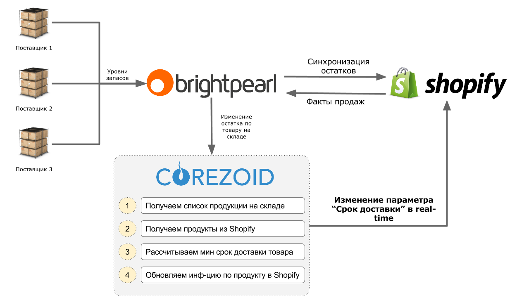

**[Инструкция по интеграции с 1С](#1c)**

##Что нужно знать о процессах

* в процессе, для примера,  предполагается, что со склада №2 возможна экспресс-доставка

* во избежание повышенной нагрузки на API запросы к Brightpearl и Shopify осуществляются в порядке очереди заявок, которая реализована через Логику QUEUE и Логику GET TASK. Согласно документации для Brightpearl нормой является 3 запроса в 1 секунду, для Shopify - 2 запроса в 1 секунду


##Запуск

**1)**  В очередь запросов к API Вrightpearl добавьте свои ключи и имя аккаунта brightpearl

Путь для добавления:

`Папка “Brightpearl“ - Процесс “QUEUE” - узел “Copy”`

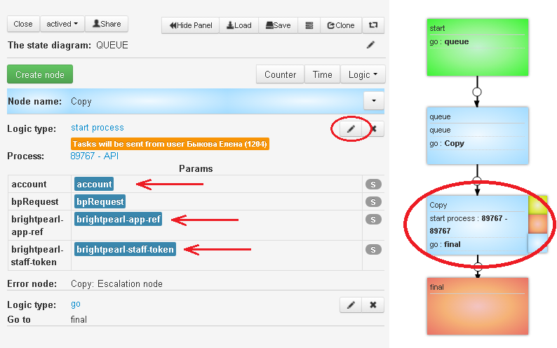

**2)**  В очередь запросов к API Shopify добавьте свои имя аккаунта shopify, ключи shopify и ключи brightpearl, где это необходимо.

Путь для добавления:

`Папка “Shopify.“ - Процесс “QUEUE” - узлы “Copy GET”, “Copy PUT_METAFIELD”, “Copy PUT_PRODUCT”, “Copy PUT_VARIANT”`

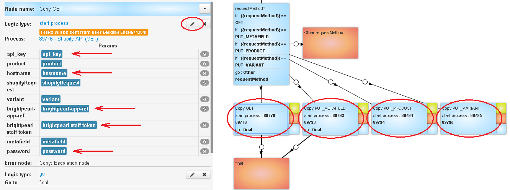

**3)**  Создайте webhook об изменении товара в Вrightpearl.

Плучите URL для загрузки заявок в главный процесс.

Для этого подсветите главный процесс и скопируйте его Direct upload.


Перейдите в папку “Вrightpearl” в процесс “Webhook create” режим “dashboard” и нажмите кнопку Add task - добавить заявку.

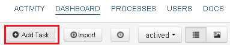

В появившемся окне укажите Вrightpearl обязательные параметры:

* account - имя аккаунта
* direct_upload - URL для загрузки заявок в главный процесс
* brightpearl-app-ref
* brightpearl-staff-token

После того как все параметры указаны, нажмите кнопку Send task

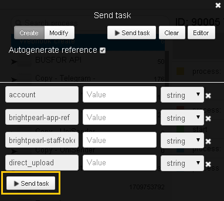

Перейдите в архив зявки узла “final” (Tasks archive).
В значении параметра "response" будет id созданного webhook`а
```
{
	"response": 1
}
```

**4)** Запустите процессы получения заявок для запросов к API.

Для двух процессов “Get task for API”  в папке “Вrightpearl” и “Shopify” выполните следующие одинаковые действия:

* Перейдите в режим “dashboard” и нажмите кнопку Add task - добавить заявку


* Нажмите кнопку Send task для отправки пустой заявки

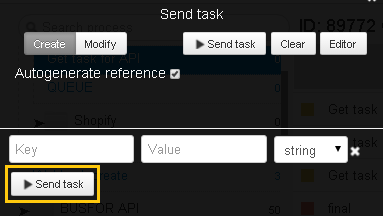


## Интеграция с 1С {#1c}

Обновление типовой конфигурации для получени изменений из любой записи справочника `"Номенклатура"` и
отправки соответсвующих событий в процесс на [Corezoid.com](https://www.corezoid.com/).


###События
- Приходная накладная (поступление товаров и услуг)
- Расходная накладная (реализация товаров и услуг)
- Списание
- Возврат от покупателя
- Возврат поставщику


###Для обновления конфигурации

**1.** Сделайте резервную копию базы данных.

**2.** Скачайте [плагин](https://github.com/corezoid/1c-plugin/raw/master/1Cv8_CorezoidAdd_v1.2.cf) в любое удобное место.

**3.** Откройте конфигуратор с правами администратора.

**4.** Проверьте на чьей стороне находится поддрежка конфигурации по наличию или отсутвию замочка напротив ее названия.

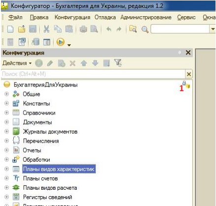

Если замочек отсутсвует, пропустите этот пункт.

Если замочек присутсвует, конфигурация находится на поддержке у поставщика (франчайзинговой фирмы 1С) - включите разрешение ее редактирования с сохранением поддержки в меню `Конфигурация – Поддержка – Настройка поддержки`

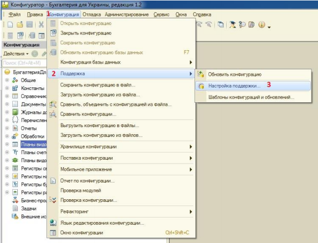


**5.** В открывшемся окне нажмите `«Включить возможность изменения»`.

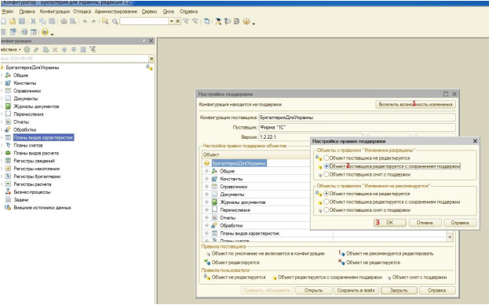

**6.** Сохраните изменения в конфигурации - `F7`.

**7.** Выполните сравнение и объединение с конфигурацией для интеграции `1Cv8_CorezoidAdd_v1.2.cf`.

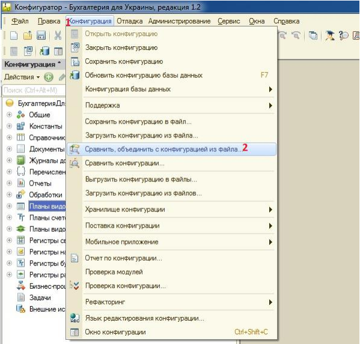

**8.** Проверьте, чтобы при сравнении/объединении остались **ТОЛЬКО** три галочки – `«Общие модули»`, `«Подписки на события»` и `«Хранилища настроек»`.

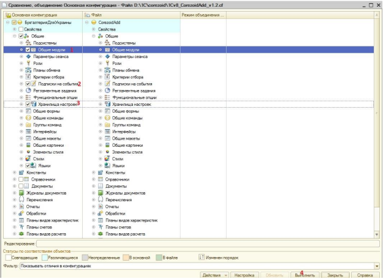

**9.** Сохраните изменения и конфигурацию:
`Выполнить - соглашаемся со всеми вопросами - F7`

На время сохранения понадобится завершить работу всех пользователей.

**10.** Запустите 1С с правами администратора.

**11.** Если 1С обычная (бух., упп), то при первом запуске под администратором откройте входящую в состав пакета
обработку `«ЗаполнитьНастройкиОбменаCorezoid_обычн»`.

Если 1С с web-интерфейсом (управление
небольшой фирмой), то обработку `«ЗаполнитьНастройкиОбменаCorezoid_вэб»`.


**12.** В открывшейся форме укажите тип цен и URL для загрузки заявок в процесс на [Corezoid.com](https://www.corezoid.com/).

Далее «Выполнить» или «Сохранить» (для вэб приложения).

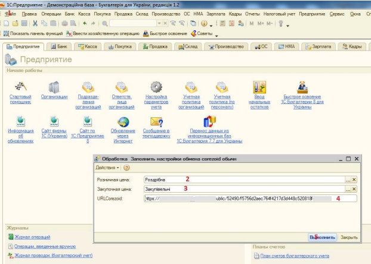

Чтобы получить URL для загрузки заявок, выберите нужный процесс и скопируйте его Direct upload.


Изменения в конфигурации начнут работать сразу же после запуска 1С - дополнительной настройки не требуется.

---
### Есть вопросы?

Посмотрите ответы или оставьте свой вопрос в [FAQ](https://www.corezoid.com/ru/faq).

