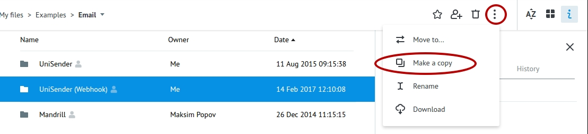
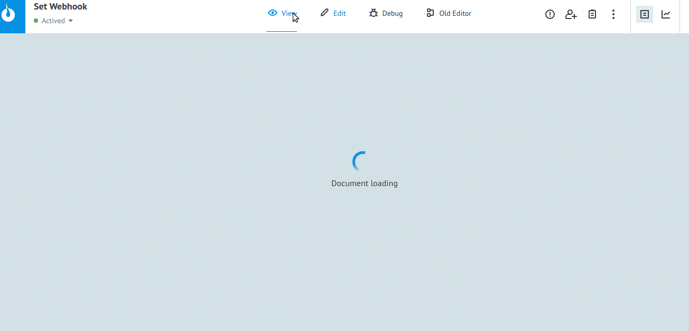
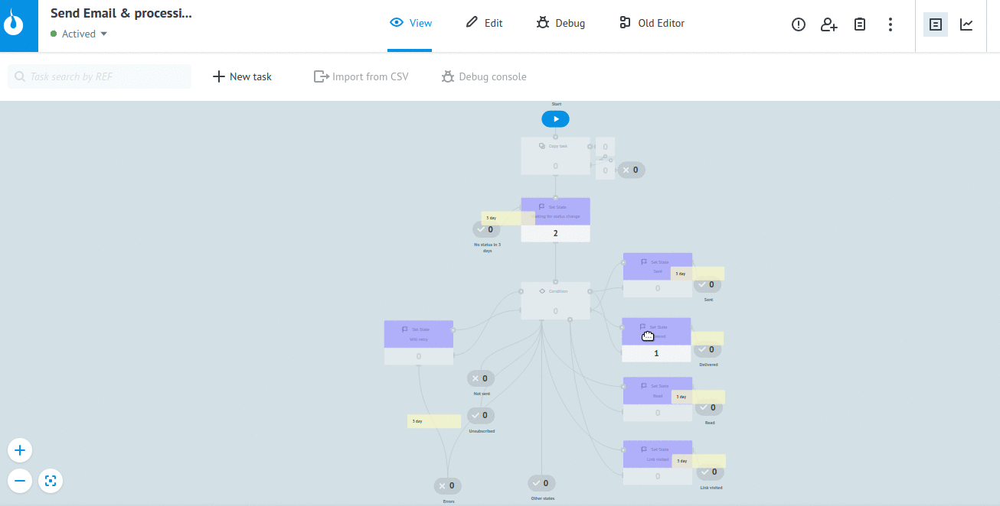

# Email (webhook)

Клонируйте [папку "UniSender (Webhook)"](https://admin.corezoid.com/folder/conv/2391) в свое окружение

## Описание процессов в папке

[**Send Email & processing**](https://admin.corezoid.com/editor/123317/204839)

Это главный процесс, который инициирует отправку сообщений и распределяет их по статусам согласно отполученным Webhook-ам.

[**Send Email**](https://admin.corezoid.com/editor/123317/204837)

Отправляет email заданному адресату из указанного списка рассылки. В случае, если id списка рассылки (параметр `list_id`) не передан, перед отправкой создает новый список и соотв. подписку адресата.

[**Set Webhook**](https://admin.corezoid.com/editor/123317/204838)

Предназначен для подключения к системе уведомлений о событиях - Webhooks

[**Dashboard**](https://www.corezoid.com/admin/view_dash/78790/123317)

Дашборд финальных состояний отправленных сообщений.

##Подготовка

С помощью [**Set Webhook**](https://admin.corezoid.com/editor/123317/204838) подключите [**Send Email & processing**](https://admin.corezoid.com/editor/123317/204839) к системе уведомлений о событиях - Webhooks. 

Для этого:

* откройте [**Send Email & processing**](https://admin.corezoid.com/editor/123317/204839)
* выберите узел `Waiting for status change`
* скопируйте `URL API callback` для Corezoid

Так вы скопировали URL процесса. Далее:

* откройте [**Set Webhook**](https://admin.corezoid.com/editor/123317/204838)
* Перейдите в режим `View`
* Нажмите `New task`
* Укажите значения входящих параметров **key** (UniSender api_key) и **url** (ранее полученный URL API callback процесса [**Send Email & processing**](https://admin.corezoid.com/editor/123317/204839))
* Нажмите `Add task`

Если параметры указаны верно, заявка перейдет в узел "Success".

## Тестирование 

**1.** Перейдите в режим `View` процесса [**Send Email & processing**](https://admin.corezoid.com/editor/123317/204839)

**2.** Нажмите `New task`

**3.** Укажите значения обязательных входящих параметров:

* **key** - ключ доступа к API UniSender
* **email** - е-mail адрес получателя (для подписки и отправки)
* **FROMemail** - е-mail адрес отправителя
* **FROMname** - имя отправителя
* **subject** - тема письма
* **body** - текст письма в формате HTML

И необязтельных:

* **list_id** - id списка рассылки
* **list_name** - название нового списка для создания
* **name** - имя адресата (для подписки)
* **double_optin** - число от 0 до 3 - есть ли подтверждённое согласие подписчика, и что делать, если превышен лимит подписок. [Подробнее](https://support.unisender.com/index.php?/Knowledgebase/Article/View/57/0/subscribe---podpist-drest-n-odin-ili-neskolko-spiskov-rssylki)

**ВАЖНО!**
E-mail адрес отправителя (**FROMemail**) должен быть проверен UniSender. Для этого нужно: 
- создать вручную хотя бы одно письмо с этим обратным адресом через веб-интерфейс
- нажать на ссылку «отправьте запрос подтверждения» 
- перейти по ссылке из письма

[Подробное описание метода sendEmail](https://www.unisender.com/ru/support/integration/api/sendemail)

**4.** Нажмите `Add task`

Состояния отправленных сообщений будут меняться и переходить в соотв. узлы согласно полученным Webhook-ам от системы уведомлений о событиях.