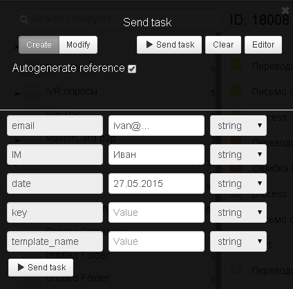

# Поздравление с днем рождения

Для того чтобы организовать email рассылку с поздравлением с Днем рождения [клонируйте шаблон процесса](https://admin.corezoid.com/editor/758/18008).


Создайте на Mandrill шаблон письма с тем именем **template**, который будет использоваться при рассылке поздравительных email.


Для тестирования добавьте в шаблон переменную
```
*|IM|* - имя адресата
```

Перейдите в режим `dashboard` и нажмите кнопку `Add task` - отправить заявку.


В появившемся окне укажите:
*   `key` - ключ доступа к API Mandrill
*   `template_name` - имя шаблона письма на Mandrill
*   `email` - кому отправляем
*   `date` - дата ближайшего дня рождения в формате dd.mm.yyyy
*   `IM` - имя адресата



Далее нажмите кнопку `Send task`.

После отправки письма с поздравлением с Днем рождения процесс расчитает дату рождения через год и заявка "зависнет" в ее ожидании. Когда в следующем году наступит расчитаный день, письмо будет отправлено снова .

Поэтому данный процесс не имеет конечного состояния - заявка не перейдет в красный узел, если не возникло ошибок вызова сервисов.
