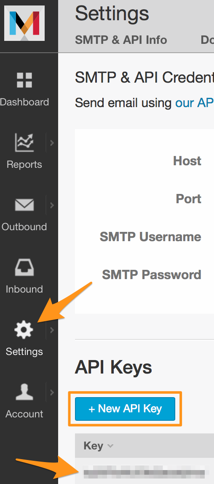
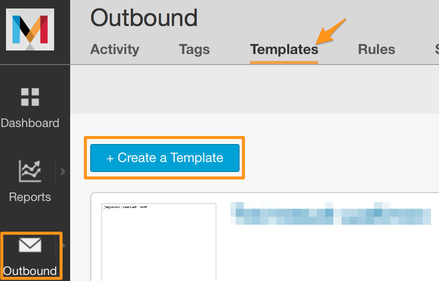
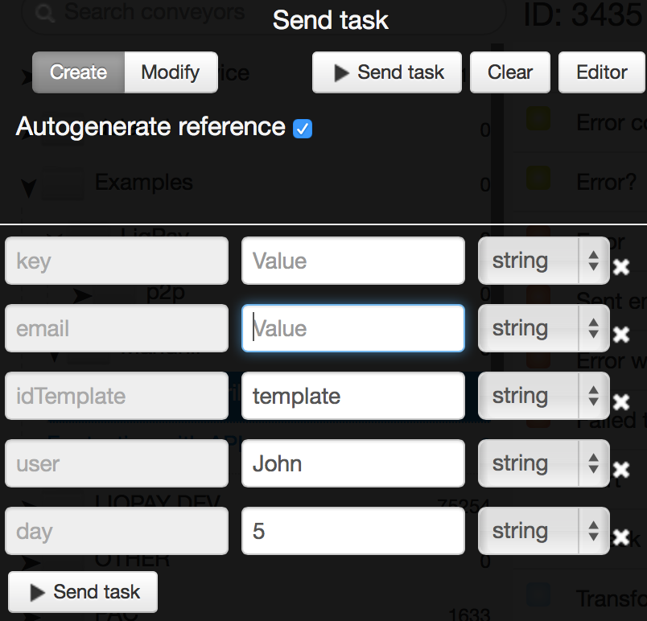
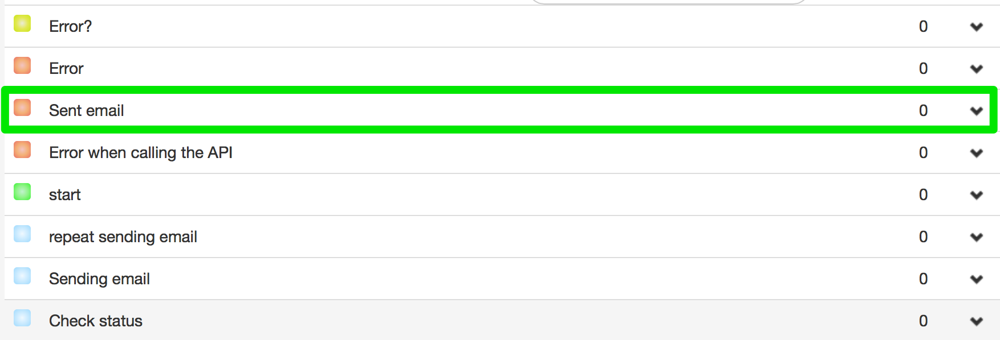
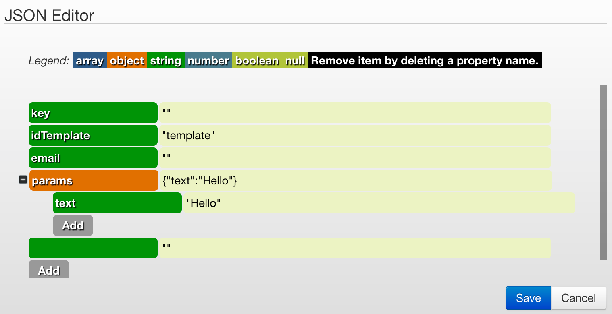

# Mandrill

##Создание шаблона email
[http://mandrill.com](http://mandrill.com) - THE FASTEST WAY TO DELIVER EMAIL.

[Регистрация на сайте](https://mandrill.com/signup/) -  в один клик. Укажите только Ваш email и пароль для аккаунта.

После регистрации, создайте ключ доступа к API mandrill, который будет использоваться в Ваших рассылках.



Создайте шаблон письма с именем **"template"**, который будет использоваться при рассылке email.



Вставьте следующий пример шаблона
```
Welcome *|user|*

today *|day|*
```

##Процесс отправки email

[Клонируйте шаблон процесса (3435)](https://www.corezoid.com/admin/edit_conv/3435) для отправки email через API Mandrill.


Перейдите в режим `dashboard` и нажмите кнопку `Add task` - отправить заявку.


В появившемся окне укажите:

|Имя параметра|Описание параметра|
|--|--|
|key|Ключ доступа к API Mandrill|
|email|Кому отправляем|
|idTemplate|Имя шаблона, в примере это **template**|
|user|Имя пользователя, которое будет вставлено в шаблон|
|day|День, который будет вставлен в шаблон|




После того как параметры заявки указаны, нажмите кнопку `Send task`.

В случае успешной отправки email заявка перейдет в состояние **Sent email**


###Редактирование параметров заявки
Параметры тестовой заявки можно добавлять/изменять в логике API через редактор. Достоточно нажать на кнопку `Editor`:



С полным перечнем доступных параметров API Mandrill Вы можете ознакомится по ссылке - [https://mandrillapp.com/api/docs/messages.JSON.html#method=send-template](https://mandrillapp.com/api/docs/messages.JSON.html#method=send-template).
