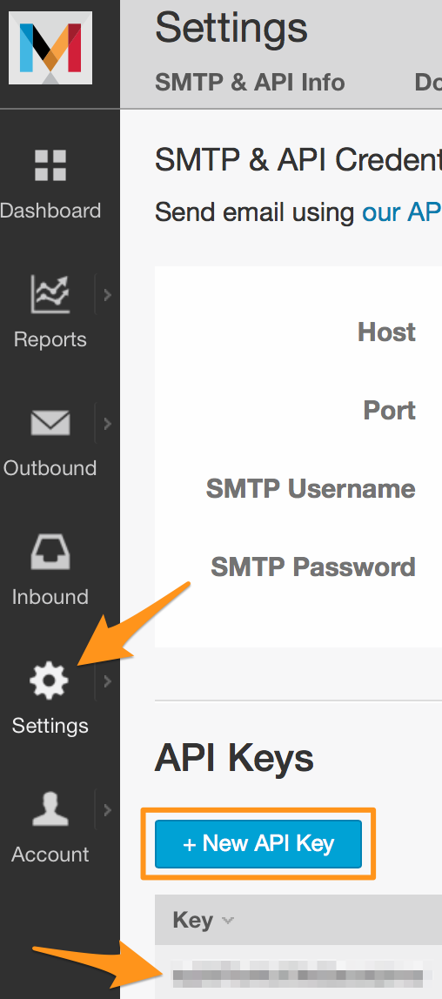
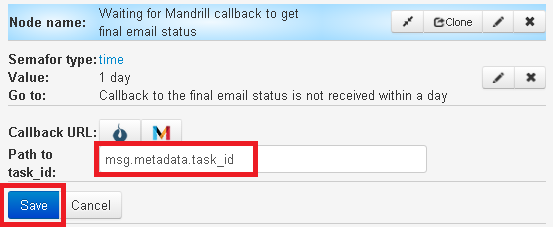
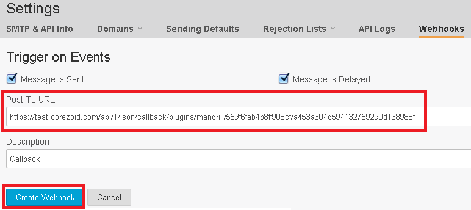
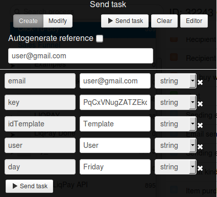

# Расчет показателя Click-To-Buy

Использование этого шаблона дает возможность рассчитать по email рассылке показатель CTB (Click-To-Buy).

##Создание шаблона email для рассылки
[http://mandrill.com](http://mandrill.com) - THE FASTEST WAY TO DELIVER EMAIL.

[Регистрация на сайте](https://mandrill.com/signup/) -  в один клик. Укажите только Ваш email и пароль для аккаунта.

После регистрации, создайте ключ доступа к API mandrill, который будет использоваться в Ваших рассылках.



Создайте шаблон письма с именем **"template"**, который будет использоваться при рассылке email.


Заполните поля в разделе `"Template Defaults"` и для тестирования вставьте следующий текст в шаблон
```
Welcome *|user|*

today *|day|*

Webstore *|link to the website|*
```

##Процесс расчета показателя Click-To-Buy

Клонируйте [папку "Расчет показателя Click-To-Buy"](https://admin.corezoid.com/folder/conv/2391) для отправки email через API Mandrill и расчета показателя Click-To-Buy.


Перейдите в процесс.

**Сгенерируйте ссылку для получения callback от Mandrill**

В узле с Логикой CALLBACK `"Waiting for Mandrill callback to get final email status"`

**1)** перейдите в режим редактирования Логики CALLBACK


**2)** нажмите на кнопку "Create callback url"


**3)** перейдите в режим редактироания Логики CALLBACK и в поле "Path to task id" пропишите следующее значение  "msg.metadata.task_id" и нажмите "Save".




>`msg.metadata.task_id` - это путь к полю в заявке с callback от Mandrill, по которому обновится заявка в процессе.


**4)** нажмите на значок "Mandrill" и ссылка будет скопирована в буфер обмена.


**Добавьте полученную ссылку в настройки Mandrill для получения callback** - на сайте Mandrill перейдите в `"Settings"` - `"Webhooks"` и нажмите кнопку `"+ Add a Webhook"`


Далее:
* отметьте события, по которым Mandrill будет отпарвлять callback в corezoid
* вставьте полученную в corezoid ссылку в поле `Post To URL`
* добавьте имя Webhook-а в поле `Description`
* нажмите кнопку `Create Webhook`



**Обновление заявки**

После рассылки от Mandrill, процесс переходит в узлы, где заявка требует обновления по референсу.

На вход загружаются `email`, при этом обязательное условие - `REF заявки = email клиента`.

Для обновления заявки необходимо отправлять HTTP запросы методом POST на Direct upload URL процесса:


Вход в личный кабинет, узел `"User logged"`:

запрос - `{"ops":[{"type":"modify","obj":"task","ref":"email клиента","conv_id":"id процесса","data":{"state":"login"}}]}`.

Клиент положил товар в корзину, узел `"Item added to the basket"`:

запрос - `{"ops":[{"type":"modify","obj":"task","ref":"email клиента","conv_id":"id процесса","data":{"state":"”basket”"}}]}`.

Клиент оплатил/подтвердил товар, узел `"Item purchased"`:

запрос - `{"ops":[{"type":"modify","obj":"task","ref":"email клиента","conv_id":"id процесса","data":{"state":"”paid”"}}]}`.


Для тестирования шаблона по отправке email через API Mandrill и расчета показателя Click-To-Buy, перейдите в режим `dashboard` и нажмите кнопку `Add task` - добавить заявку.


В появившемся окне укажите:

|Имя параметра|Описание параметра|
|--|--|
|key|Ключ доступа к API Mandrill|
|email|Кому отправляем|
|idTemplate|Имя шаблона, в примере это **template**|
|user|Имя пользователя, которое будет вставлено в шаблон|
|day|День, который будет вставлен в шаблон|




После того как параметры заявки указаны, нажмите кнопку `Send task`.

Результатом будет прохождение заявки по процессу и переход в одно из конечных состояний (узел красного цвета).

Перед попаданием в конечное состояние заявка может "зависать" в узлах с Логикой CALLBACK в ожидании ответа о статусе emailи действиях Клента.


###Редактирование параметров заявки
Параметры тестовой заявки можно добавлять/изменять в Логике API через редактор. Достоточно нажать на кнопку `Editor`:


С полным перечнем доступных параметров API Mandrill Вы можете ознакомится по ссылке - [https://mandrillapp.com/api/docs/messages.JSON.html#method=send-template](https://mandrillapp.com/api/docs/messages.JSON.html#method=send-template).
