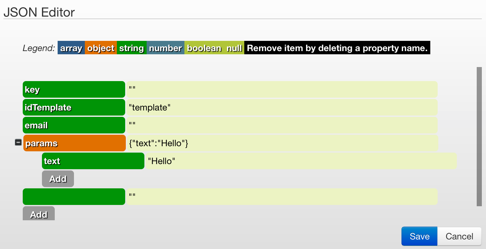

# Mandrill + callback

Как создать шаблон email описано в [п.2.1. Mandrill](mandrill.md).

##Процесс отправки email

[Клонируйте шаблон процесса (27682)](https://www.corezoid.com/admin/edit_conv/27682) для отправки email через API Mandrill.

**Сгенерируйте ссылку для получения callback от Mandrill**

В узле с Логикой CALLBACK `"Waiting for Mandrill callback to get final email status"`

**1)** перейдите в режим редактирования Логики CALLBACK

**2)** нажмите на кнопку "Create callback url"

**3)** перейдите в режим редактироания Логики CALLBACK и в поле "Path to task id" пропишите следующее значение  "msg.metadata.task_id" и нажмите "Save".

>`msg.metadata.task_id` - это путь к полю в заявке с callback от Mandrill, по которому обновится заявка в процессе.

**4)** нажмите на значок "Mandrill" и ссылка будет скопирована в буфер обмена.

**Добавьте полученную ссылку в настройки Mandrill для получения callback** - на сайте Mandrill перейдите в `"Settings"` - `"Webhooks"` и нажмите кнопку `"+ Add a Webhook"`

Далее:
* отметьте события, по которым Mandrill будет отпарвлять callback в corezoid
* вставьте полученную в corezoid ссылку в поле `Post To URL`
* добавьте имя Webhook-а в поле `Description`
* нажмите кнопку `Create Webhook`

Для тестирования шаблона по отправке email через API Mandrill перейдите в режим `dashboard` и нажмите кнопку `Add task` - добавить заявку.

В появившемся окне укажите:

|Имя параметра|Описание параметра|
|--|--|
|key|Ключ доступа к API Mandrill|
|email|Кому отправляем|
|idTemplate|Имя шаблона, в примере это **template**|
|user|Имя пользователя, которое будет вставлено в шаблон|
|day|День, который будет вставлен в шаблон|

После того как параметры заявки указаны, нажмите кнопку `Send task`.

Результатом будет прохождение заявки по процессу и переход в одно из конечных состояний (узел красного цвета).

Перед попаданием в конечное состояние заявка может "зависать" в узлах с Логикой CALLBACK в ожидании ответа от Mandrill о статусе email.

[Инструкция](https://mandrill.zendesk.com/hc/en-us/articles/205583017-Can-I-add-an-automatic-unsubscribe-link-to-Mandrill-emails-), как добавить в письмо ссылку для отказа от рассылки и получать callback с соответсвующим статусом "unsub".

###Редактирование параметров заявки
Параметры тестовой заявки можно добавлять/изменять в Логике API через редактор. Достоточно нажать на кнопку `Editor`:

С полным перечнем доступных параметров API Mandrill Вы можете ознакомится по ссылке - [https://mandrillapp.com/api/docs/messages.JSON.html#method=send-template](https://mandrillapp.com/api/docs/messages.JSON.html#method=send-template).
