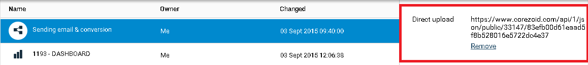

# Расчет эффективности email рассылки

Клонируйте [папку "Sending email & conversion"](https://admin.corezoid.com/folder/conv/758).

В папке размещены шаблонный процесс и дашборд.

Использование процесса дает возможность рассчитать конверсию по email рассылке через Mandrill и вывести ее на дашборд в виде воронки.

А также получить статистику по конечным статусам рассылки.

##**Схема процесса**

##**Как это работает**

После отправки email и получения callback от Mandrill, который фиксирует переход по ссылке из письма, заявка переходит в узел с Логикой CALLBACK, где ожидает обновления.

В процессе ожидается три обновления заявки - последовательно по трем фактам (действиям клиента):
  * вход или регистрация на сайте
  * добавление товара в корзину
  * оплата товара

Если в течение 7 дней после перехода по ссылке из письма заявка обновляется по факту входа или регистрации на сайте, то она переходит в следующий узел, где ждет следующего обновления и т.д.

Если же в течение 7 дней после перехода по ссылке из письма нет обновления заявки, то она переходит в конечный узел, который фиксирует это событие.

##**Чтобы процесс работал:**

**1)** референсом заявок, которые поступают на вход в процесс должен быть email клиента *(это позволит обновлять заявку по единому идентификатору)*.

**2)** в процесс нужно отправлять запросы с типом "modify" (обновление)

* на Direct upload URL процесса

* в формате corezoid:

Вход или регистрация на сайте ("state":"login") -
`{"ops":[{"type":"modify","obj":"task","ref":"{{email}}","conv_id":{{id_процесса}}","data":{"state":"login"}}]}`

Добавление товара в корзину ("state":"basket") -
`{"ops":[{"type":"modify","obj":"task","ref":"{{email}}","conv_id":{{id_процесса}}","data":{"state":"basket"}}]}`

Оплата товара ("state":"paid") -
`{"ops":[{"type":"modify","obj":"task","ref":"{{email}}","conv_id":{{id_процесса}}","data":{"state":"paid"}}]}`

##**Подготовка**

**1)** Создайте шаблон email, как описано в [п.2.1. Mandrill](mandrill.md).

**2)** Подготовьте процесс для получения callback от Mandrill, как описано в [п.2.2. Mandrill + callback](mandrill_v2.md).

