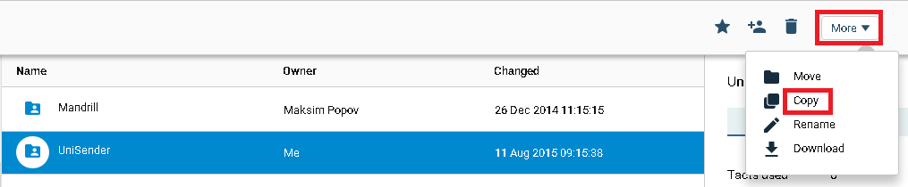
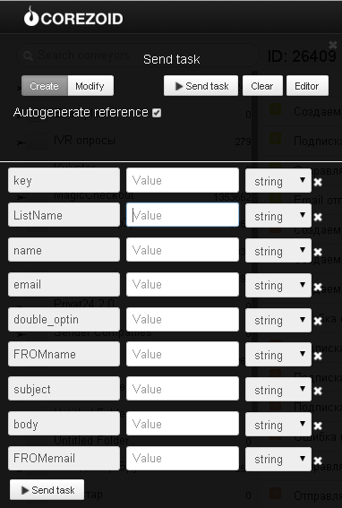

# Email

Клонируйте [папку "UniSender"](https://admin.corezoid.com/folder/conv/2391)

В процессе отправки email через UniSender можно использовать отдельно шаблоны процессов для каждого представленного в папке метода (createList, subscribe, sendEmail, checkEmail) или последовательно вызывать их из главного процесса "Отправка Email через UniSender" с помощью [логики RPC](../../interface/nodes/rpc/README.md).

Для тестирования всех процессов перейдите в режим `dashboard` главного процесса "Отправка Email через UniSender" и нажмите кнопку `Add task` - добавить заявку.

В появившемся окне укажите:
*   `key` - ключ доступа к API UniSender
*   `listname` - название нового списка для создания нового списка
*   `name` - имя адресата для подписки адресата
*   `email` - еmail адрес получателя
*   `FROMemail` - еmail адрес отправителя
*   `FROMname` - имя отправителя
*   `subject` - тема письма
*   `body` - текст письма в формате HTML.
При составлении текста письма обратите внимание на возможности [подстановки строк в письме](https://support.unisender.com/index.php?/Knowledgebase/Article/View/35/0/podstnovk-strok-v-pisme).
*   `double_optin` - число от 0 до 3 для подписки адресата. Есть ли подтверждённое согласие подписчика, и что делать, если превышен лимит подписок. Подробнее по [ссылке](https://support.unisender.com/index.php?/Knowledgebase/Article/View/57/0/subscribe---podpist-drest-n-odin-ili-neskolko-spiskov-rssylki).

После того как параметры заявки указаны, нажмите кнопку `Send task`.

Результатом будет прохождение заявки по процессу и переход в одно из конечных состояний (узел красного цвета).

Если все параметры указаны корректно, то еmail будет отправлен и заявка перейдет в конечное состояние с соответсвующим статусом отправленного еmail.

В случае ошибки - заявка перейдет в конечное состояние с соответсвующим наименованием ошибки.

С полным списком методов UniSender и их описанием Вы можете ознакомиться на [сайте](http://www.unisender.com/ru/features/integration-api/).
