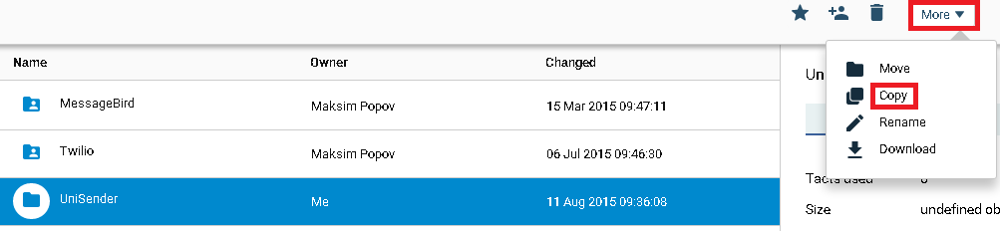
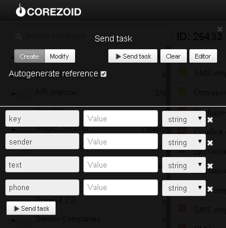

#SMS

Клонируйте [папку "UniSender"](https://admin.corezoid.com/folder/conv/2390)

В процессе отправки SMS через UniSender можно использовать отдельно шаблоны процессов для каждого представленного в папке метода (sendSms, checkSms) или последовательно вызывать их из главного процесса "Отправка SMS через UniSender" с помощью [логики RPC](../../interface/nodes/rpc/README.md).

Для тестирования всех процессов перейдите в режим `dashboard` главного процесса "Отправка SMS через UniSender" и нажмите кнопку `Add task` - добавить заявку.

В появившемся окне укажите:
*   `key` - ключ доступа к API UniSender
*   `sender` - отправитель:либо телефонный номер, либо строка до 11 латинских букв или цифр
*   `text` - текст сообщения, до 1000 символов.
Пример: text=Hello,+it's+a+test+message
*   `phone` - телефон получателя в международном формате с кодом страны (можно опускать ведущий «+»).

После того как параметры заявки указаны, нажмите кнопку `Send task`.

Результатом будет прохождение заявки по процессу и переход в одно из конечных состояний (узел красного цвета).

Если все параметры указаны корректно, то SMS будет отправлено и заявка перейдет в конечное состояние с соответсвующим статусом отправленного SMS.

В случае ошибки - заявка перейдет в конечное состояние с соответсвующим наименованием ошибки.

С полным списком методов UniSender и их описанием Вы можете ознакомиться на [сайте](http://www.unisender.com/ru/features/integration-api/).
