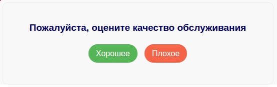
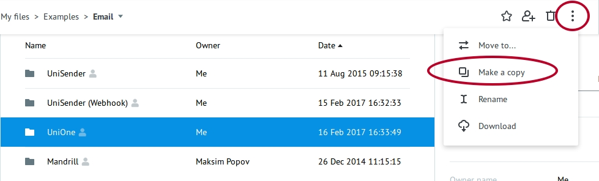
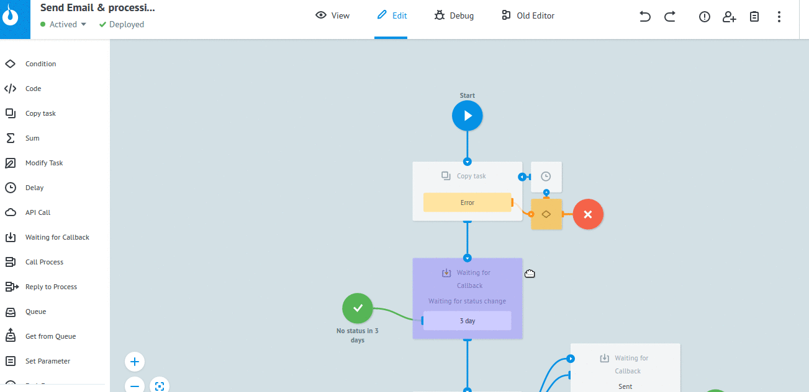
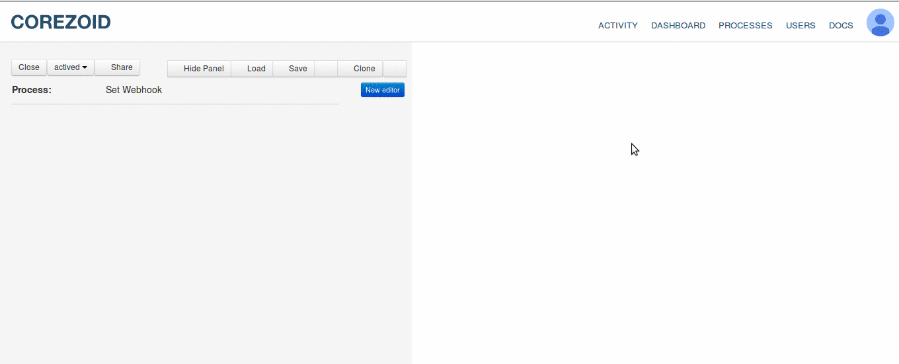
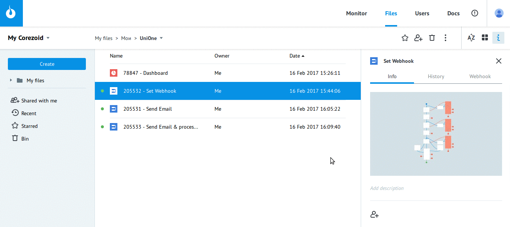
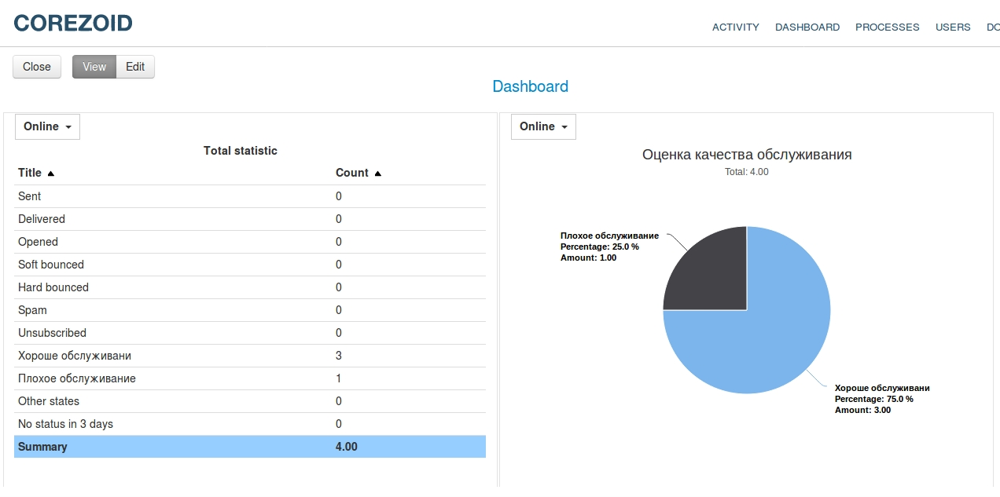

# Email с оценкой качества обслуживания


Представленный пример демонстрирует, как собрать feedback о качестве обслуживания.

Данная задача реализуется с помощью:

* подключения процесса Corezoid к системе уведомлений о событиях UniOne (Webhooks)
* шаблона пиьсма в HTML формате, которое содержит кнопки с переходом по уникальным ссылкам 

Например, 



```
<!DOCTYPE html>
<html lang="en">
<head>
    <meta charset="UTF-8">
    <title></title>
</head>
<body style="margin:0 auto !important; padding:0 !important; font-family:Arial !important; font-size:16px !important; font-family:Arial;color:#01005E; line-height: 22px !important; background: #f8f8f8 !important; display:block !important; width:100%;">

<div class="container" style="text-align:center; width:100%; background: #f8f8f8 !important; margin: 0 auto;">
    <!-- Lead text -->
    <p style="font-size:8px;color:#f8f8f8; opacity: 0;">Оценка качества обслуживания</p>

    <div style="width: 500px; margin: 0 auto; padding: 20px; border: 1px solid #eaeaea; -webkit-border-radius: 10px;-moz-border-radius: 10px;border-radius: 10px;">
        <h3>Пожалуйста, оцените качество обслуживания</h3>

        <div style="margin: 30px 0;">
            <a href="https://corezoid.com" style="text-decoration: none; margin: 0 5px; padding: 10px 15px; background: #56B556; color: #fff; -webkit-border-radius: 100px;-moz-border-radius: 100px;border-radius: 100px;">Хорошее</a>
            <a href="https://doc.corezoid.com" style="text-decoration: none;  margin: 0 5px; padding: 10px 15px; background: #F56349; color: #fff; -webkit-border-radius: 100px;-moz-border-radius: 100px;border-radius: 100px;">Плохое</a>
        </div>
    </div>
</div>

</body>
</html>
```


**Чтобы начать, клонируйте [папку "UniOne (оценка)"](https://admin.corezoid.com/folder/conv/2391) в свое окружение**




## Описание процессов в папке

[**Send Email & processing**](https://admin.corezoid.com/editor/123317/204839)

Это главный процесс, который инициирует отправку сообщений и распределяет их по статусам согласно полученным Webhook-ам.

[**Send Email**](https://admin.corezoid.com/editor/123317/204837)

Отправляет email заданному адресату.

[**Set Webhook**](https://admin.corezoid.com/editor/123317/204838)

Предназначен для подключения к системе уведомлений о событиях - Webhooks

[**Dashboard**](https://www.corezoid.com/admin/view_dash/78790/123317)

Дашборд с общей статистикой и статистикой по качеству обслуживания.


##Подготовка


С помощью [**Set Webhook**](https://admin.corezoid.com/editor/123595/205557) подключите [**Send Email & processing**](https://admin.corezoid.com/editor/123595/205555) к системе уведомлений о событиях - Webhooks. 

Для этого:

* откройте [**Send Email & processing**](https://admin.corezoid.com/editor/123595/205555)
* выберите узел `Waiting for status change`
* скопируйте `URL API callback` для Corezoid



Так вы скопировали URL процесса. Далее:

* откройте [**Set Webhook**](https://admin.corezoid.com/editor/123317/204838)
* Перейдите в режим `View`
* Нажмите `New task`
* Укажите значения входящих параметров 
  * **key** - UniOne api_key
  * **url** - ранее полученный URL API callback процесса [**Send Email & processing**](https://admin.corezoid.com/editor/123595/205555))
  * **login** - логин пользователя в системе UniOne
* Нажмите `Add task`

Если параметры указаны верно, заявка перейдет в узел "Success".




## Тестирование 

**1.** Перейдите в режим `View` процесса [**Send Email & processing**](https://admin.corezoid.com/editor/123317/204839)

**2.** Нажмите `New task`

**3.** Укажите значения входящих параметров:

* **key** - UniOne api_key
* **login** - логин пользователя в системе UniOne
* **to_email** - е-mail адрес получателя 
* **from_email** - е-mail адрес отправителя
* **from_name** - имя отправителя (необязательный параметр)
* **subject** - тема письма
* **html_body** - текст письма в формате HTML

**4.** Нажмите `Add task`



Состояния отправленных сообщений будут меняться и переходить в соотв. узлы согласно полученным Webhook-ам от системы уведомлений о событиях.

На [**Dashboard**](https://www.corezoid.com/admin/view_dash/78790/123317) в режиме on-line доступна общая статистика и статистика по качеству обслуживания



