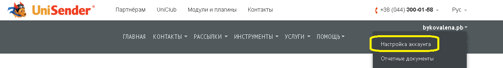
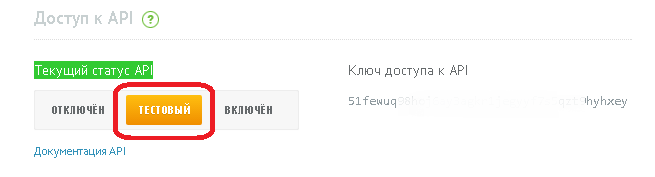

# UniSender

Зарегистрируйтесь на сайте [UniSender](http://www.unisender.com/).

Для получения ключа доступа к API перейдите в раздел "Настройки аккаунта".

На вкладке "Интеграция и API" будет размещен Ваш ключ доступа к API.

Для тестирования API выберите тестовый режим напротив Вашего ключа доступа и нажмите кнопку "Сохранить".

Для отправки сообщений через UniSender на Corezoid Вам доступны уже готовые процессы вызова методов UniSender:

- [createList](https://www.corezoid.com/admin/edit_conv/26415) - создание нового списка рассылки
- [getLists](https://www.corezoid.com/admin/edit_conv/26412) - получить списки рассылки с их кодами
- [subscribe](https://www.corezoid.com/admin/edit_conv/26416) - подписка адресата на один или несколько списков рассылки
- [sendEmail](https://www.corezoid.com/admin/edit_conv/26417) - отправка Еmail
- [checkEmail](https://www.corezoid.com/admin/edit_conv/26418) - проверка статуса доставки Еmail
- [createEmailMessage](https://www.corezoid.com/admin/edit_conv/26411) - создать Еmail для массовой рассылки
- [createCampaign](https://www.corezoid.com/admin/edit_conv/26410) - массовая отправка Еmail или SMS сообщений
- [getCampaignDeliveryStats](https://www.corezoid.com/admin/edit_conv/26414) - получить отчёт о статусах доставки сообщений для заданной рассылки
- [sendSms](https://www.corezoid.com/admin/edit_conv/26435) - отправка SMS
- [checkSms](https://www.corezoid.com/admin/edit_conv/26434) - проверка статуса достаавки SMS

**Как работать с этими методами в Corezoid?**

Вы можете использовать каждый процесс, как отдельно (например, только для проверки статуса доставки email), так и вызывать нужные методы последовательно в одном процессе с помощью [логики RPC](../../interface/nodes/rpc/README.md).

Например, если нужно `создать новый список рассылки` (createList), `подписать адресата на этот список` (subscribe), `отправить ему email` (sendEmail), а потом `проверить статуса его доставки` (checkEmail), то для Вас уже есть готовый процесс ["Отправка Еmail через UniSender"](send_email_unisender.md).

