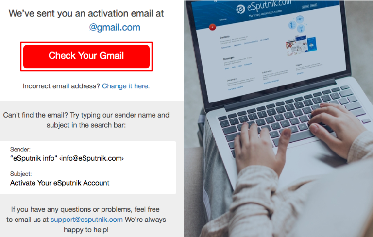
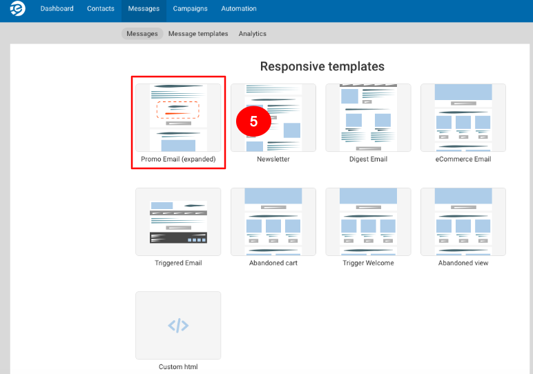
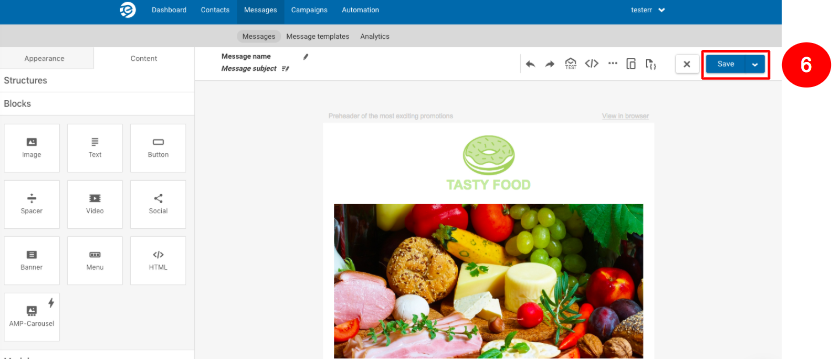
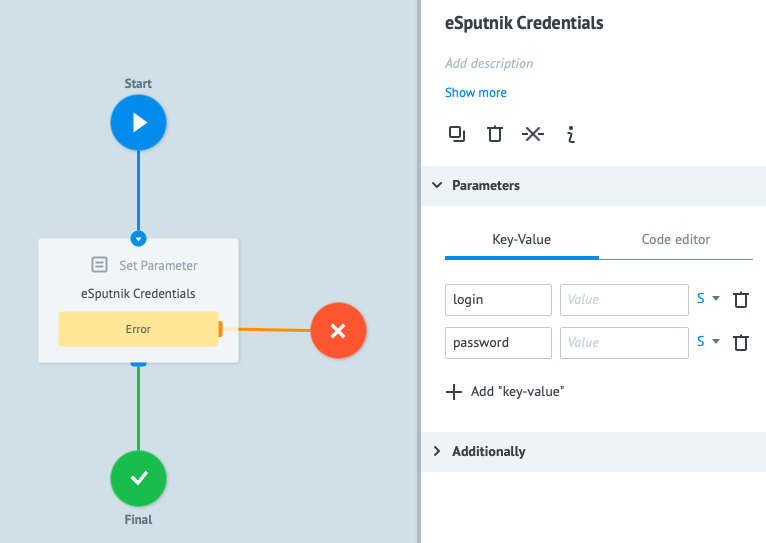
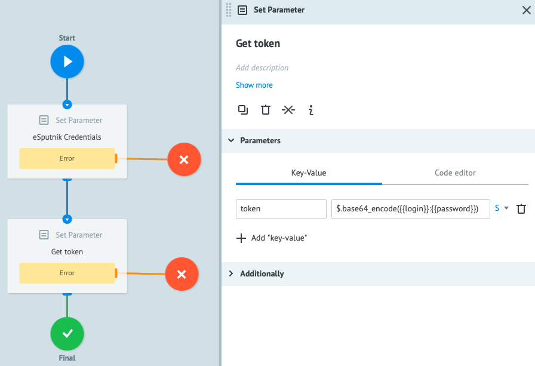
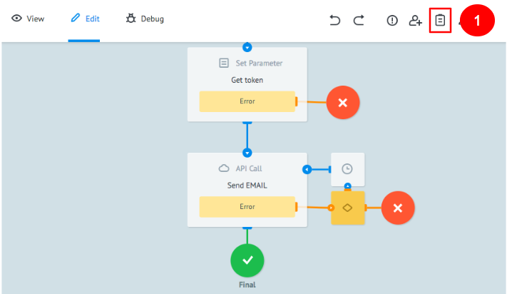
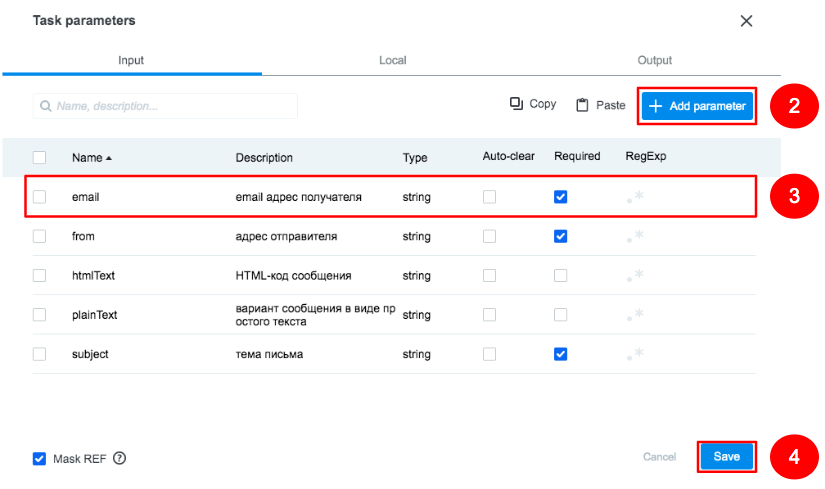
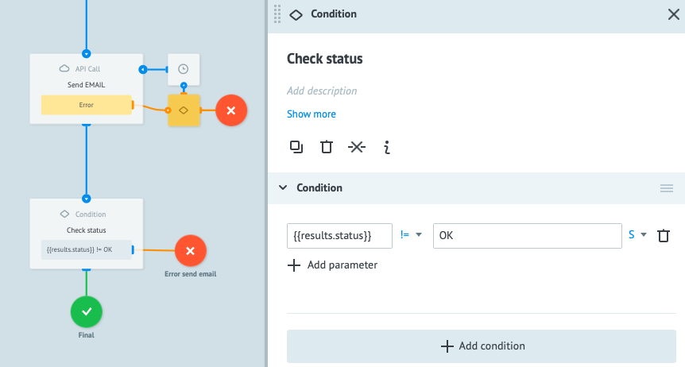
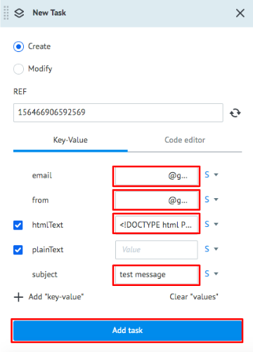

# eSputnik

**eSputnik** - это сервис для запуска email- и SMS-рассылок.

Перед настройкой процесса интеграции с **API eSputnik** рекомендуем изучить [документацию](https://esputnik.com/api/).

В этом туториале Вы научитесь настраивать процесс Сorezoid c вызовом **API eSputnik** для отправки email-сообщений клиенту с последующей проверкой статуса его доставки.

Прежде чем Вы начнете, давайте зарегистрируемся в сервисе **eSputnik**

### Регистрация в сервисе
1. Перейдите на сайт [https://esputnik.com/](https://esputnik.com/) и нажмите кнопку **Sign Up Free**

    
    
2. Заполните форму регистрации указав ваше имя, номер мобильного телефона и email.

    

3. В появившемся окне нажмите кнопку **Check Your Gmail** для подтверждения адреса электронной почты, указанного при регистрации.

    

    3.1. Перейдите в Ваш почтовый ящик, найдите письмо от **eSputnik** и перейдите по ссылке для активации аккаунта.
    
    
    После нажатия кнопки **ACTIVATE** Вы будете переведены на сайт **eSputnik** для заполнения информации о вашей деятельности.
    
    3.2. В появившейся форме заполните персональную информацию и нажмите кнопку **Activate**
    
    
    

4. Следующим шагом необходимо создать шаблон сообщения. Для этого нажмите на пункт **Messages** и в списке выберите **Messages**

    

5. Выберите тип сообщения **Email** и нажмите кнопку **Create Email**

    

6. Для тестирования выберите любой из представленных шаблонов email-сообщения. Мы выберем первый.

    

    6.1. Сохраните предоставленный email-шаблон, нажав кнопку **Save**
    
    

    6.2. Для отправки email-рассылки в одном из параметров требуется внести html-код разработанного email-сообщения, поэтому нажмите на иконку **</>** для просмотра кода

    

    6.3. Cкопируйте в буфер обмена появившийся html-код.
    
    Вы успешно прошли регистрацию в **eSputnik** и создали тестовое email-сообщение. Следующим этапом необходимо настроить процесс Corezoid для вызова **API eSputnik**
    
### Процесс для отправки email-сообщения через eSputnik

1. Создайте папку **eSputnik**

    

2. Зайдите в папку **eSputnik** и создайте процесс **Send Email**, который будет отправлять email-сообщение пользователю и проверять статус его доставки.

    

3. Ключом для вызова **API eSputnik** является логин и пароль входа в аккаунт. Чтобы при каждом вызове **API** не вводить логин и пароль, добавьте узел **Set Parameter** и назовите его **eSputnik Credentials**.
    
    
    
    3.1. После того, как Вы добавили узел, кликните на него и добавьте параметры в разделе **Parameters**:
    - `login` - логин входа на [esputnik.com](https://esputnik.com)
    - `password` - пароль входа на [esputnik.com](https://esputnik.com)
    

    3.2. Для вызова **API eSputnik** мы будем использовать [token](https://esputnik.com/api/example_v1_auth_token_POST.html). Он формируется при помощи `login` и `password` закодированного в [Base64](https://ru.wikipedia.org/wiki/Base64).
    Для этого после узла **eSputnik Credentials** добавьте узел **Set Parameter** c именем **Get token**. Добавьте параметр в разделе **Parameters**:
    ```    
    {
        "token": "$.base64_encode({{login}}:{{password}})"
    }
    ```
    
    3.3.  После узла **Get token** добавьте узел **API Call**, который будет вызывать **API eSputnik** для отправки email-сообщения.
    3.4. После того, как вы добавили узел **API Call**, кликните на него и заполните поле ***URL***:
    ```
    https://esputnik.com/api/v1/message/email
    ```
    3.5. Установите следующие значения в настройках узла **API Call**:
    ```    
    Request format: Default
    Request method: GET
    Content-Type: Application/Json
    ```
    3.6. В разделе **Parameters** добавьте параметры:
    ```    
    {
        "plainText": "{{plainText}}",
        "emails": "{{emails}}",
        "from": "{{from}}",
        "subject": "{{subject}}",
        "htmlText": "{{htmlText}}"
    }
    ```
    где:
    - `plainText` - текст сообщения в виде простого текста
    - `emails` - email-адрес получателя
    - `from` - email-aдрес отправителя (должен совпадать с одним из существующих адресов отправителя в системе)
    - `subject` - тема письма
    - `htmlText` - HTML-код сообщения
    
    3.7. В разделе  ***Additionally*** поставьте чекбокс напротив ***Header parameters***
    3.8. Для авторизации с помощью токена добавьте:
    ```    
    {
        "Authorization": "Basic {{token}}"
    }
    ```
    

4. Для того, чтобы параметры автоматически подставлялись при ручной отправке заявки, нажмите на иконку **Task parameters** и добавьте 5 параметров: `plainText`, `emails`, `from`, `subject`, `htmlText`.

    
    

5. Для статуса отправки email-сообщения добавьте узел **Condition** c названием **Check status**.

    5.1. Кликните на узел и добавьте условие ```{{results.status}} != OK``` , которое будет проверять статус доставки.
    
    

6. Для тестовой отправки email-сообщения перейдите в режим **View** и нажмите кнопку **New task**

    6.1 В окне **New Task** заполните поля: `email`, `from`, `htmlText`, `subject` из п. 3.5. раздела [Процесс для отправки email-сообщения через eSputnik](#процесс-для-отправки-email-сообщения-через-eSputnik) и нажмите **Add task**
    
    
    
    При успешной отправке email-сообщения посредством **API eSputnik** созданная заявка должна появиться в узле **Final**
    
### Проверка статуса доставки email-сообщения

1. Для этого после **Condition Sending status** добавьте узел **Delay**, чтобы подождать обновления статуса доставки в системе esputnik. Ориентировочно срок обновления статуса доставки email 2 минуты.
     
    
     
    1.1.  К узлу **Delay** добавьте узел **API Call** с именем **Check Email status**, который будет вызывать **API eSputnik** для проверки статуса доставки email-сообщения.
    
    1.2. После того, как вы добавили узел, кликните на него и заполните поле ***URL***
    
    ***URL***: 
    ```
    https://esputnik.com/api/v1/message/email/status
    ```     
    
    и установите следующие значения в настройках узла ***API Call***:
    
    ```
    Request format: Default
    Request method: GET
    Content-Type: Application/Json
    ```
    1.3. В разделе **Parameters** добавьте параметры:
    ```    
    {
        "ids": "{{results.requestId}}"
    }
    ```
    1.4. В разделе  ***Additionally*** поставьте чекбокс напротив ***Header parameters***
    
    1.5. Для авторизации с помощью токена добавьте:
    ```    
    {
        "Authorization": "Basic {{token}}"
    }
    ```
    
2. Для обработки ответов о статусе доставки email-сообщения добавьте узел **Condition** c названием **What’s status?**
 
    2.1. Создайте финальный узел и назовите его **delivered**
    
    2.2. Кликните на узел **Condition** для добавления условий
    
    2.3. В **Condition** добавьте проверку ```{{results.delivered}}  == true``` и подключите к ней узел **delivered**. Если в параметре ***delivered*** поступит значение ***true***, то этот факт успешной доставки email.
    
    2.4. В **Condition** добавьте проверку ```{{results.failed}}  == true``` и добавьте к ней узел ошибки с названием **failed**. Если доставка не прошла успешно, то при ответе от **API** в параметре **failed** Вы получите значение ***true***.
    
    2.5. Если от **API** не поступил ответ, то в **Condition** добавьте условие:
    ```
    {{results.delivered}} != true
    {{results.failed}} != true
    ```
    с переходом заявки в узел **Delay**
    

3. Для тестирования процесса перейдите в режим **View** и нажмите кнопку **New task**

    3.1. В окне **New Task** заполните поля: `htmlText` (из п. 6.3. раздела [Регистрация в сервисе](#регистрация-в-сервисе)), `email`, `plainText`, `from` и `subject` (из п. 3.6. раздела [Процесс для отправки email-сообщения через eSputnik](#процесс-для-отправки-email-сообщения-через-esputnik)) и нажмите **Add task**
    
    3.2. При успешной отправке в течение 2-х минут email Ваша заявка поступит в узел **delivered**.
    
Поздравляем! Вы научились настраивать процесс Corezoid для отправки email-сообщения и проверки его статуса доставки посредством **API eSputnik**
