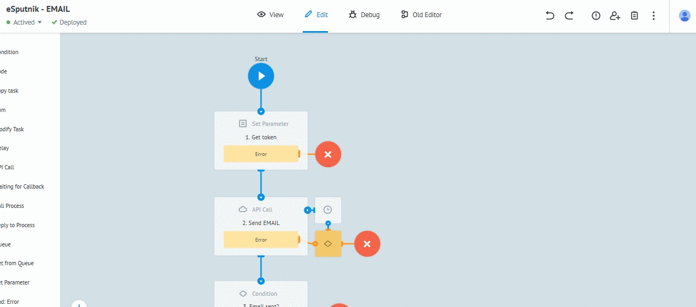
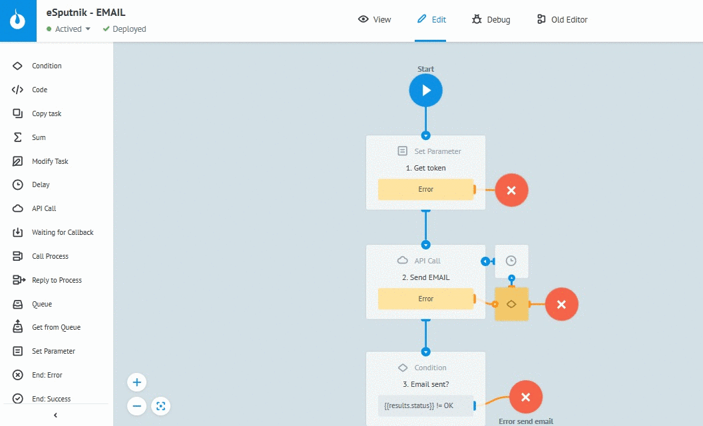

# Email

Клонируйте [процесс "eSputnik - EMAIL"](https://admin.corezoid.com/folder/conv/121461) в свое окружение

## Описание шагов процесса

**1. `Формирование токена`** - Логика Set Parameter 

**2. `Отправка email`** - вызов API eSputnik

**3. `Проверка на успешность отправки`** - Логика Condition

**4. `Ожидание 2 мин перед проверкой статуса email`** - Логика Delay

**5. `Проверка статуса email`**  - вызов API eSputnik

**6. `Распределение по статусам email`** (delivered, failed, other statuses) - Логика Condition

## Описание входящих параметров процесса

* **login** - логин входа на [esputnik.com](https://esputnik.com)
* **password** - пароль входа на [esputnik.com](https://esputnik.com)
* **from** - адрес отправителя (должен совпадать с одним из существующих адресов отправителя в системе)
* **email** - email адрес получателя
* **subject** - тема письма
* **plainText** - вариант сообщения в виде простого текста
* **htmlText** - HTML-код сообщения

## Тестирование процесса

**1.** Перейдите в режим `View`

**2.** Нажмите `New task`

**3.** Укажите значения входящих параметров

**4.** Нажмите `Add task`

