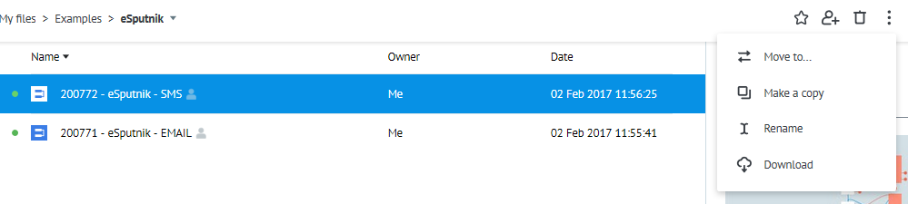
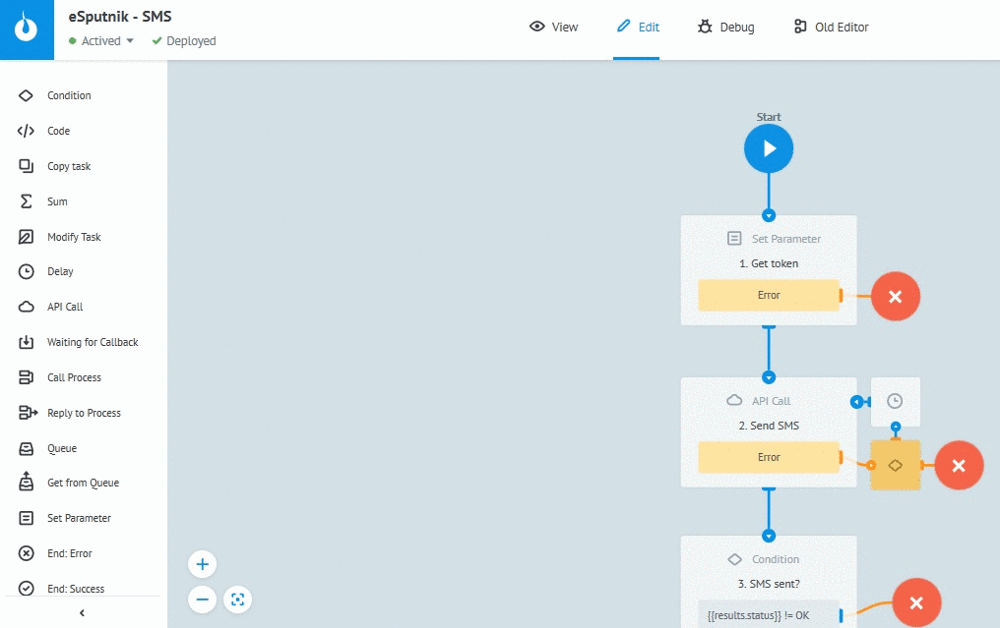

# SMS

Клонируйте [процесс "eSputnik - SMS"](https://admin.corezoid.com/folder/conv/121461) в свое окружение

## Описание шагов процесса

**1. `Формирование токена`** - Логика Set Parameter 

**2. `Отправка sms`** - вызов API eSputnik

**3. `Проверка на успешность отправки`** - Логика Condition

**4. `Ожидание 2 мин перед проверкой статуса sms`** - Логика Delay

**5. `Проверка статуса sms`**  - вызов API eSputnik

**6. `Распределение по статусам sms`** (delivered, failed, other statuses) - Логика Condition

## Описание входящих параметров процесса

* **login** - логин входа на [esputnik.com](https://esputnik.com)
* **password** - пароль входа на [esputnik.com](https://esputnik.com)
* **from** - имя отправителя (должно совпадать с одним из существующих в системе имён отправителей)
* **phone** - номер телефона получателя
* **text** - текст сообщения

## Тестирование процесса

**1.** Перейдите в режим `View`

**2.** Нажмите `New task`

**3.** Укажите значения входящих параметров

**4.** Нажмите `Add task`

