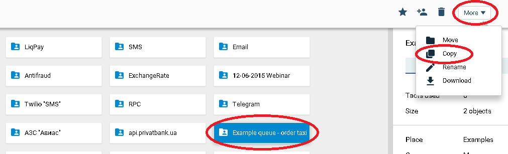
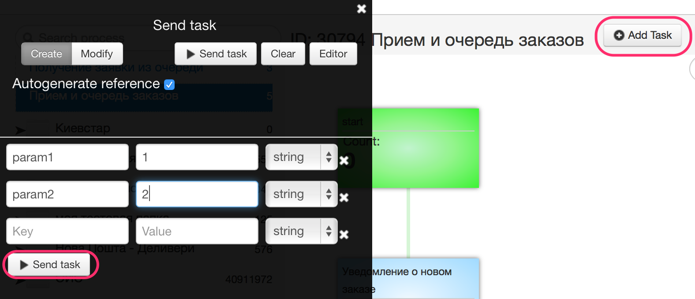
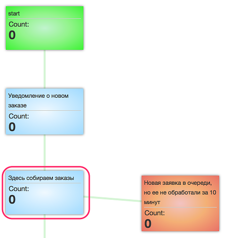
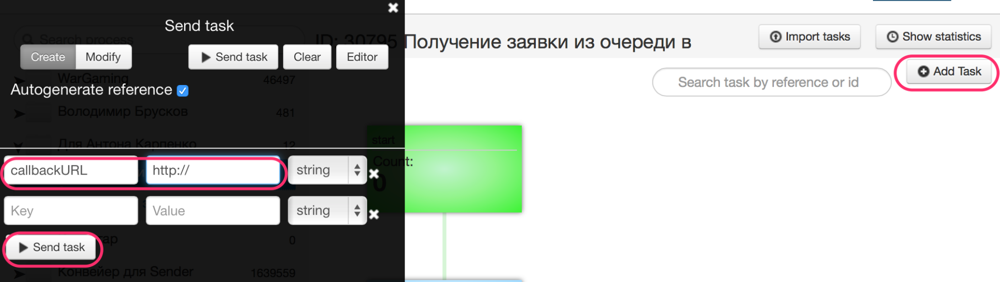
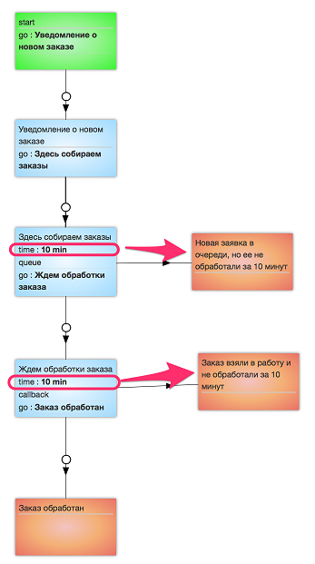
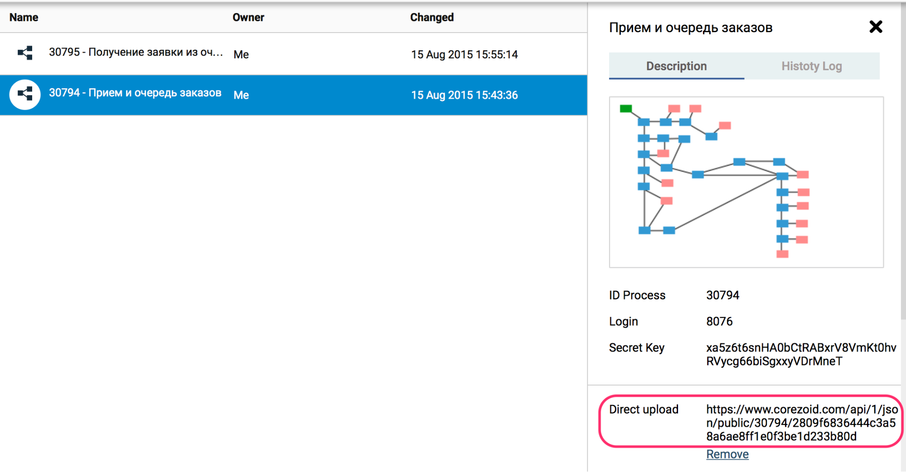

# Работа с очередью заявок в обработке заказов такси

Здесь представлен пример того, как на Сorezoid можно распределять и обрабатывать поток заказов такси с помощью [Логики QUEUE](../../interface/nodes/queue/queue.md) и [Логики GET TASK](../../interface/nodes/queue/get_task.md).

**Задача:**

Организовать последовательную обработку заказов от самых старых к новым, разным количеством операторов, с контролем времени обработки заказов.

**Проблема:**

Поступающих заказов может быть больше, чем операторов для их обработки и у них есть только две кнопки `"Взять новый заказ"`, `"Заказ обработан"`, т.е. нет возможности отложить заказ.

При этом заказы не принятые в работу через 10 мин с момента их поступления теряют актуальность и не нуждаются в обработке.

**Решение:**

Все новые заявки "складываются" в очередь и ожидают приянтия в работу после активации оператором кнопки `"Взять новый заказ"`.

Время ожидания - 10 минут.

**Для реализации задачи нам нужны два процесса:**

первый процесс ["Прием и очередь заказов"](https://www.corezoid.com/admin/edit_conv/91383/8074) для сохранения заказа в очередь и контроля времени его обработки

второй ["Получение заказа из очереди в работу"](https://www.corezoid.com/admin/edit_conv/91384/8074) - для получения заказа из очереди после активации оператором кнопки `"Взять новый заказ"`.

##Тестирование

Клонируйте папку ["Example queue - order taxi"](https://admin.corezoid.com/folder/conv/1833)

**Отправка тестовой заявки в очередь**

Перейдите в режим `dashboard` первого процесса "Прием и очередь заказов" и нажмите кнопку `Add task` - добавить заявку.

В появившемся окне укажите два условных параметра `param1` и `param2`.

Далее нажмите кнопку `Send task` - отправить заявку.

Заявка попадет в очередь и будет ждать обработки 10 минут.

Если в течение 10 минут заявка не будет обработана, то она перейдет в архивный узел "Новая заявка в очереди, но ее не обработали за 10 минут".

**Получение заявки из очереди**

В процессе "Получение заказа из очереди в работу" аналогично создаем заявку с единственным параметром `URL` - URL, на который необходимо отправить заявку для обработки в интерфейсе.

Если в очереди процесса "Прием и очередь заказов" нет заявок, то заявка перейдет в узел “В очереди нет заявок”.

Если заявки есть, то вместе с заявкой из очереди будут получены все параметры по заказу.

**Контроль времени обработки заказов**

**Загрузка данных в процессы**

Создавать боевые заявки в процессах можно просто отправляя данные в формате JSON методом POST на Direct URL.

