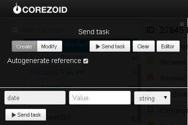

# Архив курсов валют ПриватБанка и НБУ

Клонируйте [шаблон процесса](https://www.corezoid.com/admin/edit_conv/27938) для получения архивных курсов валют Приватбанка

Перейдите в режим `dashboard` и нажмите кнопку `Add task` - добавить заявку

В появившемся окне укажите:
*   `date` - дата, за которую нужно получить курсы

Далее нажмите кнопку `Send task` - отправить заявку.

**В случае успеха** в заявку будут добавлены параметры:

Курс покупки НБУ:
* `buy_USD_NBU`- доллар США
* `buy_CAD_NBU`- канадский доллар
* `buy_GBP_NBU`- фунт стерлингов
* `buy_CHF_NBU`- швейцарский франк
* `buy_PLZ_NBU`- польский злотый
* `buy_EUR_NBU`- евро
* `buy_RUB_NBU`- российский рубль
* `buy_XAU_NBU`- золото

Курс продажи НБУ:
* `sale_USD_NBU`- доллар США
* `sale_PLZ_NBU`- польский злотый
* `sale_EUR_NBU`- евро
* `sale_RUB_NBU`- российский рубль
* `sale_CAD_NBU`- канадский доллар
* `sale_GBP_NBU`- фунт стерлингов
* `sale_CHF_NBU`- швейцарский франк
* `sale_XAU_NBU`- золото

Курс покупки ПриватБанка:
* `buy_USD`- доллар США
* `buy_GBP`- фунт стерлингов
* `buy_CHF`- швейцарский франк
* `buy_PLZ`- польский злотый
* `buy_EUR`- евро
* `buy_CAD`- польский злотый

Курс продажи ПриватБанка:
* `sale_USD`- доллар США
* `sale_GBP`- фунт стерлингов
* `sale_CHF`- швейцарский франк
* `sale_PLZ`- польский злотый
* `sale_EUR`- евро
* `sale_CAD`- канадский доллар

**В случае ошибки** заявка перейдет в узел эскалации с параметром:
* `Error` - описание ошибки
