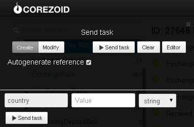

# Курсы валют и курсы драгоценных металлов НБУ и ЦБ РФ

Клонируйте [шаблон процесса](https://www.corezoid.com/admin/edit_conv/27936) для получения курсов валют и курсов драгоценных металлов НБУ и ЦБ РФ

Перейдите в режим `dashboard` и нажмите кнопку `Add task` - добавить заявку

В появившемся окне укажите значение входящего параметра `country` - идентификатор страны банка.

`country` может принимать следующие значения:

* **ua** - для получения курсов НБУ по основным валютам (RUB,USD,EUR)
* **ua&full** - для получения курсов НБУ по всем валютам, включая драгоценные металлы
* **ru** - для получения курсов ЦБ РФ по основным валютам (USD, EUR)
* **ru&full** - для получения курсов ЦБ РФ по всем валютам, включая драгоценные металлы
* пустое значение параметра `country` возвращает курсы НБУ

Далее нажмите кнопку `Send task` - отправить заявку.

**В случае успеха** в заявку будут добавлены параметры:

Если `country` = **ua**:
* `buy_USD`- курс покупки доллара США
* `buy_EUR`- курс покупки евро
* `buy_RUR`- курс покупки российского рубля
* `sale_USD`- курс продажи доллара США
* `sale_EUR`- курс продажи евро
* `sale_RUR`- курс продажи российского рубля

Если `country` = **ua&full** получаем курсы покупки валют:
* `buy_UZS`    - Узбекский сум
* `buy_PLZ`    - Польский злотый
* `buy_EUR`    - Евро
* `buy_CNY`    - Юань Ренминби
* `buy_RUR`    - Российский рубль
* `buy_PKR`    - Пакистанская рупия
* `buy_MNT`    - Монгольский тугрик
* `buy_JPY`    - Японская йена
* `buy_IQD`    - Иракский динар
* `buy_ILS`    - Израильский шекель
* `buy_PEN`    - Перуанский новый сол
* `buy_MDL`    - Молдовский лей
* `buy_INR`    - Индийськая рупия
* `buy_HUF`    - Угорский форинт
* `buy_HKD`    - Гонконгский доллар
* `buy_XAG`    - Серебро
* `buy_LBP`    - Ливанский фунт
* `buy_EGP`    - Египетский фунт
* `buy_CAD`    - Канадский доллар
* `buy_XPT`    - Платина
* `buy_XPD`    - Палладий
* `buy_KWD`    - Кувейтский динар
* `buy_AUD`    - Австралийский доллар
* `buy_XDR`    - Специальные права заимствования
* `buy_SYP`    - Сирийский фунт
* `buy_NOK`    - Норвежская крона
* `buy_XOF`    - Малийский франк КФА
* `buy_MXN`    - Мексиканский новый песо
* `buy_LYD`    - Ливийский динар
* `buy_KGS`    - Киргизский сом
* `buy_XAU`    - Золото
* `buy_SAR`    - Риал Саудовской Аравии
* `buy_NZD`    - Новозеландский доллар
* `buy_KRW`    - Вон Республики Корея
* `buy_DKK`    - Датская крона
* `buy_TJS`    - Сомоны
* `buy_SEK`    - Шведская крона
* `buy_KZT`    - Казахський теньге
* `buy_ISK`    - Исландская крона
* `buy_GBP`    - Английский фунт стерлингов
* `buy_USD`    - Доллар США
* `buy_GEL`    - Грузинский Лари
* `buy_CLP`    - Чилийский песо
* `buy_BYR`    - Беларусский рубль
* `buy_VND`    - Вьетнамский донг
* `buy_SGD`    - Сингапурский доллар
* `buy_LTL`    - Литовский лит
* `buy_CZK`    - Чешская крона
* `buy_BRL`    - Бразильский реал
* `buy_AMD`    - Армянский драм
* `buy_IRR`    - Иранский реал
* `buy_HRK`    - Хорватская куна
* `buy_CHF`    - Швейцарский франк
* `buy_TWD`    - Новый тайванский доллар

Если `country` = **ru** получаем курсы покупки:
* `buy_EUR`- евро
* `buy_USD`- доллара США

Если `country` = **ru&full** получаем курсы покупки валют:
* `buy_UZS`    - Узбекский сум
* `buy_PLZ`    - Польский злотый
* `buy_EUR`    - Евро
* `buy_CNY`    - Юань Ренминби
* `buy_JPY`    - Японская йена
* `buy_UAH`    - Украинская гривня
* `buy_MDL`    - Молдовский лей
* `buy_INR`    - Индийськая рупия
* `buy_HUF`    - Угорский форинт
* `buy_XAG`    - Серебро
* `buy_CAD`    - Канадский доллар
* `buy_XPT`    - Платина
* `buy_XPD`    - Палладий
* `buy_AUD`    - Австралийский доллар
* `buy_XDR`    - Специальные права заимствования
* `buy_NOK`    - Норвежская крона
* `buy_KGS`    - Киргизский сом
* `buy_XAU`    - Золото
* `buy_KRW`    - Вон Республики Корея
* `buy_DKK`    - Датская крона
* `buy_SEK`    - Шведская крона
* `buy_KZT`    - Казахстанский теньге
* `buy_GBP`    - Английский фунт стерлингов
* `buy_USD`    - Доллар США
* `buy_BYR`    - Беларусский рубль
* `buy_SGD`    - Сингапурский доллар
* `buy_CZK`    - Чешская крона
* `buy_AMD`    - Армянский драм
* `buy_CHF`    - Швейцарский франк

**В случае ошибки** заявка перейдет в узел эскалации с параметром:
* `Error` - описание ошибки
