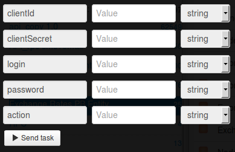

# Курсы валют ПриватБанка для юрлиц

Для получения доступа к сервису Вам необходимо авторизоваться на странице https://link.privatbank.ua/console/auth/p24business/start.

Добавить новое приложение:

и получить **clientId** и **clientSecret**.

Клонируйте [папку "PrivatBank exchange rates for legal entities"](https://admin.corezoid.com/folder/conv/3553) для получения процесса и дашборда.

Для тестирования процесса перейдите в режим `dashboard` и нажмите кнопку `Add task` - чтобы добавить  заявку.

В открывщейся форме укажите параметры запроса и нажмите "Send task".

*   `clientId` - id Клиента, полученный после добавлеия приложения
*   `clientSecret` - пароль Клиента, полученный после добавления приложения
*   `login` - логин в Приват24 для бизнеса
*   `password` - пароль в Приват24 для бизнеса
*   `action` - идентификатор курсов в системе банка: 3 - курсы НБУ, 5 - курсы Приватбанка по всем валютам.

**В случае успеха** в заявку будут добавлены параметры:

* `Rate`- курсы валют ПриватБанка для юрлиц

**В случае ошибки** заявка перейдет в узел эскалации с параметром:
* `Error` - описание ошибки
