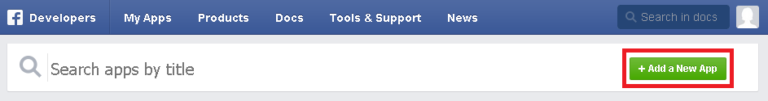
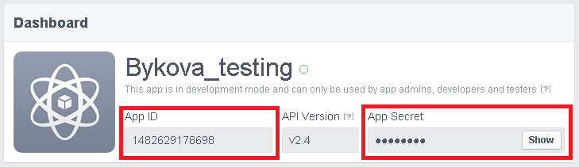
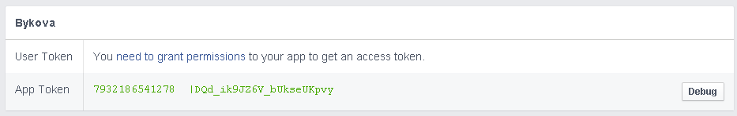

# Авторизация

Cоздайте приложение Facebook на сайте [https://developers.facebook.com/apps](https://developers.facebook.com/apps)

После создания Вы получите id (`App ID`) и пароль (`App Secret`) Вашего приложения.

Перейдите на вкладку `"Tools&Support`" - `"Access Token Toll"`.

Здесь можно получить ключи авторизации Вашего приложения - значение параметра **"access_token"** в запросах к API Facebook.

**App Token** = app_id|app_secret

Для получения **"User Token"** нажмите на `"need to grant permissions"`.

Подробнее об авторизации приложения в запросах к API Facebook в разделе ["Access Tokens"](https://developers.facebook.com/docs/facebook-login/access-tokens#apptokens).