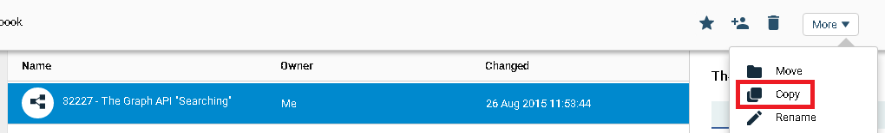
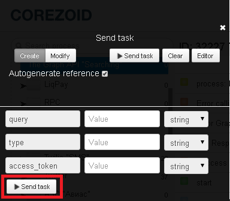

# Поиск публичных объектов

Для поиска публичных объектов социальной сети Facebook клонируйте [шаблон процесса "The Graph API "Searching""](https://admin.corezoid.com/folder/conv/8838).

## Описание входящих параметров процесса

1. **query** - поисковой запрос
2. **type** - тип поискового запроса
    *   `user` - имя пользователя Facebook
    *   `page` - название страницы
    *   `event` - название события
    *   `group` - название группы
    *   `place` - место. С этим параметров можно использовать дополнительные: center (широта и долгота) и distance (радиус).
Пример заполнения парметров такого типа запроса:
q=coffee&
type=place&
center=37.76,-122.427&
distance=1000
3. **access_token** - ключ авторизации
    *   для типов поисковых запросов `Page` и `Place` используется "App Token" = app_id|app_secret. Например, 7932301794081|76f2681c01df1d0c190bc6a503
    *   для всех остальных типов "User Token" (генерится в настройках приложения Facebook)

## Запуск процесса

**1)** Перейдите в режим `dashboard` и нажмите кнопку `Add task` - добавить заявку.

**2)** В появившемся окне укажите обязательные параметры:
*   query
*   type
*   access_token

**3)** После того как все параметры указаны, нажмите кнопку `Send task`.

## Описание исходящих праметров процесса

**В случае успеха** в заявку будет добавлен параметр
* `Result` - массив данных с результатом запроса

**В случае, если API Facebook вернет ошибку**, заявка уйдет в узел эскалации и будут добавлены параметры:

* `Code` - код ошибки
* `Type` - тип ошибки
* `Message` - текст ошибки

**В случае ошибки вызова API Facebook**, заявка уйдет в узел эскалации и будет добавлен параметр

* `Code` - код ошибки

Подробное описание [Graph API "Searching"](https://developers.facebook.com/docs/graph-api/using-graph-api/v2.0)

