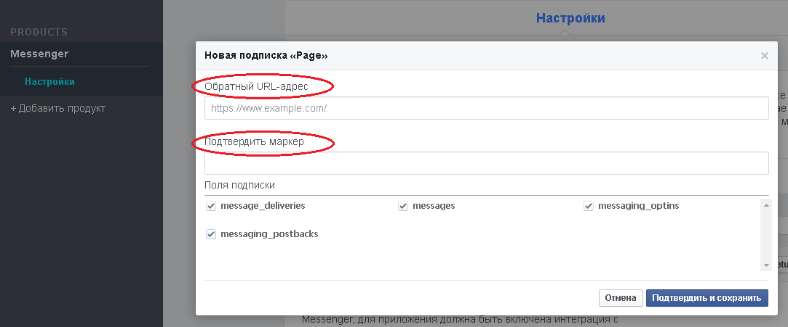

# TicketsBot
 
 Клонируйте [папку "TicketsBot"](https://admin.corezoid.com/folder/conv/8838)

 
 
 В папке размещены четыре процесса:

 * `Set Welcome Message` предназначен для установки приветсвенного сообщения пользователю. Пользователь увидит его при первом заходе в чат с Ботом.
 
 * `Main` -получает все сообщения, поступающие в чат Бота, определяет текстовое это сообщение - "message" или нажатие на кнопку - "postback". Обновляет заявку в процессе **TicketsBot**.
   
Обновить заявку в процессе **TicketsBot** = продолжить чат с пользователем в рамках уникального id чата.

Это становится возможным благодаря созданию новой заявки в процессе **TicketsBot**, когда пользователь отправляет команду `Start Chatting`. 

Данная заявка создается с референсом равным id чата (`{{entry[0].messaging[0].sender.id}}`).
 
Если при обновлении заявки по id чата таковая не была найдена, значит у нас еще нет открытого диалога в данном чате - нет заявки в процессе **TicketsBot**. 

Тогда проверяем какая команда получена от пользователя:

   **start** - пользователю будет предложено начать чат - кликнуть на кнопку `Start Chatting`.

   **Start Chatting** - создаем заявку в процессе **TicketsBot** (как было описано выше).

   **More information** - отправляем сообщение "For getting more information, please contact your airline".

  Если же получено что-то отличное от данных команд - отправляем пользователю соответствующее сообщение об неизвестной команде.
 
 
 
 * `TicketsBot` - в этот процесс поступают заявки из **Main** процесса, если пользователь отправил команду `Start Chatting`,и первым шагом отправляется сообщение с предложением ввести город отправки.

Напомним, референсом заявок в этом процессе является уникальный id чата `{{entry[0].messaging[0].sender.id}}`.

Это позволяет получать обновления (новые команды или сообщения от пользователя в чат Бота) из **Main** процесса, когда заявка находится в узле с [Логикой CALLBACK](https://doc.corezoid.com/ru/interface/nodes/callback.html).

Итак, после отправки сообщения с предложением ввести город отправки, заявка переходит в ожидание этого выбора.

Если через 2 минуты пользователь ничего не введет (заявка не обновится из **Main** процесса), то заявка переходит в финальный узел и если необходимо начать чат заново - выберите `Start Chatting` или `Start`. 

Если же город отправки введен, предлагаем пользователю  ввести название города прибытия и дату отправки в указанном формате.

После каждого предложения пользователю, мы ждем в узле с CALLBACK.

При неправильном вводе названия городов или даты отправления, отправляем пользователю соответствующее сообщение об ошибке.

На любом этапе ошибки введения названия города либо даты, пользователю будет предложено заменить неправильно введенные данные без изменений уже введенных правильных данных.

Если была команда `Start Chatting` и все данные введены корректно, получаем информацию по рейсу и возвращаем самый дешевый билет(без пересадки, с одной или двумя пересадками) и отправляем в сообщении. 

* `Send Message` - Отправляет сообщения в FB Messenger.

Оба процесса Main и TicketsBot обращаются к нему через [Логику Copy task](https://doc.corezoid.com/ru/interface/nodes/copy.html).

 ## Установка Webhook

 **1)** Создайте facebook [приложение](https://developers.facebook.com/quickstarts/?platform=web) и [страницу](https://www.facebook.com/pages/create/). Получите `Page ID`.

 **2)** В настройках facebook приложения кликните на `"+Добавить продукт"` и выберите `Messenger`
   
  
 **3)** Получите маркер доступа страницы - `Page Access Token`
  
 

 **4)** Подключите процесс **Main** к FB Messenger, указав маркер доступа Вашей страницы:

 
 
 **5)** Получите webhook-url процесса **Main** для FB Messenger

 
 
 **6)** Установите webhook в настройках facebook приложения, указав полученный webhook-url процесса **Main** в поле `Обратный, URL-адрес`, а маркер доступа страницы - в поле `Подтвердить маркер`

 
 
 **7)** Выбрав нужную страницу подпишите webhook к ее событиям
  [Подробная инструкция на Facebook](https://developers.facebook.com/docs/messenger-platform/product-overview)
 

 ##Интеграция с Travelpayouts

 Для удобства пользователей в [шаблон TicketsBot](https://admin.corezoid.com/editor/126761/211905) добавлен токен **API Travelpayouts**. 
 (мы используем API доступа к данным по авиабилетам).

 Чтобы получить свой токен API Travelpayouts перейдите по [ссылке](https://www.travelpayouts.com/developers/api) и зарегистрируйтесь.

 
 
  В процессе **Main** в узле `Set tokens` замените тестовый токен к API Travelpayouts на полученный Вами в значении параметра `X-Access-Token`.
 
 
 
 
 ##Интеграция с Yandex.Trasnlate
 
 Для работы с API Travelpayouts, был использован **API Yandex.Translate** для перевода вводимого пользователем английского текста на русский.
 
 Для получения детальной информации для работы с API Yandex.Trasnlate перейдите по [ссылке](https://tech.yandex.ru/translate/doc/dg/reference/translate-docpage/)
 	
 Вам необходимо получить **API-ключ**. Он выдается бесплатно [здесь](https://tech.yandex.ru/keys/get/?service=trnsl).
 
  
 
 В процессе **Main** в узле `Set tokens` замените тестовый API-ключ Yandex.Trasnlate на полученный Вами в значении параметра `yandex_key`.
 

 
 ##Тестирование и запуск
 
 **Установите приветсвенное сообщение Бота**

 Для этого:
  - перейдите в режим `View` процесса [Set Welcome Message](https://admin.corezoid.com/editor/126761/211907)
  - нажмите кнопку `Add task` - добавить заявку.
  - в появившемся окне укажите обязательные параметры:
 *   **access_token** - маркер доступа страницы
 *   **welcome_text** - приветсвенное сообщение Вашего Бота. Например, `Hi! Here you can get the cheapest tickets for selected flight (without a transfer, with one or two transfers) to the specified direction.`
  - после того как все параметры указаны, нажмите кнопку `Send task`.

 А далее просто добавьте своего Бота в **Facebook Messenger** и начните чат.
 
    
   
   
   
 
 При неправильном вводе названия городов или даты отправления, пользователь получает сообщение об ошибке: 
 
  
  
 
 Пользователю предлогается откорректировать неправильные значения, не меняя уже введенных данных:
 
  
  
  
  
  
 Перейдите в режим `View` или `Debug` [TicketsBot](https://admin.corezoid.com/editor/126761/211905),чтобы увидеть поток заявок, их прохождение и распределение по узлам процесса.

 
 
 >Пока Ваше приложение находится в режиме разработки, его функциональность и API будет работать только для администраторов, разработчиков и тестеров приложения. После того, как Ваше приложение будет одобрено и опубликовано, оно станет доступно для широкой публики.
