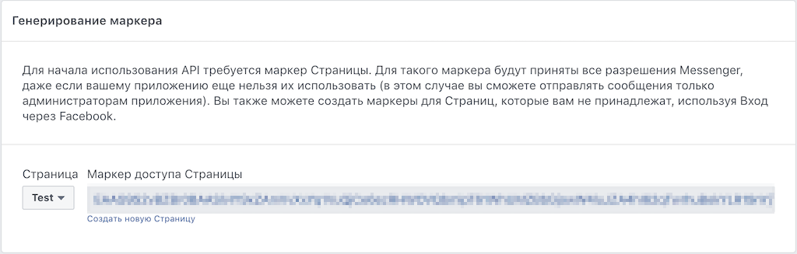

# WeatherBot
 
Создайте копию папки ["WeatherBot"](https://admin.corezoid.com/folder/conv/8838).

 
В папке находятся процессы:

* [**Set Welcome Message**](https://admin.corezoid.com/editor/94444/140229) - предназначен для установки приветственного сообщения пользователю.

* [**WeatherBot**](https://admin.corezoid.com/editor/94444/140228) - принимает webhook с названием города, получает по нему температуру воздуха и отправляет сообщение.

В случае, если сообщение не содержит название города или город указан некорректно, а также если в процессе возникла ошибка, отправляет соответсвующее сообщение.

## Установка Webhook

**1)** Создайте Facebook [страницу](https://www.facebook.com/pages/create/). Получите **Page ID**.

**2)** Создайте Facebook [приложение](https://developers.facebook.com/quickstarts/?platform=web):

**3)** В настройках facebook приложения добавьте продукт **Messenger**:

**4)** В настройках **Messenger** в разделе "Генерирование маркера" получите маркер доступа страницы - **Page Access Token** и скопируйте его в буфер обмена.

 
**5)** Подключите процесс **WeatherBot** к Facebook Messenger. Для этого выделите процесс и нажмите кнопку **View details**, выберите вкладку Webhook и нажмите кнопку **Connect to messengers**.

Выберите **Messenger** и в открывшемся окне укажите **Page Access Token**. Скопируйте Webhook (URL процесса для Facebook Messenger) с помощью специальной кнопки и нажмите **ОК**.
 

 
**6)** Настройте Webhook для Facebook приложения. Нажмите кнопку "Настройка Webhooks":

Скопированный URL вставьте в поле **URL обратного вызова**, а маркер доступа страницы - в поле **Подтвердить маркер**.

Укажите [события](https://developers.facebook.com/docs/messenger-platform/webhook#setup), на которые необходимо подписаться, и нажмите кнопку "Подтвердить и сохранить".

**7)** Выбрерите страницу и подпишите webhook на ее события:
 

## Интеграция с OpenWeatherMap

Для удобства пользователей в [шаблон WeatherBot](https://admin.corezoid.com/editor/94444/140228) добавлен тестовый ключ доступа к API OpenWeatherMap.

Чтобы получить свой ключ доступа к API OpenWeatherMap перейдите по [ссылке](http://openweathermap.org/register) и зарегистрируйтесь.

Скопируйте значение **Key** из вкладки **API keys**:

 
В узле **Set APPID_key** замените тестовый ключ API OpenWeatherMap на полученный Вами:
 
 

## Тестирование и запуск
 
**Установите приветсвенное сообщение Бота**

Для этого:
  - откройте процесс **Set Welcome Message**
  - перейдите в режим **View**
  - нажмите кнопку **+ New task** для добавления заявки
  - заполните обязательные параметры:
       - **access_token** - маркер доступа страницы
       - **welcome_text** - приветсвенное сообщение бота. Например, `Hi! Enter city name to get the weather.`
  - после того как все параметры указаны, нажмите кнопку **Add task**.

Далее просто добавьте своего Бота в Facebook Messenger и начните чат.

Процесс **WeatherBot** переведите в режим **View**, чтобы увидеть поток заявок, их прохождение и распределение по узлам процессса.

 

> Пока Ваше приложение находится в режиме разработки, его функциональность и API будет работать только для администраторов, разработчиков и тестеров приложения. После того, как Ваше приложение будет одобрено и опубликовано, оно станет доступно для широкой публики.

> Подробнее о проверке приложения на [developers.facebook.com](https://developers.facebook.com/docs/messenger-platform/app-review/).
