#Firebase

**Firebase** – это облачная база данных с готовыми **API** для интеграции.

Перед настройкой процесса рекомендуем изучить [документацию Firebase](https://firebase.google.com/docs)

Прежде чем Вы начнете, давайте создадим проект в **Firebase**

### Создание проекта Firebase

1. Перейдите в [Firebase](https://console.firebase.google.com/) консоль и нажмите кнопку **Create a project**

    

2. В появившейся форме добавьте имя проекта в поле **Project name**

    2.1. Добавьте новый или оставьте предложенный **ID** в поле **Project ID** 

    2.2. Выберите страну вашей организации в поле **Analytics location**

    2.3. Если Вы согласны с условиями от **Firebase**, то отметьте соответствующие чекбоксы. 

    2.4. Нажмите на кнопку **Сreate project**
    
     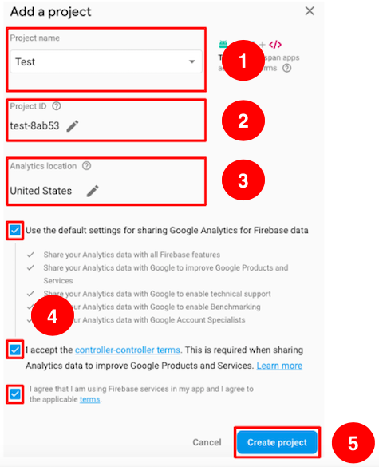

    Если проект создан успешно, то Вы увидите экран с кнопкой **Continue**

     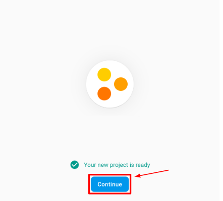

    Дальше мы научимся получать ключ доступа к **API Firebase**. 
    
### Получение ключа к API Firebase

1. Для вызова **API Firebase** необходим **Firebase API Secret Key** . Для его получения кликните на иконку **Settings** и в появившемся меню выберите **Project settings**.

    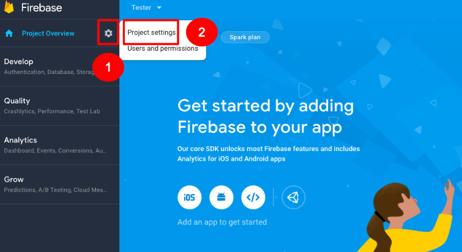

2. Перейдите на вкладку **Service accounts**
    
    2.1. В появившемся окне выберите раздел **Database accounts**
    
    2.2. В нижнем правом углу **нажмите на кнопку **Show** и скопируйте Firebase API Secret Key**.

    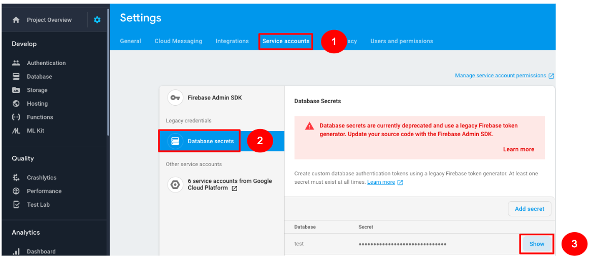

    2.3. Для вызова **API Firebase** нужно получить уникальный url, идентифицирующий Ваш проект. Для этого перейдите в раздел **Database**
        
    2.4. Выберите вкладку **Data**
    
    2.5. В верхнем меню выберите **Realtime Database**
    
    В появившемся окне Вам будет доступен URL для вызова **Firebase API**

    
 
    В следующем окне Вы можете видеть структуру созданной базы данных, которую можно настроить под Ваши требования. 
 
    Например, рассмотрим хранение в базе данных 3 полей: 
    - ID 
    - имя клиента
    - фамилия клиента 
    
    2.6. Для начала добавьте имя для Вашей базы данных. 

    При добавлении имени базы данных изменится url запрос **API Firebase** на ```https://test-xxx.firebaseio.com/{{имя_БД}}```
    
    В рамках туториала мы будем использовать имя **testdb**:
 
   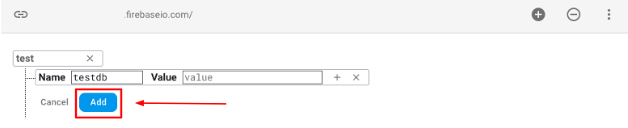

    2.7. Следующим элементом в **URL** рекомендуем добавить имя таблицы (коллекции) объектов, которые Вы будете сохранять, например, **clients**:

    ```
    https://test-xxx.firebaseio.com/testdb/clients
    ```
    
    2.8. Для хранения информации о клиенте создайте индекс с номером **1**. У каждого нового клиента в БД будет свой уникальный номер таблицы для хранения его имени и фамилии.
 
    2.9. Добавьте в индекс **1** параметры клиента **first name** и **last name**.

    В итоге Вы должны получить древовидную структуру хранения клиентских имени и фамилии, как на изображении ниже:

    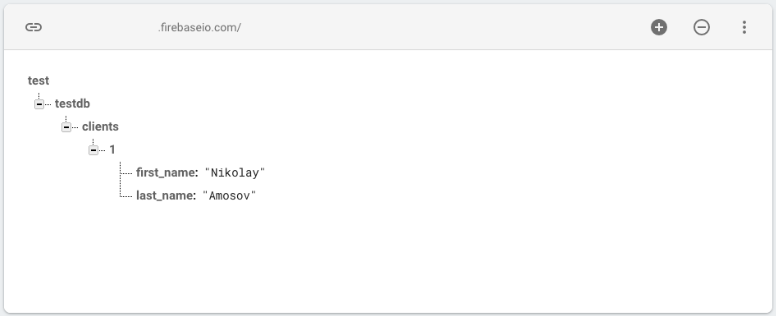

    Вы научились создавать структурированную базу данных в **Firebase**. Далее Вы настроите 2 процесса в Corezoid для выгрузки информации из БД, а также для добавления новых клиентских данных в БД.
    
### Получение данных из Firebase

1. Для удобства работы с проектами создайте папку **Firebase**

     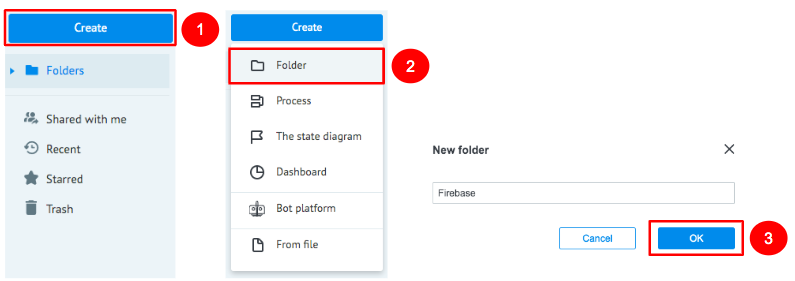

2. Зайдите в папку **Firebase** и создайте процесс **Get data**, который будет получать данные из таблицы БД с помощью **API Firebase**.

     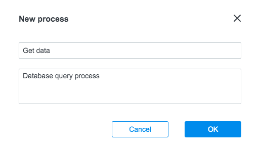

3. В созданном процессе добавьте узел **API Call**, который будет вызывать **API Firebase**  для получения информации из базы данных.

     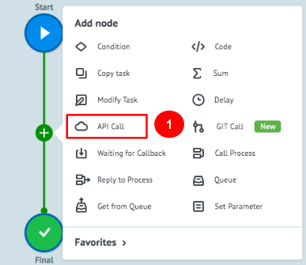

    3.1 После того, как вы добавили узел, кликните на него и заполните поле **URL**:
    ```
    {{url}}/testdb/clients.json?auth={{key}}
    ```
    и установите следующие значения в настройках узла **API Call**:
    ```
    Request format: Default
    Request method: GET
    Content-Type: Application/Json
    ```
    где:
    - **url** - Вы получили на шаге 2.3 раздела [Получение ключа к API Firebase](#получение-ключа-к-api-firebase).
    - **testdb** - Имя каталога, которое Вы дали на шаге 2.3 раздела [Получение ключа к API Firebase](#получение-ключа-к-api-firebase).
    - **clients** - Имя таблицы, которое Вы дали на шаге 2.3 раздела [Получение ключа к API Firebase](#получение-ключа-к-api-firebase).
    - **key** - это ключ доступа к БД, который Вы получили на шаге 2.2 раздела [Получение ключа к API Firebase](#получение-ключа-к-api-firebase).
    Пример URL: 
    ```
    https://test-xxxx.firebaseio.com/testdb/clients.json?auth={{key}}
    ```
    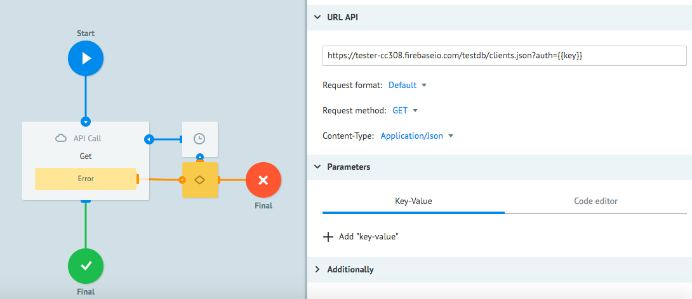
4. Для того, чтобы **Firebase API Secret** **Key** автоматически подставлялся при вызове **API Firebase**, после стартового узла добавьте узел **Set Parameter** с именем **key**

    4.1. В разделе **Parameters** узла **Set Parameters** добавьте параметр key со значением **Firebase API Secret Key**, полученного в шаге 2.2 раздела [Получение ключа к API Firebase](#получение-ключа-к-api-firebase).
    
    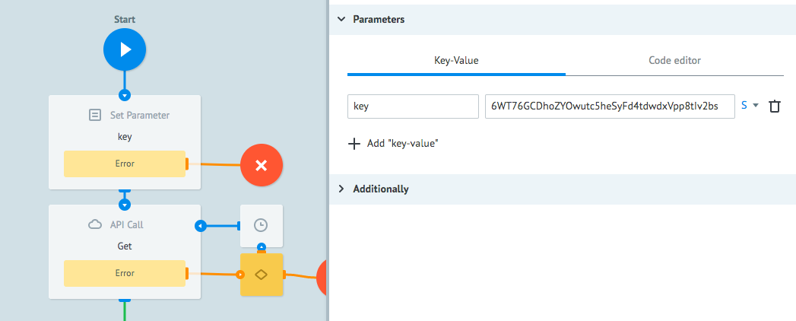

    Для того, чтобы убедиться в правильности настройки узла **API Call**, сделайте вызов **API Firebase**, в результате которого Вы получите ответ с информацией из базы данных.
    
5. Для этого перейдите в режим **View**

    5.1. Нажмите кнопку **New task**

    5.2. В окне Task заполните поле **key**, полученным на шаге 2.2 раздела [Получение ключа к API Firebase](#получение-ключа-к-api-firebase) **Firebase API Secret Key** и нажмите Add task.

    В случае успешного вызова **API Firebase** Ваша заявка будет находиться в узле **Final**. Нажав на него, Вы увидите содержимое заявки c параметрами, которые Вы вручную добавили в **clients** базы данных testdb
    
    ```
    "first_name": "Nikolay",
    "last_name": "Amosov"
    ```      
    
     
### Сохранение данных в Firebase
 
В шаге 2.4 раздела [Получение ключа к API Firebase](#получение-ключа-к-api-firebase) Вы научились в ручном режиме добавлять записи в базу данных **Firebase**. На практике запись данных в таблицу **clients** каталога **testdb** осуществляется с помощьдю **API Firebase**. 

1. Для этого создайте новый процесс c названием **PUT data**.

    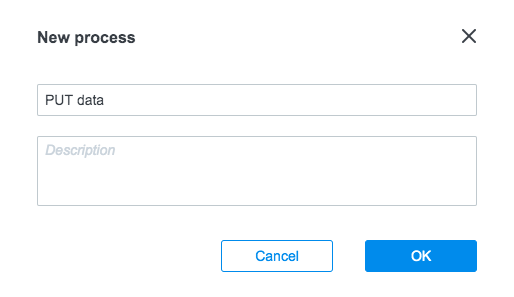

2. В процессе **PUT data** cоздайте узел **API Call** c именем **PUT**, который будет добавлять данные в **Firebase** через API.

    2.1. После того, как вы добавили узел **PUT**, кликните на него и заполните поле **URL**, а также параметры запроса в разделе **Parameters**.
    Правила формирования ***URL***:
    
    ```    
    {{url}}/testdb/clients/{{client_id}}.json?auth={{key}}
    ```
    
    где:
    - **url** - Вы получили на шаге 2.3 раздела [Получение ключа к API Firebase](#получение-ключа-к-api-firebase).
    
    - **testdb** - Имя каталога, которое Вы дали на шаге 2.3 раздела [Получение ключа к API Firebase](#получение-ключа-к-api-firebase).
    
    - **clients** - Имя таблицы, которое Вы дали на шаге 2.3 раздела [Получение ключа к API Firebase](#получение-ключа-к-api-firebase).
    
    - **key** - это ключ доступа к БД, который Вы получили на шаге 2.3 раздела [Получение ключа к API Firebase](#получение-ключа-к-api-firebase).
    
    Пример ***URL***: 
    ```
    https://tester-xxxx.firebaseio.com/testdb/clients/2.json?auth=rwer4545fgdfb534...
    ```
    
    ```    
    Request format: Default
    Request method: PUT
    Content-Type: Application/Json
    ```

    2.2. В разделе ***Parameters*** добавьте:
        
    ```     
    {
        "last_name": "{{last_name}}",
        "first_name": "{{first_name}}"
    }
    ```

    Значения параметров **{{first_name}}, {{last_name}}** это имя и фамилия нового клиента, которого нужно добавить в таблицу **clients** каталога ****. 
 
    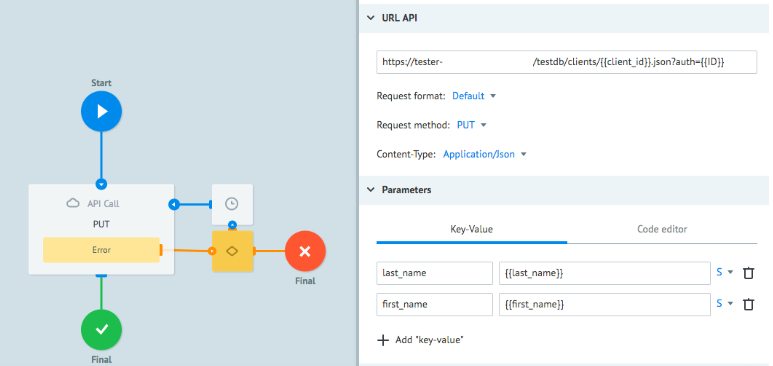
 
В случае успешного вызова **API** **Firebase**, Ваша заявка будет находиться в узле **Final**. Нажав на него, Вы увидите содержимое заявки c параметрами, которые Вы успешно записали в таблицу БД
    
```
"first_name": "Nikola",
"last_name": "Tesla"
```

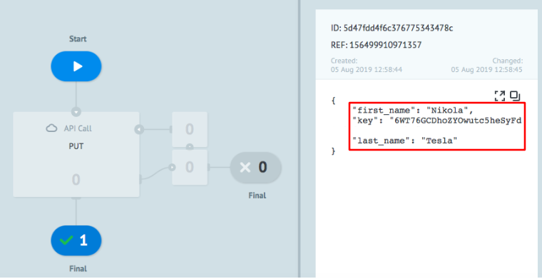

**Поздравляем! Вы научились создавать для записи и чтения данных через API Firebase**
 

