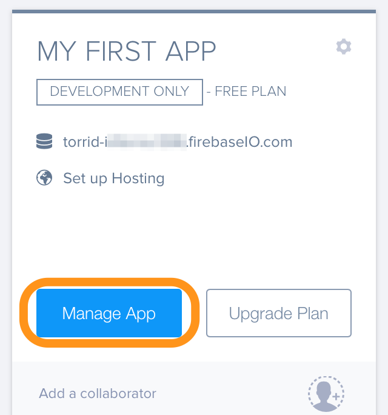
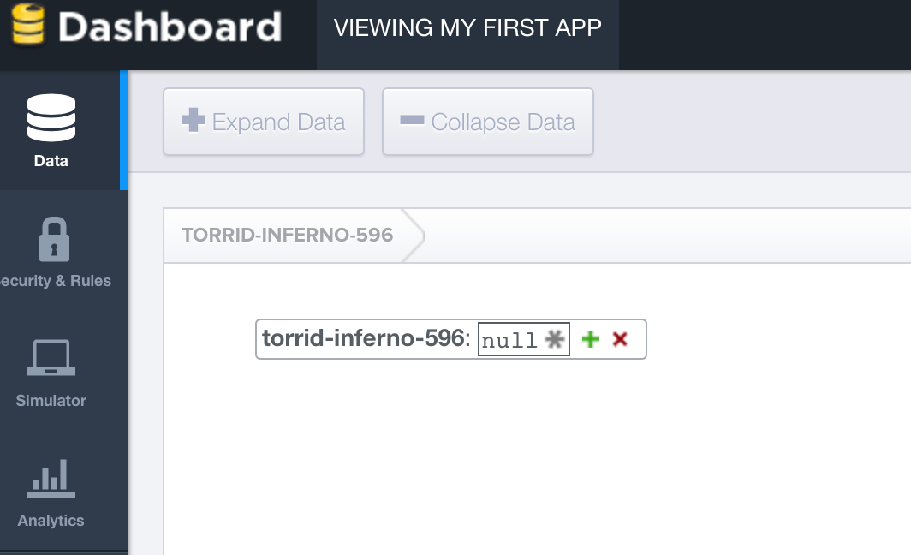
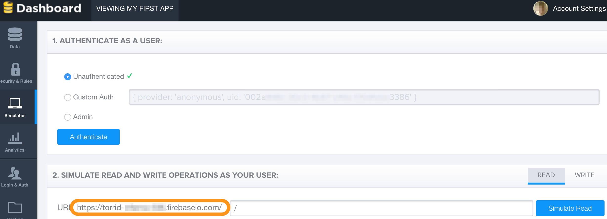
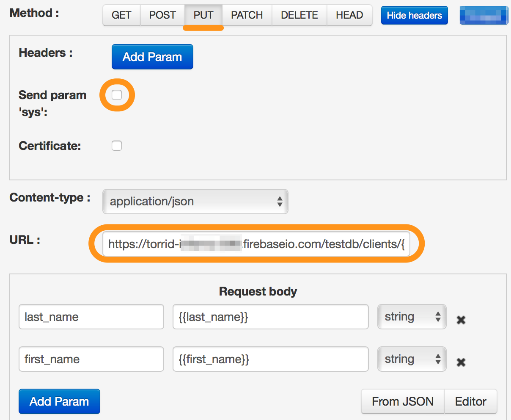
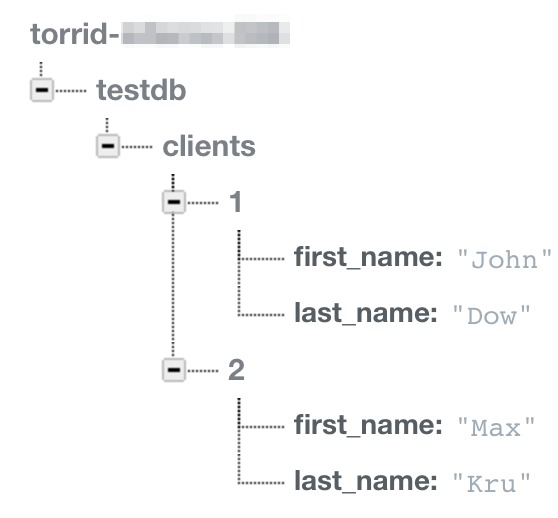

# Firebase

##[Описание методов REST API](https://www.firebase.com/docs/rest/api/)

Firebase позволяет сохранять и получать данные по API, фактически предоставляя пользователям БД с API.

1.  [Получение тестовой БД](#получение-тестовой-бд)
2.  [Структура URL](#структура-url)
3.  [Добавление записи (PUT)](#добавление-записи-put)
4.  [Получение записей (GET)](#получение-записей-get)

## Получение тестовой БД

После регистрации Вы автоматически получаете БД и API к ней


Вы можете сразу, в браузере просмотреть, добавить или удалить данные в БД через интерфейс `Data`


Протестировать работу API с БД Вы можете через раздел `Simulator`. Вам сразу будет доступен URL для отправки GET/POST запросов



## Структура URL

Рассмотрим пример выданного URL
`https://torrid-xxx.firebaseio.com/`

Все параметры которые Вы будете добавлять после / будут определять структуру Вашей БД.

Для начала рекомендуем обязательно добавить им каталога, например testdb:
`https://torrid-xxx.firebaseio.com/testdb`

Следующим элементом в URL рекумендуем добавить имя таблицы(коллекции) объектов которые Вы будете сохранят:
`https://torrid-xxx.firebaseio.com/testdb/clients/`

## Добавление записи (PUT)

Для того чтобы добавить запись в таблицу `clients` каталога `testdb` необходимо выбрать:
*   метод `PUT`
*   URL https://torrid-xxx.firebaseio.com/testdb/clients/{{ID}}.json
*   В параметрах указать переменные объекта, например:
    *   first_name
    *   last_name

Пример настроенной логики:


> Обратите внимание на:
*   чекбокс с параметра `sys param` - он должен быть снят
*   ID клиента передается как параметр в URL


Итоговый результат в итерфейсе firebase:


## Получение записей (GET)

Для получения данных из firebase необходимо использовать:
*   метод `GET`
*   URL https://torrid-xxx.firebaseio.com/testdb/clients/{{ID}}.json

где `ID` - идентификатор клиента в нашей БД


Результат работы GET запроса Вы можете посмотреть в `Task archive`. Он будет выглядеть следующим образом:
```json
"data": {
                "last_name": "Dow",
                "first_name": "John",
                "ID": "1"
        }
```
