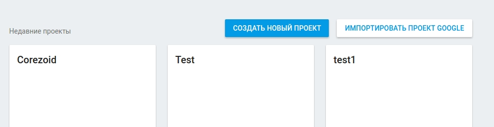
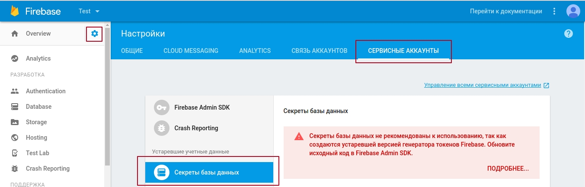
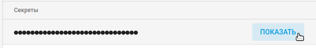
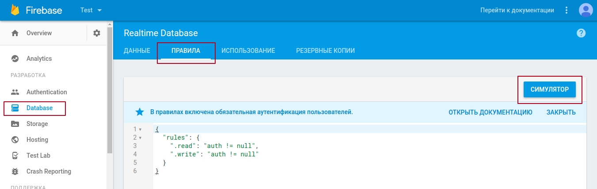

# Firebase

##[Описание методов REST API](https://firebase.google.com/docs/reference/rest/database/)

Firebase позволяет сохранять и получать данные по API, фактически предоставляя пользователям БД с API.

1.  [Создание проекта Firebase](#создание-проекта-firebase)
2.  [Получение ключа доступа](#получение-ключа-доступа)
3.  [Структура URL](#структура-url)
4.  [Правила](#правила)
5.  [Добавление записи (PUT)](#добавление-записи-put)
6.  [Получение записей (GET)](#получение-записей-get)

## Создание проекта Firebase

Перейдите в [Firebase консоль](https://console.firebase.google.com/) выберите существущий или создайте новый проект - введите его название и выберите регион

## Получение ключа доступа

Перейдите в **"Настройки"** проекта на вкладку **"СЕРВИСНЫЕ АККАУНТЫ"** меню **"Секреты базы данных"**

Нажмите **"Показать"** рядом со скрытым ключем 

## Структура URL

Перейдите в раздел **"Database"** - здесь сразу будет доступен URL

Все параметры, которые Вы будете добавлять после **"/"** будут определять структуру Вашей БД.

Для начала рекомендуем обязательно добавить имя каталога, например, **testdb**:

`https://torrid-xxx.firebaseio.com/testdb`

Следующим элементом в URL рекумендуем добавить имя таблицы (коллекции) объектов, которые Вы будете сохранять, например, **clients**:

`https://torrid-xxx.firebaseio.com/testdb/clients`

Для отправки запросов добавьте ".json?auth=`{{secret_key}}`", где 

* **secret_key** - ключа доступа к БД

`https://torrid-xxx.firebaseio.com/testdb/clients.json?auth={{secret_key}}`

## Правила

В случае необходимости измени правила работы с Вашей БД и протестируйте изменения с помощью Симулятора

Подробное [описание Database Rules](https://firebase.google.com/docs/database/security/quickstart)

## Добавление записи (PUT)

Для того чтобы добавить запись в таблицу **`clients`** каталога **`testdb`** необходимо выбрать:

*   метод `PUT`
*   URL `https://torrid-xxx.firebaseio.com/testdb/clients/{{ID}}`.json, где **ID** - идентификатор клиента в Вашей БД
*   В параметрах указать переменные объекта, например:
    *   **first_name** - имя клиента
    *   **last_name** - фамилия клиента

[Пример PUT запроса в процессе](https://admin.corezoid.com/editor/125245/209485).

Итоговый результат в итерфейсе firebase:

## Получение записей (GET)

Для получения данных из firebase необходимо использовать:
*   метод `GET`
*   URL `https://torrid-xxx.firebaseio.com/testdb/clients/{{ID}}`.json

где **ID** - идентификатор клиента в Вашей БД

[Пример GET запроса в процессе](https://admin.corezoid.com/editor/125245/209486)

Результат работы GET запроса Вы можете посмотреть в `Task archive`

