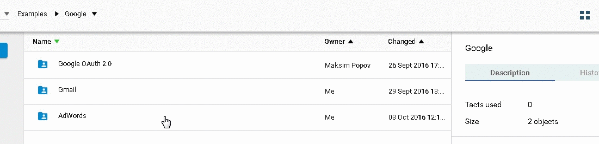
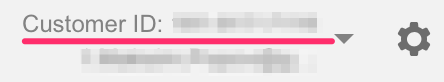
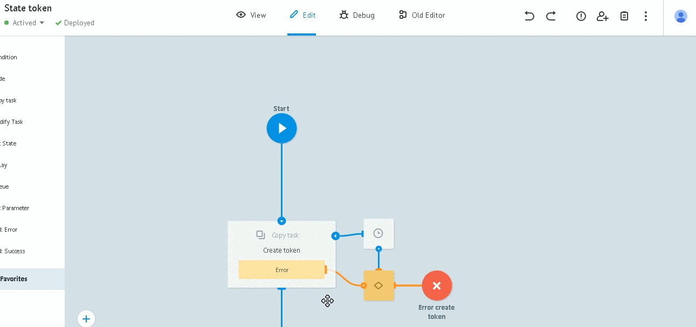
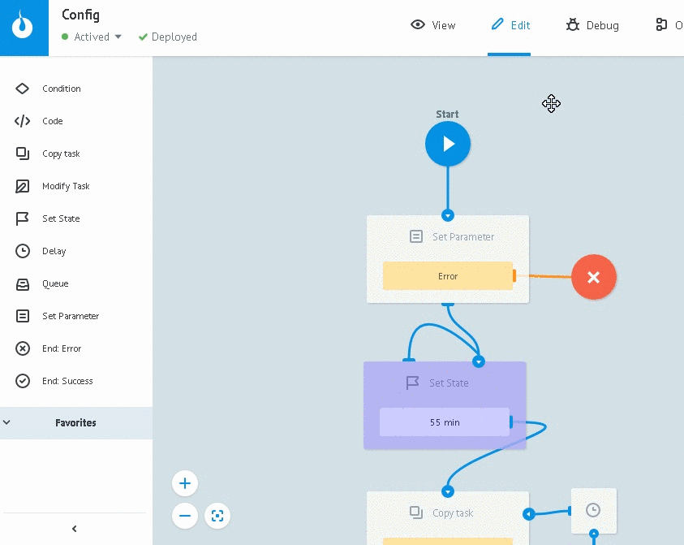

# AdWords

*   Начало работы с AdWords.
*   Получение токена разработчика
*   Получение access_token Google OAuth 2.0
*   Установка токенов в диаграмме состояний Config
*   Описание объектов в папке AdWords

##Начало работы с AdWords

Клониуйте папку [AdWords](https://admin.corezoid.com/folder/conv/105609) в свое окружение.

Для работы с API AdWords Вам понадобятся данные аккаунта и токен Google OAuth 2.0.

###Получение токена разработчика

Создайте отдельный (управляющий) аккаунт, получите его ID и токен разработчика.

*   **clientCustomerId** - ID Вашего аккаунта.

Скопируйте его из верхнего правого угла в аккаунте AdWords

>Вы должны указывать ID аккаунта в котором запущены кампании, а не ID управляющего аккаунта из которого Вы взяли токен.

*   **developerToken** - токен разработчика.

Чтобы получить его используйте [инструкцию](https://developers.google.com/adwords/api/docs/signingup?hl=ru).

###Получение access_token Google OAuth 2.0

**1)** Настройте процессы и получите `access_token`, как описано в разделе [OAuth аутентификация](oauth.md) с одним отличием от инструкции в п.8:

>Создайте заявку на получение access_token с **Reference = adwords**

**2)** Скопируйте ID диаграммы состояний `State token` из информационного блока ее стартового узла.

Это значение нам понадобится ниже.

##Установка токенов в диаграмме состояний Config

**1)** Перейдите в режим `View` диаграммы состояний [Config](https://admin.corezoid.com/editor/106173/164137) и нажмите `New task`

**2)** Заполните следующие параметры:
* **Reference** = config
* **clientCustomerId** - ID Вашего аккаунта
* **developerToken** - токен разработчика
* **state_diagram_id** - ID диаграммы состояний `State token` Google OAuth 2.0

**3)** Нажмите `Add task`

Теперь все необходимые параметры для авторизации в AdWords API установлены и готовы для получения их значений из других процессов.

##Описание объектов в папке AdWords

**Диаграмма состояний [Config](https://admin.corezoid.com/editor/106173/164137)** - хранение авторизационных данных

____________

**Процесс [Get campaings](https://admin.corezoid.com/editor/106173/164143)** - получение списка кампаний

Входящие параметры отсутсвуют

Исходящие параметры "успех":
* `array` - json массив с результатами запроса

Исходящие параметры "ошибка":
* `code` - код ошибки

______________

**Процесс [Report](https://admin.corezoid.com/editor/106173/164138)** - получение [отчетов](https://developers.google.com/adwords/api/docs/appendix/reports/all-reports)

Входящие параметры:
* `reportType` - тип отчета

Исходящие параметры "успех":
* `array` - json массив с результатами запроса

Исходящие параметры "ошибка":
* `code` - код ошибки

_______________

Папка **[AdGroupService](https://admin.corezoid.com/folder/conv/106171)** - управление группами объявлений

**Процесс [adGroup - GET by CampaignId](https://admin.corezoid.com/editor/106171/164140)** - получние списка групп объявлений по ID кампании

Входящие параметры:
* `CampaignId` - id кампании

Исходящие параметры "успех":
* `array` - json массив с результатами запроса

Исходящие параметры "ошибка":
* `code` - код ошибки
* `faultstring` - текст ошибки

____________________

Папка **[AdGroupService](https://admin.corezoid.com/folder/conv/106171)** - управление группами объявлений

**Процесс [adGroup - UPDATE](https://admin.corezoid.com/editor/106171/164139)** - изменение статуса по группе объявлений

Входящие параметры:
* `adGroupId` - id группы
* `status` - новый статус группы

Исходящие параметры "успех":
* `result` - новый статус

Исходящие параметры "ошибка":
* `code` - код ошибки
* `faultstring` - текст ошибки

_________________

Папка **[AdGroupAdService](https://admin.corezoid.com/folder/conv/106172)** - управление объявлениями

**Процесс [AD - GET by AdGroupId](https://admin.corezoid.com/editor/106172/164142)** - получение списка объявлений по ID группы объявлений

Входящие параметры:
* `adGroupId` - id группы

Исходящие параметры "успех":
* `array` - json массив с результатами запроса

Исходящие параметры "ошибка":
* `code` - код ошибки
* `faultstring` - текст ошибки

______________________

Папка **[AdGroupAdService](https://admin.corezoid.com/folder/conv/106172)** - управление объявлениями

**Процесс [AD - UPDATE](https://admin.corezoid.com/editor/106172/164141)** - изменение статуса по объявлению

Входящие параметры:
* `adGroupId` - id группы
* `status` - новый статус объявления
* `adId` - id объявления

Исходящие параметры "успех":
* `result` - новый статус

Исходящие параметры "ошибка":
* `code` - код ошибки
* `faultstring` - текст ошибки
