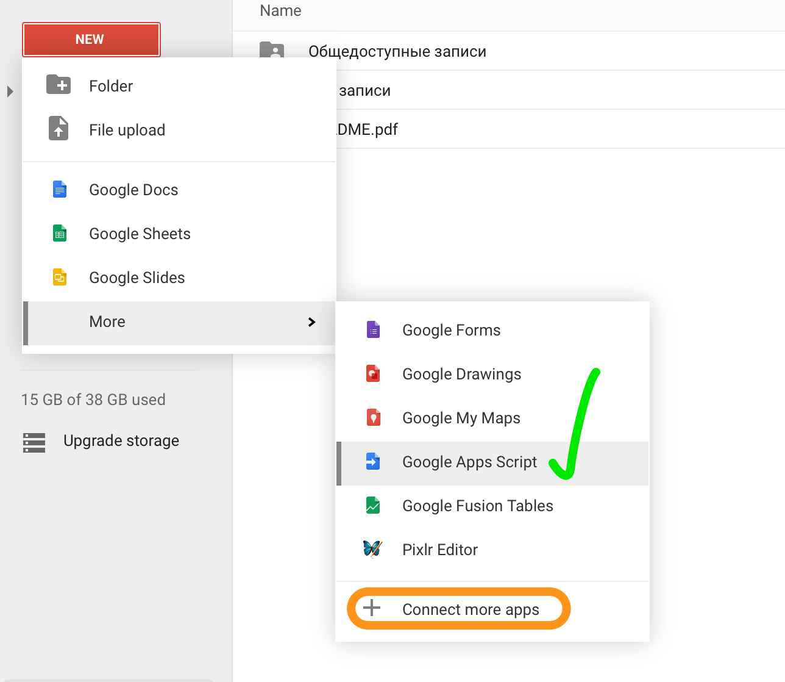
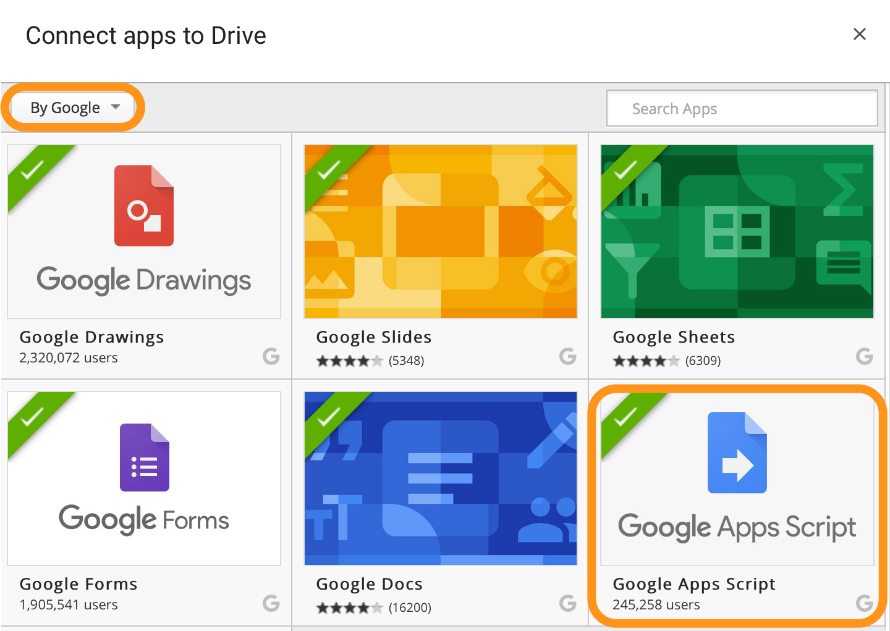

# AppScripts

Используя [Google Apps Script](https://developers.google.com/apps-script/) можно подключиться к любым сервисам Google. Например:
*   [Fusion tables](fusion_tables.md)
*   [Sheets](sheets.md)

##Как подключить Apps Script в Google Drive?

Если "Google Apps Script" у Вас есть еще нет в меню "New", то можно его добавить выбрав пункт меню "Connect more apps"

И в открывшемся окне выбрать фильтр приложений по "By Google" и установить "Google Apps Script".
