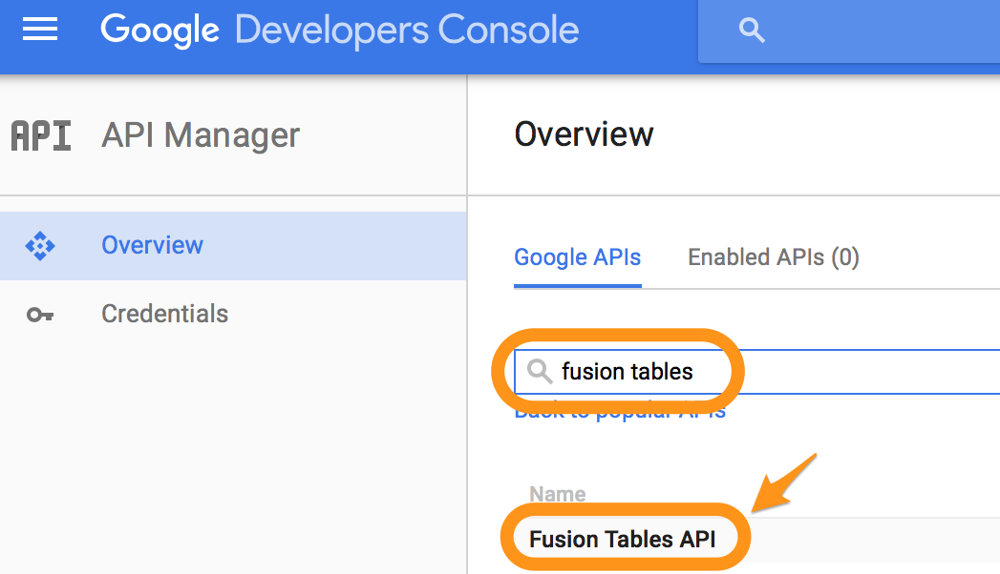
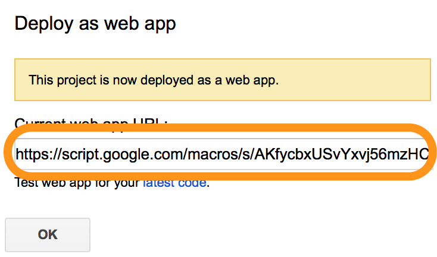

# Fusion Tables

Рассмотрим пример сохранение данных в таблицу Fusion Tables следующего вида:
*   Text
*   Number
*   Location
*   Date


Для этого мы создадим [Google Apps Script](appscripts.md)


Сразу переименуем проект в "Fusion tables"


И включим доступ к Fusion Tables из Google Apps Script


Дополнительно необходимо перейти в Google Developers Console и включить режим API для Fusion Tables



После этого вставляем код следующего вида:
```js
function doPost(request) {

  var table = "Insert ID Table";

  var content = JSON.parse(request.postData.contents);

  var column = "";
  var value = "";
  for (var elem in content) {
    column += elem + ",";
    value += "'" + content[elem] + "',";
  }

  column = column.substr(0, column.length-1);
  value = value.substr(0, value.length-1);

  var sql = "INSERT INTO " + table
  + " ( " + column + ") "
  + " VALUES (" + value + ")";

  Logger.log(sql);

  var sqlResult = FusionTables.Query.sql(sql);

  var result = {"result":"ok"};

  return ContentService.createTextOutput(JSON.stringify(result))
    .setMimeType(ContentService.MimeType.JSON);
}
```

В переменной `table` заменяем текст `Insert ID Table` на ID таблицы, который необходимо скопировать как указано ниже


###Публикация скрипта

Теперь публикуем наш код как веб-приложение с доступом всем:


После публикации нам доступен URL, на который необходимо методом POST отправлять JSON с данными для сохранения


Имена ключей в JSON должны соответствовать полям в Fusion Tables. В нашем случае JSON для отправки на API будет выглядеть следующим образом:
```json
{
  "Text":"d",
  "Number":1,
  "Location":24.5455545,
  "Date":"2016-01-01"
}
```
