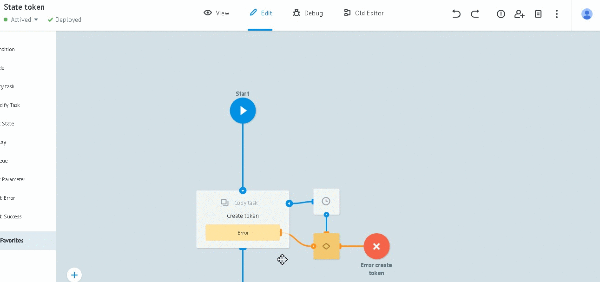

# Gmail

Чтобы вычитывать Gmail сообщения клониуйте папку [Gmail](https://admin.corezoid.com/folder/conv/105609) в свое окружение


##Описание процессов

[**System process**](https://admin.corezoid.com/editor/105962/163610)

Генерирует регулярный сигнал в процесс [Reading](https://admin.corezoid.com/editor/105962/163613) для получения непрочитанных сообщений.

В примере - 1 раз в 10 минут (значение задается в узле `Wait`).


[**Reading**](https://admin.corezoid.com/editor/105962/163613)

Получает непрочитанные сообщения и по одному отправляет их id в [Message info](https://admin.corezoid.com/editor/105962/163612) для получения детальной информации .

[**Message info**](https://admin.corezoid.com/editor/105962/163612)

Получает детальную информацию по id сообщения.

Формирует параметры для уведомлений о новом сообщении:
* `message_text` - текст сообщения
* `subject` - тема сообщения
* `from` - отправитель
* `attachments` - ссылки для скачивания вложений

Передает данные в процесс [Mark messages as READ](https://admin.corezoid.com/editor/105962/163611) для пометки сообщения прочитанным.


[**Mark messages as READ**](https://admin.corezoid.com/editor/105962/163611)

Помечает сообщение прочитанным.
А если быть точнее, снимает с сообщения метку "UNREAD".

##Запуск

**1)** Настройте процессы и получите `ACCESS_TOKEN`, как описано в разделе [OAuth аутентификация](oauth.md).

> на этапе 8 инструкции создайте заявку на получение access_token с **Reference = gmail**

**2)** Скопируйте ID диаграммы состояний `State token`(ID_DIAGRAM) из информационного блока ее стартового узла.



Это значение нам понадобится ниже.

**3)** В процессе [System process](https://admin.corezoid.com/editor/105962/163610) установите нужные значения и нажмите `Deploy`:

* `email` - адрес gmail
* `token` - контрукция для получения ACCESS_TOKEN из State diagram

```
{{conv[ID_DIAGRAM].ref[gmail].access_token}}
```


**4)** В процессе [Message info](https://admin.corezoid.com/editor/105962/163612) настройте логику отправки и обработки уведомлений о новых сообщениях.

>Например, в [Sender](https://sender.mobi/ru/) через `Логику Sender form` (доступна процессам, размещенным в компании)

>


**5)** Перейдите в режим `View` процесса [System process](https://admin.corezoid.com/editor/105962/163610), нажмите `New task`, а далее `Add task`.


