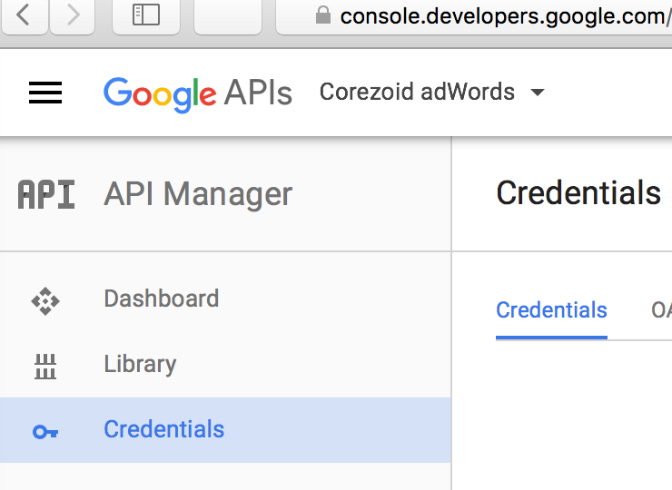
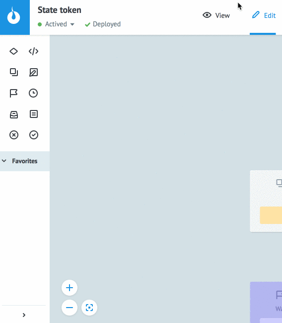

# OAuth аутентификация

Все запросы к API Google поддерживают авторизацию только через OAuth 2.0.

Общая схема выглядит следующим образом:


Каждый запрос к API должен содержать в `Header`:
```
Authorization : Bearer {{ACCESS_TOKEN}}
```

Для того чтобы получить `ACCESS_TOKEN` Вам необходимо выполнить следующие действия:

**1)**  Скопируйте папку [`Google OAuth 2.0`](https://admin.corezoid.com/folder/conv/105609) из `Examples` в свое окружение


**2)**  Зайдите на [console.developers.google.com](https://console.developers.google.com) в раздел `Credentials`



**3)**  Создайте `Client ID` и `Client Secret`


**4)**  В URL подставьте параметры и вызовите его в браузере
https://accounts.google.com/o/oauth2/v2/auth?redirect_uri=urn%3Aietf%3Awg%3Aoauth%3A2.0%3Aoob&response_type=code&access_type=offline&scope={{SCOPE}}&client_id={{CLIENT_ID}}

    где
    *   **{{CLIENT_ID}}** - ID клиента полученный на шаге 2
    *   **{{SCOPE}}** - API Google (обязательно в формате encode) к которому Вы хотите получить доступ. Например для adWords это `https://www.googleapis.com/auth/adwords`

**5)**  В появившемся окне выберите к какому аккаунту Вы хотите получить доступ. В следующем окне нажмите кнопку "Разрешаю". Скопируйте `CODE` появившийся на странице, он понадобится Вам на шаге 7.

**6)**  Перейдите в диаграмму `State token`, в режим View и нажмите кнопку `New task`




**7)**  В окне `Task` в поле `Reference` добавьте его значением "token", заполните указанные ниже и нажмите `Add task`

    *   client_id - Вы его получили на шаге 3
    *   client_secret - Вы его получили на шаге 3
    *   code - Вы его получили на шаге 5

**8)**  В окне `Task` заполните указанные ниже поля и нажмите `Add task`
    *   **Reference** - дайте название ключу, который Вы получаете. Например если это ключ к `gmail`, то укажите в поле `Reference` = `gmail`. По этому ключу Вы будете получать из других процессов `access_token`.
    *   **client_id** - Вы его получили на шаге 3
    *   **client_secret** - Вы его получили на шаге 3
    *   **code** - Вы его получили на шаге 5
>378b3cf1a534ac0e5c990fbab3f2a7fdb26917f6

В случае успшеного содания `ACCESS_TOKEN`, Ваша заявка будет находиться в узле `Active token`. Нажав на него Вы увидете содержимое заявки, одним из параметров которой является `access_token`.

Вы можете использовать полученный `access_token` для работы с любым API Google добавляя его в Header как:
```
Authorization : Bearer {{conv[ID_DIAGRAM].ref[REFERENCE].access_token}}
```
где:
*   `ID_DIAGRAM` - ID диаграммы `State token`. Этот ID можно получить:
    1.  Выбрать процесс в режиме браузера диаграмм
    2.  Выбрав узел `Start` внутри диаграммы
*   `REFERENCE` - Вы задали на шаге 7, когда делали `Add task` и генерировали `access_token`.
