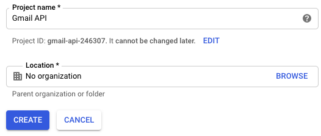
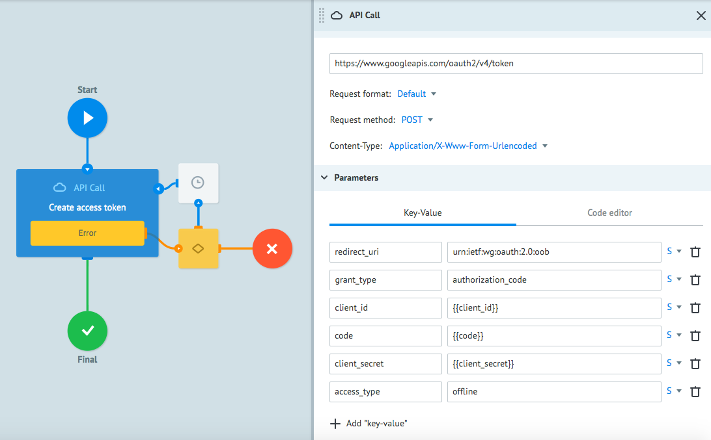

# Google OAuth 2.0


**Google OAuth 2.0** - это протокол авторизации, позволяющий выдать одному сервису (приложению) права на доступ к ресурсам пользователя на другом сервисе. Протокол избавляет от необходимости доверять приложению логин и пароль, а также может выдавать ограниченный набор прав, а не все сразу.

Перед настройкой процесса рекомендуем изучить документацию Google OAuth 2.0 по ссылке: [https://developers.google.com/identity/protocols/OAuth2](https://developers.google.com/identity/protocols/OAuth2)

Прежде чем вы начнете, давайте создадим проект, который использует OAuth 2.0 для подключения к API Google от имени пользователя. 


## Создание проекта в Google

1. Перейдите на [console.developers.google.com](console.developers.google.com) и создайте новый проект.

    
    

2. Дайте вашему проекту имя.

    

3. Перейдите в Библиотеку, найдите API Google, которые вы хотите использовать в своем приложении и включите их.  

    

    Мы будем использовать в качестве примера API Gmail. 

    
    

    Все запросы к API Google требуют авторизацию через протокол OAuth 2.0.

    Общая схема взаимодействия между сервисами Google с помощью OAuth 2.0 выглядит следующим образом:

    

    Каждый запрос к API должен содержать следующие параметры в **Header**:

    `Authorization: Bearer {{ACCESS_TOKEN}}`

    **ACCESS_TOKEN** используется для авторизации запросов и хранения дополнительной информации о пользователе (user_id, user_role или еще что либо, эту информацию также называют payload). Другими словами токен нужен для проверки ваших учётных данных перед запросом к API Google.

    Для того, чтобы Вы могли использовать **ACCESS_TOKEN** в других проектах, необходимо сделать процесс хранения ****ACCESS_TOKEN**** универсальным. 
 
    Вы сможете получать **ACCESS_TOKEN**, добавив в нужном процессе узел **Set Parameter** c конструкцией 
    ```
    {{conv[id процесса].ref[референс заявки].название параметра, в котором находится ACCESS_TOKEN}}
    ``` 
    
    Например: 
    ```
    {{conv[4].ref[gmail].ACCESS_TOKEN}}
    ```
    
    Для этого нужно создать 2 универсальных процесса в Corezoid:
    - **Token Storage** - диаграмма состояний для хранения и обновления полученного **ACCESS_TOKEN**.
    - **Сreate/Refresh Token** - процесс для вызова API создания и обновления **ACCESS_TOKEN** .
 
    На рисунке ниже Вы можете видеть их взаимодействие с Google OAuth 2.0:

    

    Вы прошли подготовительный этап по созданию проекта в Google. Далее Вы настроите процессы в Corezoid для получения **ACCESS_TOKEN** по инструкции ниже.


## Получение токена

1. Для удобства работы с проектами создайте папку **Google OAuth 2.0**.

    

2. Перейдите в папку и создайте процесс **Create/Refresh Token**, который будет генерировать и обновлять **ACCESS_TOKEN** с помощью Google API.

    

3. В созданном процессе добавьте узел **API Call**, который будет вызывать **Google OAuth 2.0 API** для генерирования **ACCESS_TOKEN**

    

    3.1. После того, как вы добавили узел, кликните на него и заполните поле **URL** и другие параметры вызова API:

    ```
    URL: https://www.googleapis.com/oauth2/v4/token
    ```
    
    ```
    Request format: Default
    Request method: POST
    Content-Type: Application/X-Www-Form-Urlencoded
    ```
  
    3.2. В раздел **Parameters** добавьте:
    ```
    {
        "redirect_uri": "urn:ietf:wg:oauth:2.0:oob",
        "grant_type": "authorization_code",
        "client_id": "{{client_id}}",
        "code": "{{code}}",
        "client_secret": "{{client_secret}}",
        "access_type": "offline"
    }
    ```
    
    Значения параметров `{{client_id}}`, `{{code}}`, `{{client_secret}}` вы сгенерируете в разделе **[Настройка вызова Google API](#настройка-вызова-google-api)** этого туториала при получении ключей доступа к аккаунту Google.

    
  
4. Для того, чтобы параметры автоматически подставлялись при ручной отправке заявки для генерирования **ACCESS_TOKEN**, нажмите на иконку **Task parameters** и добавьте 3 параметра: `client_id`, `code`, `client_secret`.
 
    
    
 
Настроенный dами **API Call** готов для отправки запроса, в результате которого Вы получите **ACCESS_TOKEN** от **API Google OAuth 2.0**. 

После того как Вы создали процесс Corezoid с логикой **API Call**, Вы можете настроить вызов Google API для получения **ACCESS_TOKEN**.
 

## Настройка вызова Google API

1. В [console.developers.google.com](console.developers.google.com) перейдите в раздел **Credentials**.

    

2. Создайте **Client ID** и **Client Secret**.

    

3. В URL подставьте параметры и вызовите его в браузере:
    ```
    https://accounts.google.com/o/oauth2/v2/auth?redirect_uri=urn%3Aietf%3Awg%3Aoauth%3A2.0%3Aoob&response_type=code&access_type=offline&scope={{scope}}&client_id={{client_id}}
    ```
    где:
    - `{{client_id}}` - это id клиента, полученный на шаге 2
    - `{{scope}}` - API Google к которому Вы хотите получить доступ. Например для Gmail это “https://mail.google.com/”. Список доступных Google API: [https://developers.google.com/identity/protocols/googlescopes](https://developers.google.com/identity/protocols/googlescopes)
   
4. В появившемся окне выберите, к какому аккаунту Вы хотите получить доступ. 

    4.1. В следующем окне нажмите кнопку "Разрешаю". 

    

    4.2. Скопируйте **CODE**, появившийся на странице, он понадобится вам на следующем шаге.

5. Перейдите в процесс **Create/Refresh Token**, в режимe **View** нажмите кнопку **New task**.
    
    5.1. В окне **Task** заполните указанные ниже поля:
    - `Reference` - дайте название ключу, который Вы получаете. <br/>Например если это ключ к “gmail”, то укажите в поле `Reference = “gmail”`. 
    - `client_id` - Вы его получили на шаге 2
    - `client_secret` - Вы его получили на шаге 2
    - `code` - Вы его получили на шаге 3
    
     и нажмите **Add task**

    

    В случае успешного создания **ACCESS_TOKEN**, Ваша заявка будет находиться в узле **Final**. Нажав на него, Вы увидите содержимое заявки, одним из параметров которой является **ACCESS_TOKEN**.
 
 
 
## Обновление токена

Согласно протоколу Google OAuth, срок действия токена составляет 1 час, поэтому необходимо настроить вызов Google API для обновления токена

1. Для обновления **ACCESS_TOKEN** в процессе **Create/Refresh Token** добавьте 2 узла **Condition** и **API Call**: **Condition** нужен для перевода заявки в узел **API Call** обновления токена при условии `grant_type == refresh_token`.

    1.1. Для этого в узле **Condition** добавьте проверку наличия значения `refresh_token` в параметре `grant_type`. 
    
    1.2. Добавьте к этому условию узел **API Call**, который нужен для вызова Google API обновления токена.

    

2. Для этого в поле **URL API** укажите ссылку `https://www.googleapis.com/oauth2/v4/token` 
и установите следующие значения в настройках узла **API Call**:

    ```
    Request format: Default  
    Request method: POST
    Content-Type: Application/X-Www-Form-Urlencoded
    ```

    В разделе **Parameters** добавьте:
    ```
    {
        "refresh_token": "{{refresh_token}}",
        "grant_type": "refresh_token",
        "client_id": "{{client_id}}",
        "client_secret": "{{client_secret}}"
    }
    ```

    

    Процесс для генерирования и обновления **ACCESS_TOKEN** готов!
 

## Настройка диаграммы состояний Token Storage

1. Чтобы при каждом запросе к API Google не вызывать процесс **Create/Refresh Token** для генерации **ACCESS_TOKEN**, необходимо создать механизм хранения активного **ACCESS_TOKEN**. Для этого мы будем использовать диаграмму состояний.

    1.1. Создайте диаграмму состояний с названием **Token Storage** 

    

    Диаграмма состояний **Token Storage** служит для хранения заявки с активным **ACCESS_TOKEN**. 
    
    Из диаграммы состояний Вы будете вызывать процесс **Create/Refresh Token** для  обновления **ACCESS_TOKEN**

    1.2. В диаграмме состояний **Token Storage** добавьте узел **Copy task** для вызова процесса **Create/Refresh Token**.

    1.3. В поле **Reference** укажите: 
    ```
    {{root.ref}}
    ``` 
    
    1.4. В разделе **Parameters** добавьте:
    ```
    {
        "refresh_token": "{{refresh_token}}",
        "grant_type": "refresh_token",
        "client_id": "{{client_id}}",
        "client_secret": "{{client_secret}}",
        "code": "{{code}}"
        
    }
    ```
    
    
    
    В процессе **Create/Refresh Token** Вы создадите заявку для генерирования **ACCESS_TOKEN**, копия этой заявки отправится в диаграмму состояний **Token Storage**. 
    
     Если в процессе **Token Storage** наступит время обновления **ACCESS_TOKEN**, то заявка перейдет через узел **Copy Task** в процесс для обновления **ACCESS_TOKEN** и будет ждать модификации в следующем узле **Set State**.
     
    
     
    1.5. В узле **Set State** добавьте Condition: `ACCESS_TOKEN == ` для проверки наличия параметра **ACCESS_TOKEN** после модификации заявки. Если поступит пустой параметр, то заявка попадет в финальный узел **Token is not refresh** (Вы можете дать другое название узлу). 
    
    
    
    1.6. В этом же узле **Set State** добавьте таймер для ожидания ответа. Для этого кликните на вкладку **Additionally** и установите галочку напротив **Limit the time of the task in the node**. Установите минимальное время 30 секунд, как на изображении ниже. Если в течение 30 секунд в диаграмму состояний не поступит ответ от **Create/Refresh Token**, то заявка перейдет в узел **Timeout create token**.
    
    
      
2. Cогласно протокола Google OAuth, cрок действия токена составляет 1 час, поэтому необходимо настроить цикл обновления токена в заданное время. 

    Для этого в узле **Active token** нажмите на **Limit the time of the task in the node** и установите таймер 1 hour.

    Итоговый вид процесса **Token Storage** с подключенными узлами: 

    

3. Для передачи сгенерированного **ACCESS_TOKEN** в диаграмме состояний **Token Storage** перейдите в процесс **Create/Refresh Token**. После узла **Create access token** добавьте узел **Copy Task.**

    3.1. В узле **Copy Task**, в поле **Process** подключите диаграмму состояний с названием **Token Storage**.    

    3.2. В поле **Reference** укажите: `gmail`

    3.3. В раздел **Parameters** добавьте:
    ```
    {
        "access_token": "{{access_token}}",
        "expires_in": "{{expires_in}}",
        "client_secret": "{{client_secret}}",
        "code": "{{code}}",
        "client_id": "{{client_id}}",
        "refresh_token": "{{refresh_token}}"
    }

    ```

    

4. Для обновления **ACCESS_TOKEN** в диаграмме состояний **Token Storage**, добавьте в процессе **Create/Refresh Token** после узла **Create access token** узел **Modify Task**.

    4.1. В узле Modify Task, в поле Process подключите диаграмму состояний с названием Token Storage.    

    4.2. В разделе Parameters передавайте: 
    ```
    {
        "refresh_token": "{{refresh_token}}",
        "access_token": "{{access_token}}",
        "expires_in": "{{expires_in}}"
    }
    ```
    где: 
    - `refresh_token` - токен для обновления **ACCESS_TOKEN**.
    - `ACCESS_TOKEN` -  токен доступа к API Google.
    - `expires_in` - срок действия **ACCESS_TOKEN**.
    
    4.3. В поле **Reference** укажите: `{{root.ref}}`

    

    
После того как весь проект из 1 процесса и 1 диаграммы состояний собран, Вы можете работать с активным **ACCESS_TOKEN**.

Для этого повторите пункт получения **CODE** и создайте новую заявку в процессе **Create/Refresh Token** для генерирования **ACCESS_TOKEN**, тем самым Вы запустите процесс хранения и обновления токена в диаграмме состояний **Token Storage**.

В случае успешного создания **ACCESS_TOKEN**, Ваша заявка будет находиться в узле Active token. Нажав на него Вы увидите содержимое заявки, одним из параметров которой является **ACCESS_TOKEN**.


На рисунке ниже Вы можете видеть взаимодействие процессов Corezoid с универсальной диаграммой состояний **Token Storage** и **API Google**:
 


Вы можете использовать полученный **ACCESS_TOKEN** во всех процессах своей компании для работы с любым API Google, добавляя его в **Header** при авторизации:

```
Authorization : Bearer {{conv[DIAGRAM_ID].ref[REFERENCE].access_token}}
```
где: `DIAGRAM_ID` - ID диаграммы состояний **Token Storage**. 

**Для получения DIAGRAM_ID необходимо:**

1. В диаграмме состояний **Token Storage** перейти в режим **Edit**. 

2. Нажать на узел **Start**.

3. В разделе **Connection data** скопировать число из строки **ID process**.

 

**REFERENCE** - Вы задали на шаге 5. В нашем случае это будет “gmail”.

Пример вызова API Google c подключением Google OAuth 2.0 через узел **API Call**:


**Поздравляем! Вы научились создавать процессы с использованием диаграммы состояний для авторизации Google OAuth 2.0.**

 
