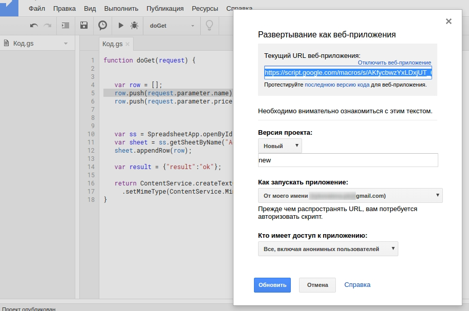
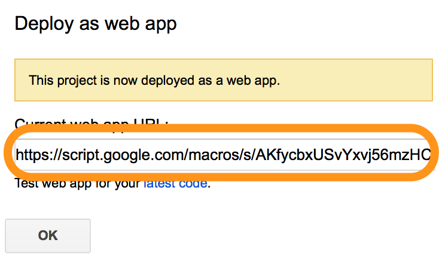
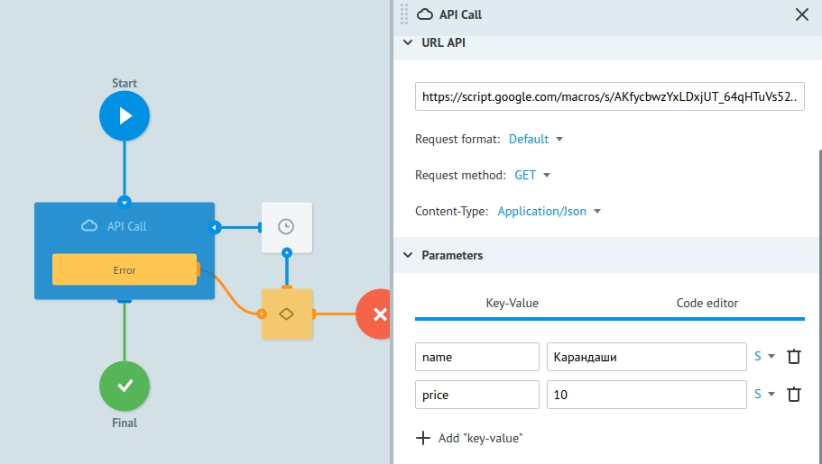
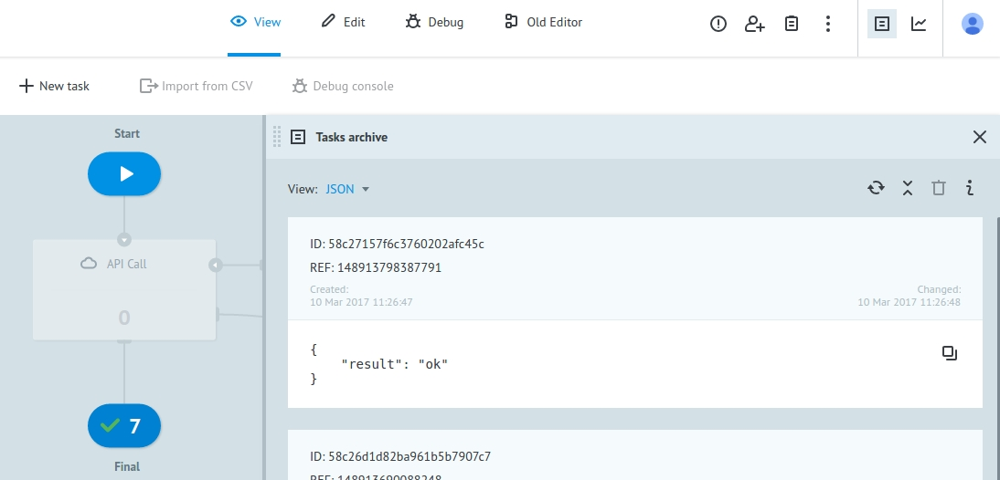
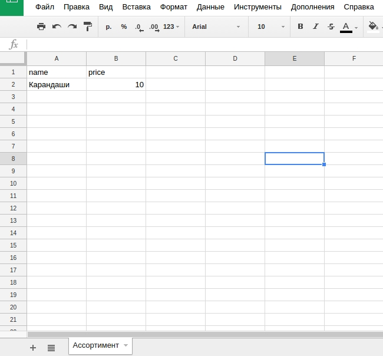

# Sheets

Пример добавления записей в заранее созданную таблицу.

Cоздадим скрипт внутри таблицы.

Для этого откроем редактор
![google]

И вставим в появившемся окне следующий скрипт, который добавляет записи `name` и `price` в таблицу
```javascript
function doGet(request) {


   var row = [];
   row.push(request.parameter.name);
   row.push(request.parameter.price);

   

   var ss = SpreadsheetApp.openById("Sheet_id")
   var sheet = ss.getSheetByName("Sheet_name");
   sheet.appendRow(row);

   var result = {"result":"ok"};

   return ContentService.createTextOutput(JSON.stringify(result))
     .setMimeType(ContentService.MimeType.JSON);
}
```

Теперь заменим текст `Sheet_name` на название листа Вашей таблицы, а `Sheet_id` на ее ID.

Скопируем ID из URL таблицы (выделенно желтым цветом)


Скрипт для записи данных в таблицу из Corezoid готов.

Опубликуем его и запустим из Corezoid.

###Публикация скрипта


Теперь публикуем наш код как веб-приложение с доступом всем:



После публикации нам доступен URL, на который необходимо методом GET отправлять JSON с данными для сохранения


Пример, настроенной логики Api Call



Результат обработки в процессе



Результат обработки в таблице




