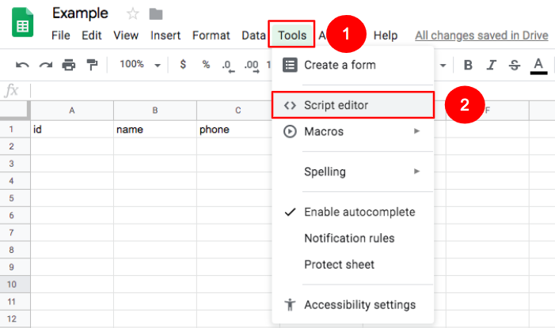
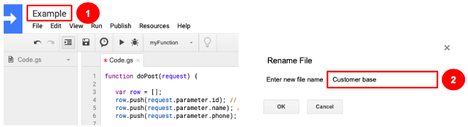
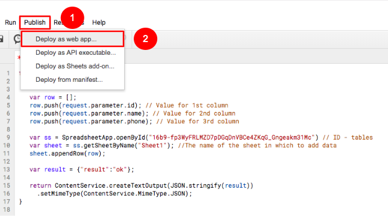
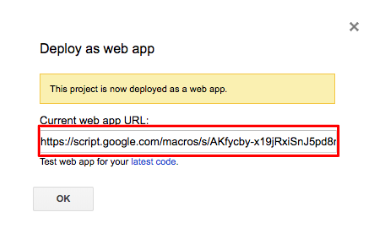
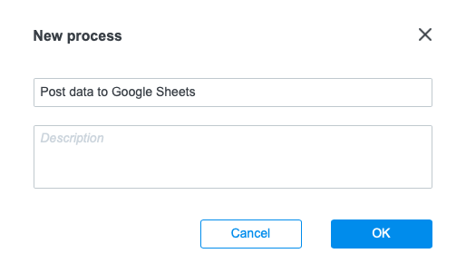
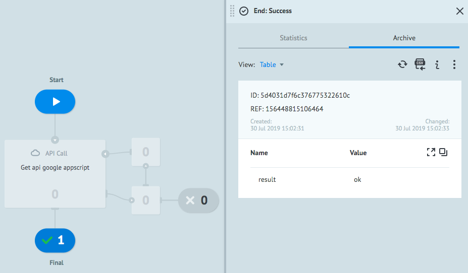

# Google AppScripts

**Google AppScripts** - это сервис для автоматизации работы инструментов Google, основанный на JavaScript. С его помощью можно расширять функциональность сервисов Google Suite: Docs, Sheets, Forms и т.д.

**Google AppScripts** позволяет создавать приложения, которые будут взаимодействовать не только с продуктами Google, но и с внешними сервисами. 

В этом туториале Вы научитесь добавлять записи в таблицу **Google Sheets** с помощью вызова API Google AppScripts из Corezoid.

Перед началом настройки процесса рекомендуем ознакомиться c [документацией **Google AppScripts**](https://developers.google.com/apps-script/quickstart/macros). 

Далее мы настроим таблицу **Google Sheets** для приема данных из Corezoid.

### Создание и настройка таблицы Google Sheets

1. Зайдите на [https://drive.google.com/drive](https://drive.google.com/drive)

    1.1. Cоздайте новую или используйте ранее созданную таблицу **Google Sheets**. В нашем примере мы создадим новую таблицу под название **Example**.
    
    

    1.2. В созданной Google-таблице c именем **Example** в первую строку добавьте названия столбцов, которые Вы будете заполнять, передавая данные из Corezoid. В нашем случае это будет таблица с параметрами клиентов: `id`, `name` и `phone`, где:
    - `id` - порядковый номер клиента;
    - `name` - имя клиента 
    - `phone` - номер мобильного телефона клиента
    
    

    1.3. Следующим шагом нажмите на раздел **Tools** и откройте пункт меню **Script editor**.
    
    

    1.4. В появившемся окне редактора скрипта вставьте следующий код:
    
    ```  
    function doPost(request) {
    
       var row = [];
       row.push(request.parameter.column1); // Значение для 1-го столбца
       row.push(request.parameter.column2); // Значение для 2-го столбца
       row.push(request.parameter.column3); // Значение для 3-го столбца
    
       // И так далее для всех столбцов, в порядке в котором они указаны в таблице
    
       var ss = SpreadsheetApp.openById("sheet_id") // ID - таблицы
       var sheet = ss.getSheetByName("sheet_name"); // Имя листа в который добавлять данные
       sheet.appendRow(row);
    
       var result = {"result":"ok"};
    
       return ContentService.createTextOutput(JSON.stringify(result))
         .setMimeType(ContentService.MimeType.JSON);
    }
    ``` 
    
    1.5. Для того, чтобы Вы могли наполнять созданные столбцы вашей таблицы, измените названия параметров: `column1`, `column2`, `column3`, и т.д. на названия Ваших параметров `id`, `name`, `phone` для получения вида скрипта, как на изображении
    
    

    1.6. Дайте название скрипту, например, **Сustomer base**
    
    

    1.7. В поле адресной строки браузера скопируйте id таблицы, в которую Вы добавили параметры: `id`, `name` и `phone`.
    
    

    1.8. В редакторе скриптов в строке `var ss = SpreadsheetApp.openById("sheet_id")` замените `"sheet_id"` на `id` Вашей таблицы.
   
    1.9. Скопируйте имя листа таблицы, в который Вы будете добавлять данные с помощью **Google AppScripts**

    

    1.10. В строке `var sheet = ss.getSheetByName("sheet_name");` вместо `sheet_name` вставьте имя скопированного листа.

Вы должны получить скрипт вида:

   

Вы внесли все необходимые настройки Google-скрипта для наполнения таблицы. Следующим шагом Вам нужно будет опубликовать созданный Google AppScript для возможности его вызова из Corezoid как API.

### Публикация web-приложения

1. В меню редактора скрипта нажмите кнопку **Publish**
    
    1.1. В выпадающем списке нажмите **Deploy as web app...**
        
    

2. В появившемся окне, в поле **Project version** добавьте версию проекта, например, 1 

    2.1. В выпадающем списке **Execute the app as** нужно выбрать от чьего имени запускать приложение. Выберите от имени своего аккаунта.
    
    2.2. В выпадающем списке **Who has access to the app** списке выберите “Дать доступ всем, включая анонимных пользователей”.
    
    2.3. Нажмите кнопку **Deploy**
  
    

    2.4. В следующем появившемся окне нажмите нажмите **Review Permission**

    

    2.5. После публикации Вам будет доступен URL, который Вы можете использовать как API для отправки данных в формате JSON для сохранения в Google Sheets.
    
     

Поздравляем! Ваш первый **Google AppScripts** готов для записи данных в таблицу.

### Настройка процесса Corezoid для сохранения данных в Google Sheets.

1. Создайте папку **Google AppScripts**

    

2. В папке **Google AppScripts** создайте процесс **Post data to Google Sheets**, который будет генерировать запрос с помощью **Google AppScripts**.

    

    2.1. В созданном процессе добавьте узел **API Call**, который будет вызывать **Google AppScript** для добавления данных в Google Sheets.
    
     

    2.2. Кликните на созданный узел **API Call** и заполните поле ***URL API***:

    ```
    https://script.google.com/macros/s/{{api_id}}/exec
    ```
    
    где: `URL` - url скрипта, который вы получили на шаге 2.5 раздела [Публикация web-приложения](#публикация-web-приложения)
 
    2.3. Установите следующие значения в настройках узла **API Call**:
    ```
    Request format: Default
    Request method: GET
    Content-Type: Application/Json
    ```
 
    2.4. В разделе **Parameters** добавьте параметры: `id`, `name`, `phone` со значениями, которые Вы хотите сохранить в таблице.
    
    ```
    {
        "id": "1",
        "name": "Taras",
        "phone": "380671234567"
    }
    ```
     
     

    Имена параметров должны совпадать с именами параметров, которые указаны в скрипте и с имена колонок в таблице Google.
        
    Для того, чтобы убедиться в правильности настройки узла **API Call**, сделайте вызов **Google AppScript**, в результате которого Вы получите ответ о передаче данных в Google Sheets.
 
3. Для этого перейдите в режим **View**
    
    3.1. Нажмите кнопку **New task**
    
    3.2. Нажмите кнопку **Add task**.
    
При успешном сохранении данных в Google Sheets заявка появится в узле **Final**. 
Если Вы кликните на него, то увидите в заявке параметр ***result*** со значением ***ok***. Это является подтверждением того, что данные успешно сохранены.

   

Если Вы перейдете в созданную таблицу **Example**, то увидите наполненные столбцы данными из заявки Corezoid.

   

Поздравляем! Вы научились сохранять данные в таблицу **Google Sheets** с помощью Corezoid и **Google AppScript**.
