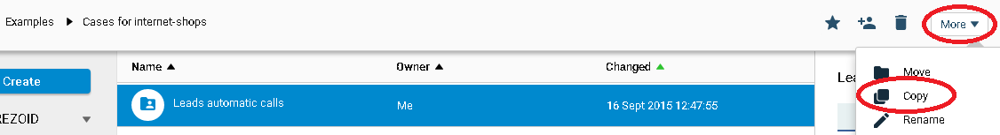
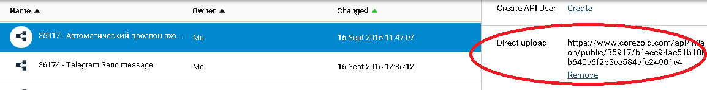
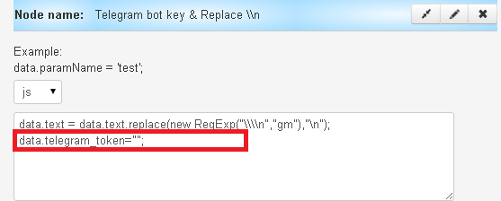
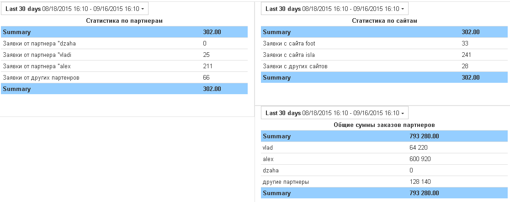

# Автоматический прозвон входящих лидов

1. Копирование шаблонов в свой аккаунт
2. Главный процесс
2. Cоздание нового лида Bitrix
3. Обзвон через VoxImplant
4. Отправка сообщения в Telegram
5. Процесс для дашборда
6. Дашборд


###Копирование шаблонов в свой аккаунт

Шаблоны процессов для автоматического прозвона входящих лидов доступны в папке ["Examples" / "Cases for internet-shops" / "Leads automatic calls"](https://admin.corezoid.com/folder/conv/11445).

Скопируйте папку в свой аккаунт




###Главный процесс

Главный процесс получает исходные данные и выполняет следующие действия:

* Вызов API для получения списка партнеров из Bitrix
* Вызов RPC-процесса для сздания нового лида Bitrix
* Вызов RPC-процесса для обзвона через VoxImplant
* Вызов RPC-процесса для отправки сообщения в Telegram
* Копирование данных в процесс для дашборда

На вход в главный процесс `"Leads automatic calls (MAIN)"` передаются данные о лиде из web-формы на сайте.

Пример API-запрос с php-скрипта:

```
$data = (object) array('server'=>$_SERVER,'cookies'=>$_COOKIE,'post'=>$_POST );
$full = (object) array('ops'=> array( (object) array( 'ref'=>$ip,'type'=>'create','obj'=>'task','conv_id'=>'31754','data'=> $data)) );

$cmd = ( json_encode( $full ) );
$str = "curl 'https://www.corezoid.com/api/1/json/public/31754/e4203ff8f55f17595a46549d35dbd00d51d0879d' -H 'Accept: application/json, text/javascript, */*; q=0.01' --data '".$cmd."' --compressed";
```

Объект `$data` формируется из данных, которые необходимо передать на обработку в Corezoid.

Объект `$ops` включает в себя параметр `ref` (referense) – уникальный id, под которым заявка зафиксируется в Corezoid. Если в данный момент уже есть заявка в процессе работы с таким же `ref`, то вторая добавлена не будет. Для примера, в качестве `ref` можно использоать ip-адрес клиента.

Параметр `conv_id` отвечает за формирование задачи в определенном процессе (ID Process).

URL, на которйый нужно отправлять данные и `conv_id` процесса, можно получить в админке:



В главном процессе не указаны значения таких параметров, как
* `{{portal}}` - имя Вашего портала на Bitrix,
* `{{chat_id}}` - id чата Telegram
* `conv_id` - в параметре `auth` id процесса генерации и обновления access_token Bitrix
* и т.д.

Эти параметры уникальны для каждого пользователя Bitrix и Telegram. Пропишите их конкретные значения и другие постоянные значения параметров в своих клонирвоанных процессах.

###Cоздание нового лида Bitrix

Процесс создает новый лид в Bitrix и возвращает его ID.

[Описание](../bitrix/new_lead.md) процесса создания нового лида.

[Описание](../bitrix/autorizatoin.md) процесса генерации и обновления access_token Bitrix.


###Обзвон через VoxImplant

В случае, если номер телефона не длинее 11 симолов и вемя суток подходящее для звонка, VoxImplant осуществляет звонок клиенту и проигрывает ему подготовленную запись. Дополнительно в код встроена функция определения автоответчика - [код сценария](http://jsfiddle.net/jqdr9npr/).

После получения Callback от VoxImplant анализируем ответ и распределяем заявку по соответвующим узлам.

Если мы не дождались ответа, что-то пошло не так, и заявка «падает» можно настроить ручную обработку заявки.

###Отправка сообщения в Telegram

Сообщение в Telegram будет отправлено продавцу в двух случаях:
* в главном процессе при получении в Bitrix списка партнеров будет невалидный токен и нужно обработать заявку в ручную
* лид успешно создан - сообщение будет содержать информацию о нем.

В процессе отправки сообщения в Telegram нужно прописать Ваш ключ доступа в узле с Логикой CODE в значение параметра "telegram_token"



###Процесс для дашборда

Данный процес позволяет получить статистику:
* по партнерам
* по сайтам
* по общей сумме заказов от кажого пратнера

С помощью Логики IF заявки распределяются по соотвествующим узлам согласно критериев, которые определяют партнера или сайт.

С помощью Логики SUM суммируется значение параметра, который содержит сумму заказа.

###Дашборд




