# WeatherBot в Line

* [Авторизация в Line](#auth)
* [Webhook и Access token](#connect)
* [WeatherBot](#weatherbot)
* [Установка Webhook](#webhook) 
* [Что делает WeatherBot](#doing)
* [Интеграция с OpenWeatherMap](#openWeatherMap)
* [Тестирование и запуск](#test)

### Авторизация в Line{#auth}

  1. Зарегистрируйте свой LINE@ account в [**“LINE Business Center"**](https://business.line.me/en/) выберите Messaging API в категории Services:
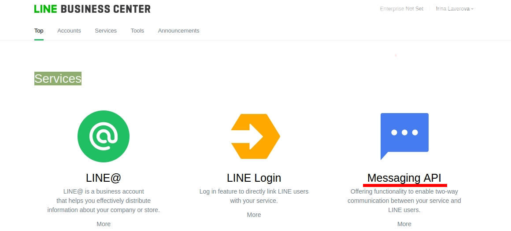
 
  2. Далее выбираете **Start using Messaging API**.
  3. Введите необходимую информацию о Вашем Боте (account name, business type) для вашего LINE@ accont.
  4. Далее выберите LINE@ MANAGER.
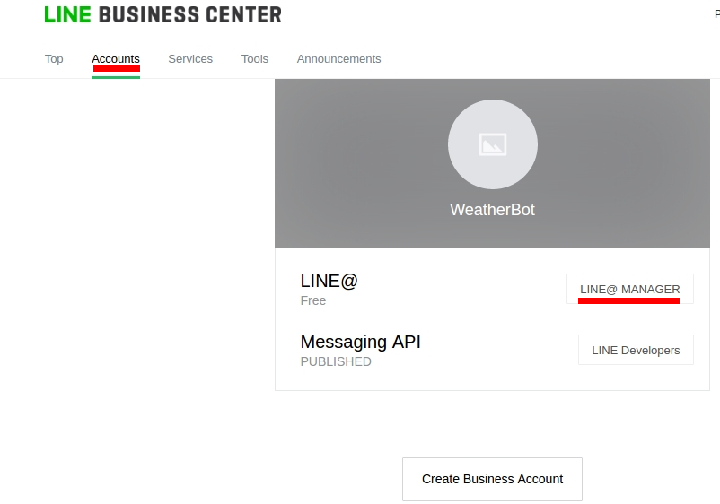
  5. Далее на странице **“Bot Settings”** нажмите **Enable API**.
  6. Настройте своего бота с помощью [Настройки Вашего бота](https://developers.line.me/messaging-api/getting-started#set_up_bot), сделав такие дополнительные настройки: кликнуть "Разрешить" для "Отправки уведомлений о событиях" и "Допуск ботов в групповые чаты", а также "Запретить" для "Cообщений автоответчика" и "Сообщение-приветствие".'
    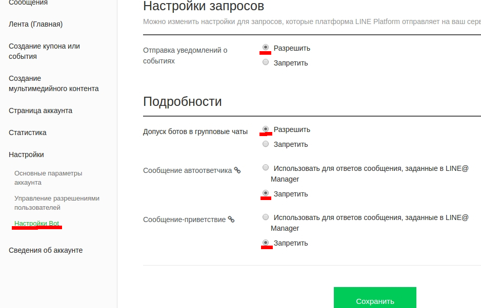
 
###  Webhook и Access token{#connect}

  1. В [**“LINE Business Center"**](https://business.line.me/en/) в разделе Accounts выберите **LINE Developers** для перехода в **Channel Console**.
  2. Для получения **Channel access token** для доступа к API, нажмите **ISSUE** возле поля “Channel access token”. 
  3. Нажмите EDIT и установите webhook URL.
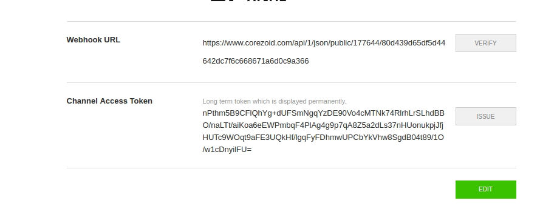
  4. После выполнения этих шагов, ваш бот будет взаимодействовать с вашими пользователями, используя API, предоставляемые Messaging API и Вы можете приступить к [настройке своего бота](#weatherbot).

###  WeatherBot{#weatherbot}

Клонируйте [шаблон "WeatherBot"](https://admin.corezoid.com/folder/conv/121756)
 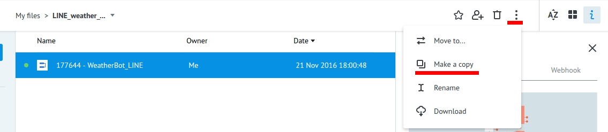
WeatherBot - принимает webhook-и с названием города или вашими координатами, получает по нему температуру воздуха и отправляет сообщение.

В случае, если сообщение не содержит название города или город указан некорректно, а также если в процессе возникла ошибка, отправляет соответсвующее сообщение.

Далее в узле **"Set access_token and APPID_key"** в значениях переменных:
* **access_token** введите свой персональный **Channel Access Token**, полученный вами при создании Бота в [**“LINE Business Center"**](https://business.line.me/en/) в разделе **Accounts** - **LINE Developers** - **Channel Console**.
* **APPID_key** введите тестовый ключ доступа к API OpenWeatherMap.

### Установка Webhook{#webhook}

  Для получения webhook-url процесса WeatherBot выберите "Connect to messenger": 
  
 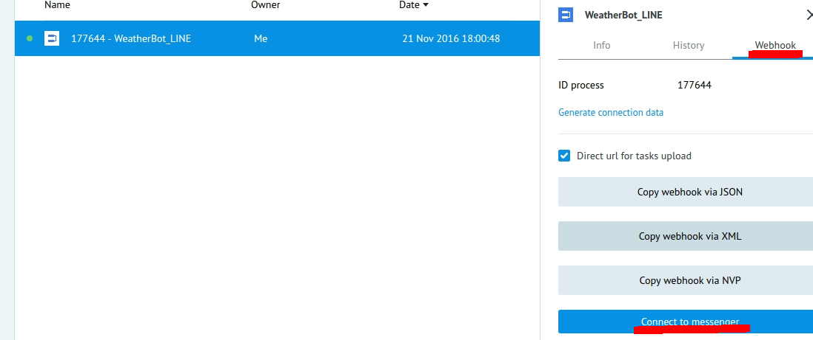
  

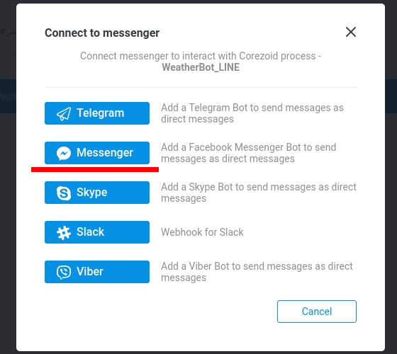

Получите webhook-url процесса WeatherBot для LINE Messenger. А в пустое поле введите свой персональный **Channel Access Token**, полученный вами при создании Бота в [**“LINE Business Center"**](https://business.line.me/en/) в разделе **Accounts** - **LINE Developers** - **Channel Console**.

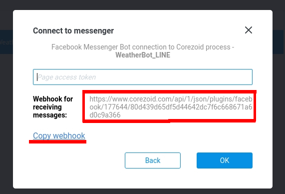
 
 Укажите полученный webhook-url процесса в настройках вашего бота в [**“LINE Business Center"**](https://business.line.me/en/) в разделе **Accounts** -**LINE Developers**-**Channel Console**,более подробно описано [здесь](#connect).

### Что делает WeatherBot{#doing}

  Вам достаточно ввести название города или ваши координаты и Ваш Бот получает по ним температуру воздуха и отправляет сообщение.
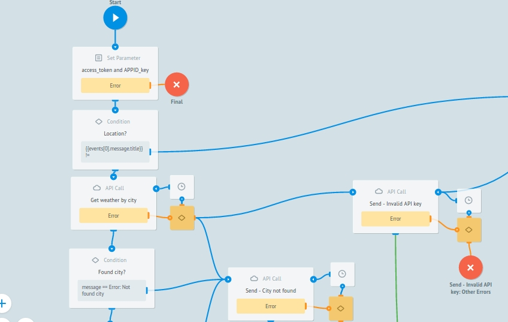

В случае, если город или координаты указаны некорректно, а также если в процессе возникла ошибка, отправляет соответсвующее сообщение.
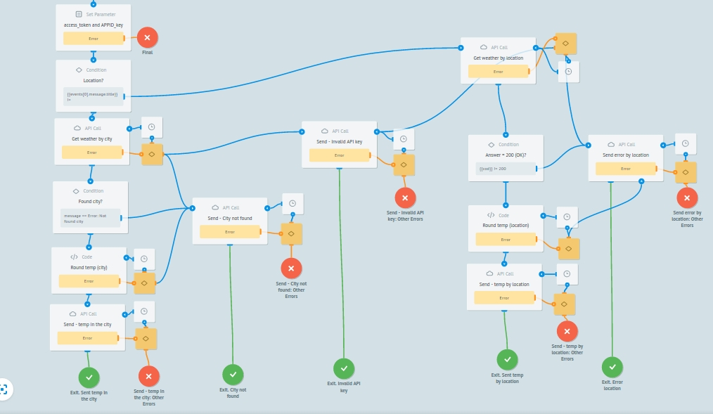

### Интеграция с OpenWeatherMap{#openWeatherMap}

Для удобства пользователей в [шаблон "WeatherBot"](https://admin.corezoid.com/folder/conv/121756) добавлен тестовый ключ доступа к API OpenWeatherMap.Чтобы получить свой ключ доступа к API OpenWeatherMap перейдите по [ссылке](https://home.openweathermap.org/) и зарегистрируйтесь.
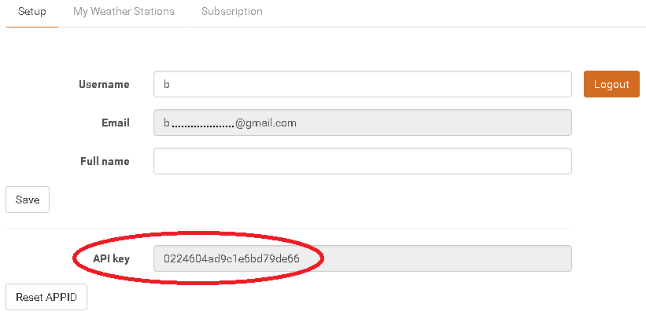
В узле Set access_token and APPID_key замените тестовый ключ API OpenWeatherMap на полученный Вами в значении параметра APPID_key.
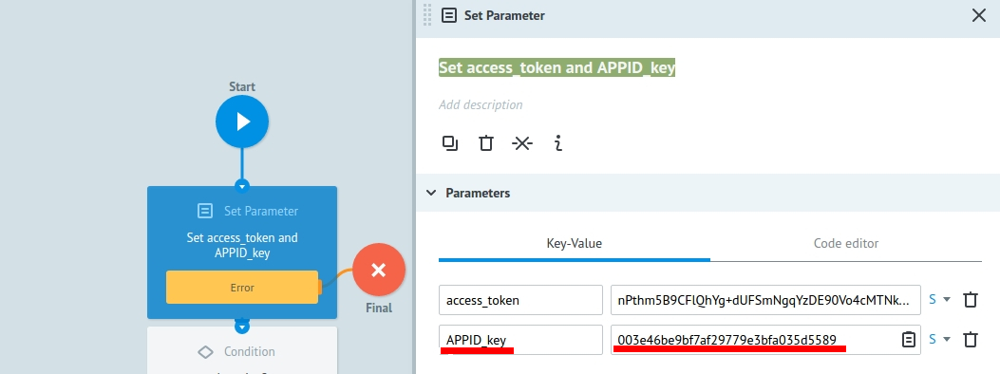

### Тестирование и запуск{#test}

Чтобы протестировать бота, добавьте его к себе в друзья по ID LINE - @zvm1764c или QR-коду:       

Просто добавьте своего Бота в Line и начните чат:

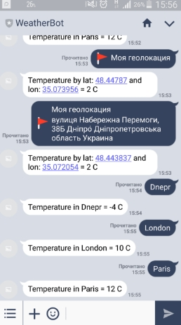

Перейдите в режим **View** или **Debug**, чтобы увидеть поток заявок, их прохождение и распределение по узлам процесса.

