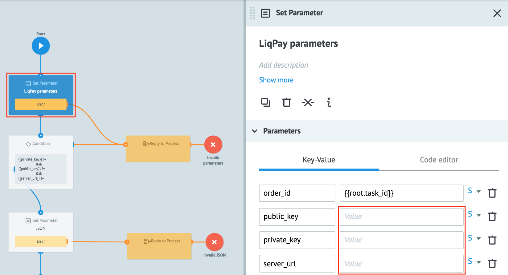
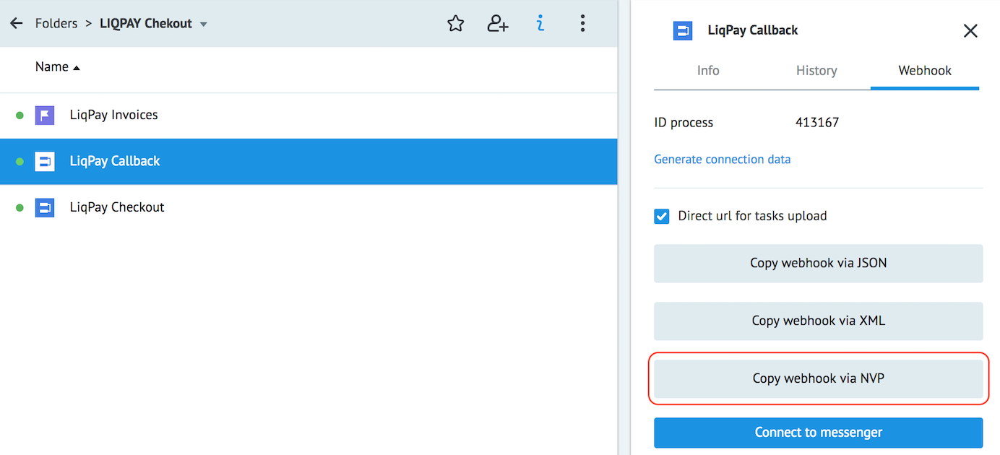

# Checkout

Скопируйте [папку "LIQPAY Chekout"](https://admin.corezoid.com/folder/conv/215972) в свое окружение.

Процесс **LiqPay Checkout** формирует запрос на **API Checkout** согласно [технической документации](https://www.liqpay.ua/documentation/api/aquiring/checkout/doc).
Результатом выполнения будет ссылка на страницу (`href`), которая используется для редиректа клиента на новую вкладку браузера, где откроется платежная страница LiqPay.

Клиент производит оплату и в процесс **LiqPay Callback** приходит ответ от LiqPay со статусом оплаты.

В диаграмму состояний **LiqPay Invoices** копируются заявки с отправленными инвойсами до получения конечного статуса платежа.

Перейдите в процесс **LiqPay Checkout**.

Кликните на узел **LiqPay parameters**.

В узле  укажите:
* **order_id** - уникальный ID покупки в Вашем магазине, по умолчанию указан уникальный идентификатор заявки - `{{root.task_id}}`
* **public_key** - публичный ключ из [настроек магазина](https://www.liqpay.ua/ru/admin/business)
* **private_key** - приватный ключ из [настроек магазина](https://www.liqpay.ua/ru/admin/business)
* **server_url** - скопированный DirectURL для загрузки в процесс **LiqPay Callback** (формат NVP)

> Для получения DirectURL выделите процесс **LiqPay Callback** в папке, нажмите View details. В открывшейся панели откройте вкладку Webhook. Нажмите **Copy webhook via NVP** и прямая ссылка будет скопована в буфер обмена:

> 

Нажмите **Deploy**, чтобы изменения вступили в силу.

Для тестирования процесса перейдите в режим **View** и нажмите кнопку **+ New task**.

Укажите значения параметров:
* `amount` - сумма платежа. Например: 5, 7.34
* `currency` - валюта платежа. Возможные значения: USD, EUR, RUB, UAH, GEL
* `description` - описание платежа
* `email` - email клиента для отправки инвойса
* `language` - язык клиента. Возможные значения: ru, uk, en

и нажмите **Add task** - отправить заявку.

В результате успешного выполнения заявка пройдет по процессу и перейдет в финальный узел **Invoice sent**.
В основной процесс будет возвращена ссылка (`href`) для редиректа клиента на новую вкладку браузера, где откроется платежная страница LiqPay.

В случае возникновения ошибки заявка перейдет в один из финальных узлов для ошибок.