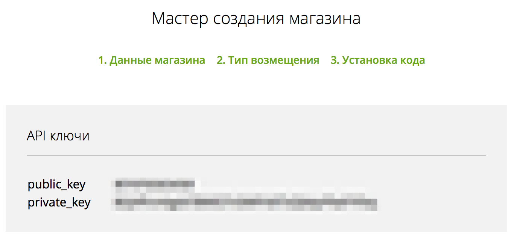

# LiqPay

Для начала работы с LiqPay, Вам необходимо зарегистрироваться на сайте https://www.liqpay.com и получить:
*   public key - ID Вашего магазина в системе LiqPay
*   private key - секретный ключ, которым будут подписываться все Ваши запросы, при отправке в систему LiqPay

Доступные из процесса методы LiqPay:
*   [Отправка инвойсов на email и проверка статуса платежа](invoice_email.md)
*   [Перевод с карты на карту](p2p.md)
*   [Покупка в магазине по карте](pay.md)
*   [Блокировка средств на карте клиента](hold.md)
*   [Регистрация нового магазина](shop_create.md)
*   [Подтверждение операций с помощью OTP пароля](otp_verify.md)
*   [Покупка в магазине по card_token](paytoken.md)
*   [Перевод со счета магазина на карту получателя](p2p_credit.md)
*   [Списание заблокированной суммы](hold_completion.md)
*   [Проверка статуса платежа](status.md)
*   [Отмена подписки (регулярного платежа)](unsubscribe.md)
*   [Возврат средств Клиенту](refund.md)
*   [Отмена выставленного счета](invoice_cancel.md)

А также [мультиплатформенный Бот](invoice_multi_platform_bot.md) для приема платежей от Ваших клиентов через Facebook, Telegram и Viber.
