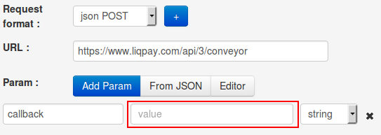
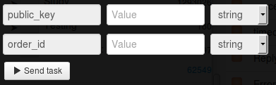

# Списание заблокированной суммы

Клонируйте [папку "Blocked amount writing-off"](https://admin.corezoid.com/folder/conv/1923) для получения процесса и дашборда.

Перейдите в процесс.

**Сгенерируйте ссылку для получения callback от LiqPay** - в узле с Логикой Callback `"Receive Callback"` нажмите на значок "Corezoid" и ссылка будет скопирована в буфер обмена.
В поле `Path to task_id` нужно указать `obj_id`.

Полученный URL нужно вставить в значение параметра `callback` логики API, который находится в узле `Calling API`.

В узле `Calling API` в поле `Secret key` вставьте Ваш `private key` из LiqPay:

Для тестирования процесса перейдите в режим `dashboard` и нажмите кнопку `Add task` - чтобы добавить  заявку.

В открывщейся форме укажите обязательные параметры и нажмите "Send task":

* `public_key` - публичный ключ магазина
* `order_id` - уникальный ID покупки в Вашем магазине. Максимальная длина - 255 символов.

Далее нажмите кнопку `Send task` - отправить заявку.

**В случае успеха** в заявку будут добавлены параметры:
* **status**  - cтатус платежа:
 * `success` - успешный платеж
* **payment_id** - ID платежа в LiqPay

**В случае ошибки** заявка перейдет в узел эскалации с параметром:
* **err_code** - код ошибки
* **err_description** - описание ошибки

